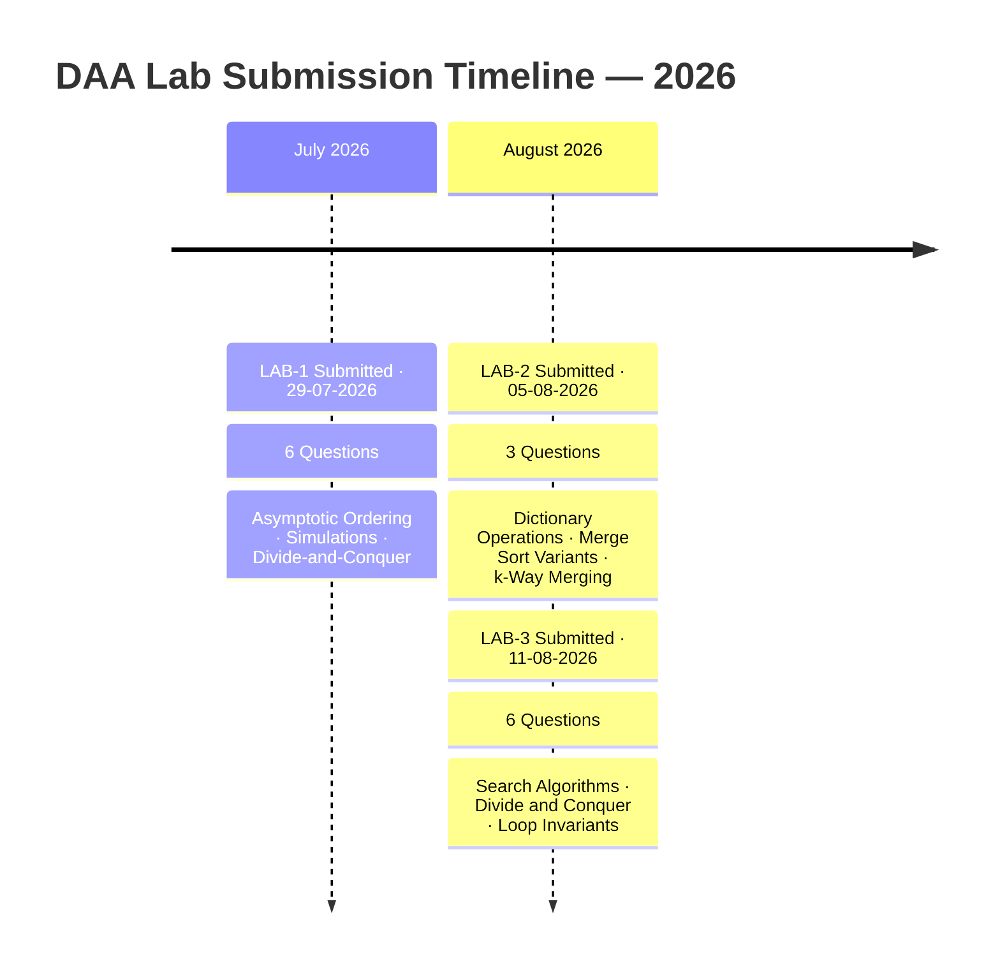
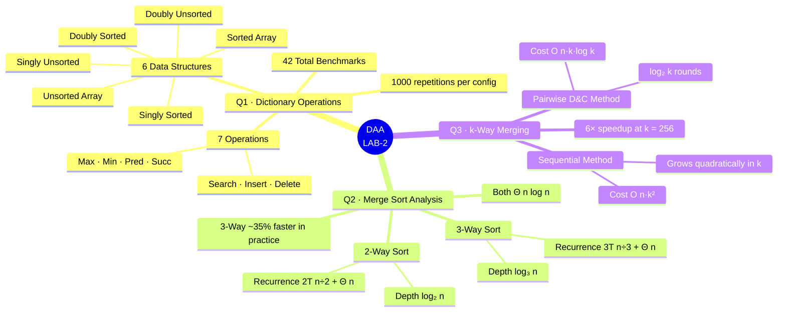
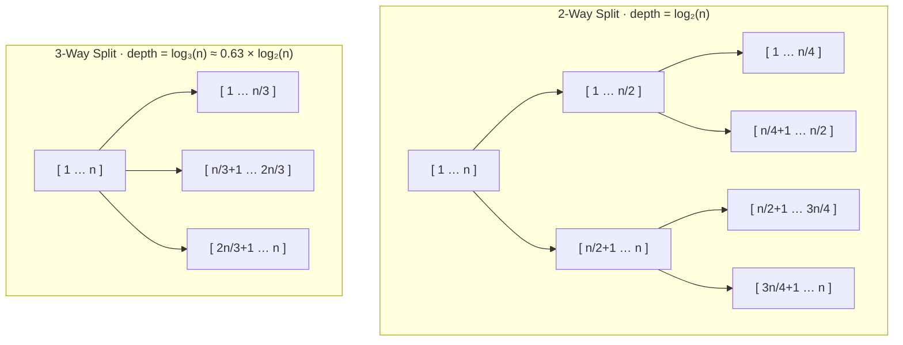
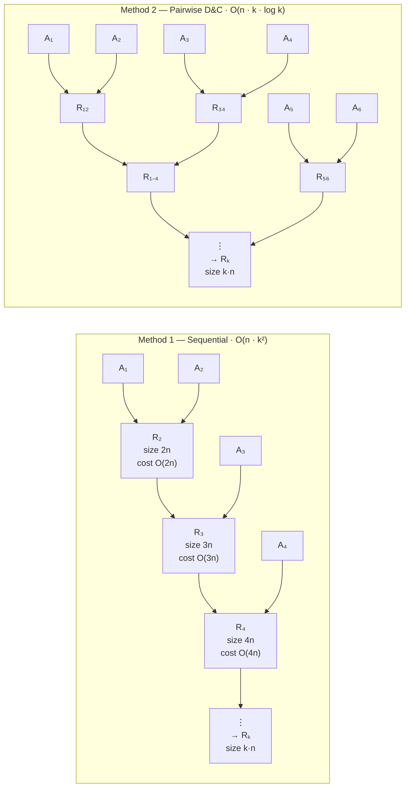
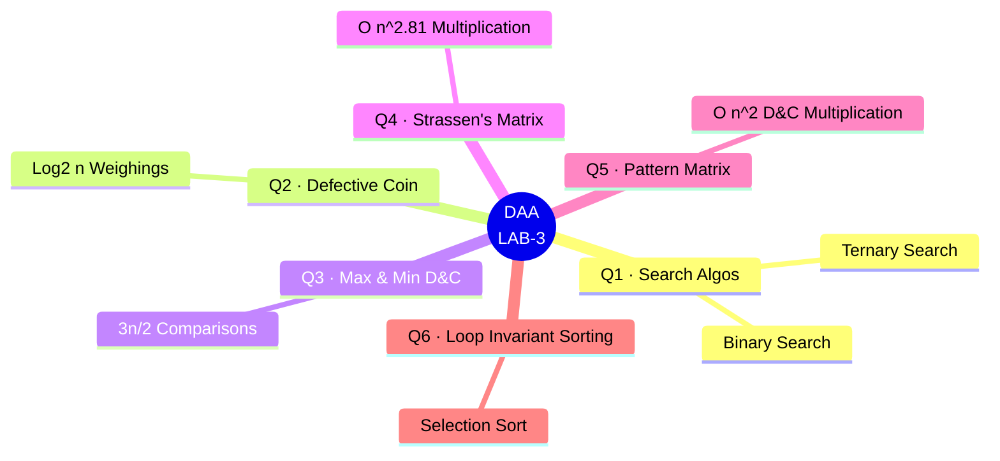
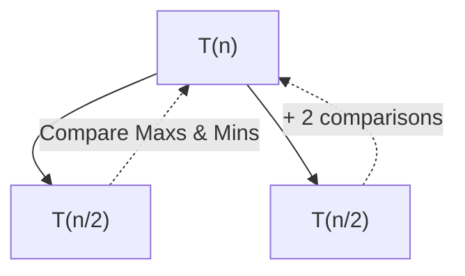

<div align="center">

<br/>

# 🧮 Design and Analysis of Algorithms
## DAA Lab Assignments — 2026

<br/>

[](https://en.wikipedia.org/wiki/C99)
[](#)
[](#)
[](#)
[](#)

<br/>

> *"An algorithm must be seen to be believed."* — **Donald Knuth**

<br/>

A curated collection of weekly programming assignments for the **Design and Analysis of Algorithms** course. Every program includes a thorough complexity analysis, a formatted terminal report, empirical benchmark datasets (`.csv`), and publication-quality plots (`.png`).

<br/>

</div>

---

## 👨‍🎓 Student Details

<div align="center">

| 🏷️ Field | 📋 Details |
|:---|:---|
| **Student Name** | Asit Kumar Mohapatra |
| **Registration ID** | B525017 |
| **Institute** | IIIT Bhubaneswar |
| **Branch** | CE — Computer Engineering |
| **Semester** | B.Tech 3rd Semester |
| **Course** | Design and Analysis of Algorithms |
| **Instructor** | Dr. Ajaya Kumar Dash |
| **Language** | C (C99) |

</div>

---

## 📋 Table of Contents

<details open>
<summary><strong>Click to expand / collapse</strong></summary>

<br/>

- [📅 Assignment Index](#-assignment-index)
- [🗂️ Repository Structure](#️-repository-structure)
- [🔬 LAB-1 Overview](#-lab-1--asymptotic-ordering-simulations--divide-and-conquer)
  - [Q1 — Put Them in Order](#q1--put-them-in-order)
  - [Q2 — Fair vs Biased Coin](#q2--fair-vs-biased-coin)
  - [Q3 — Bubble Sort Performance](#q3--performance-analysis-of-bubble-sort)
  - [Q4 — Towers of Hanoi](#q4--towers-of-hanoi)
  - [Q5 — Find the Partition Point](#q5--find-the-partition-point)
  - [Q6 — Element Uniqueness](#q6--element-uniqueness)
- [🚀 LAB-2 Overview](#-lab-2--dictionary-operations-merge-sort-variants--k-way-merging)
  - [Q1 — Dictionary Operations](#q1--dictionary-operations-asymptotic-analysis-across-data-structures)
  - [Q2 — Merge Sort vs 3-Way Merge Sort](#q2--standard-2-way-merge-sort-vs-modified-3-way-merge-sort)
  - [Q3 — Merging k Sorted Arrays](#q3--merging-k-sorted-arrays-sequential-vs-divide-and-conquer)
- [🚀 LAB-3 Overview](#-lab-3--divide-and-conquer--search-algorithms)
  - [Q1 — Binary vs Ternary Search](#q1--binary-vs-ternary-search)
  - [Q2 — Search the Defective Coin](#q2--search-the-defective-coin)
  - [Q3 — Max and Min using D&C](#q3--max-and-min-using-dc-approach)
  - [Q4 — Strassen's Matrix Multiplication](#q4--matrix-multiplication-using-dc-approach)
  - [Q5 — Pattern Square Matrices](#q5--multiply-special-pattern-square-matrices-using-dc-approach)
  - [Q6 — Loop Invariants in Sorting](#q6--use-of-loop-invariants-in-sorting)
- [📈 Complexity Growth Scale](#-complexity-growth-scale)
- [🔧 Building & Running](#-building--running)
- [📊 Complexity Quick Reference](#-complexity-quick-reference)
- [📝 Notes](#-notes)
- [👤 Author](#-author)

</details>

---

## 📅 Assignment Index

### Submission Timeline



### Lab Index Table

<div align="center">

| 🗂️ Lab | 📖 Title | ❓ Qs | 📆 Submitted | 🏁 Status |
|:---:|:---|:---:|:---:|:---:|
| [**LAB-1**](WEEK-1) | Asymptotic Ordering, Randomized Simulations & Divide-and-Conquer | 6 | 29-07-2026 | ✅ Done |
| [**LAB-2**](WEEK-2) | Dictionary Operations, Merge Sort Variants & k-Way Merging | 3 | 05-08-2026 | ✅ Done |
| [**LAB-3**](WEEK-3) | Search Algorithms, Divide and Conquer & Loop Invariants | 6 | 11-08-2026 | ✅ Done |

</div>

### ✅ Lab Completion Tracker

- [x] **LAB-1** — Asymptotic Ordering, Simulations & Divide-and-Conquer *(6 / 6 questions)*
- [x] **LAB-2** — Dictionary Operations, Merge Sort Variants & k-Way Merging *(3 / 3 questions)*
- [x] **LAB-3** — Search Algorithms, Divide and Conquer & Loop Invariants *(6 / 6 questions)*

---

## 🗂️ Repository Structure

```
📦 DAA-Assignments-2026/
│
├── 📄 README.md
│
├── 📁 WEEK-1/
│   ├── 📑 2026_Week1_DAA_Lab_01.pdf
│   ├── 🔵 q1_put_them_in_order.c
│   ├── 🔵 q2_fair_vs_biased_coin.c
│   ├── 🔵 q3_performance_analysis_of_bubble_sort.c
│   ├── 🔵 q4_towers_of_hanoi.c
│   ├── 🔵 q5_find_the_partition_point.c
│   ├── 🔵 q6_element_uniqueness.c
│   ├── 📊 fair_vs_biased_coin.csv / .png
│   ├── 📊 performance_analysis_of_bubble_sort.csv / .png
│   └── 📊 towers_of_hanoi.csv / .png
│
└── 📁 WEEK-2/
    ├── 📑 2026_Week2_DAA_Lab_02.pdf
    │
    ├── 📁 Q1/   ← Dictionary Operations
    │   ├── 🔵 q1_dictionary_operations.c          (408 lines · 42 operations)
    │   ├── 📊 dictionary_operations.csv            (420 rows)
    │   └── 🖼️  graph_search.png    graph_insert.png    graph_delete.png
    │            graph_max.png      graph_min.png        graph_predecessor.png
    │            graph_successor.png
    │
    ├── 📁 Q2/   ← Merge Sort Variants
    │   ├── 🔵 q2_merge_sort_vs_modified_merge_sort.c  (218 lines)
    │   ├── 📊 merge_sort_vs_modified_merge_sort.csv   (21 rows)
    │   └── 🖼️  merge_sort_vs_modified_merge_sort_graph_analysis.png
    │
    └── 📁 Q3/   ← k-Way Merging
        ├── 🔵 q3_merging_k_sorted_arrays.c            (415 lines)
        ├── 📊 merging_k_sorted_arrays.csv             (21 rows)
        └── 🖼️  merging_k_sorted_arrays_vs_k.png
                 merging_k_sorted_arrays_vs_n.png
                 merging_k_sorted_arrays_loglog.png
│
└── 📁 WEEK-3/
    ├── 📑 2026_Week3_DAA_Lab_03.pdf
    │
    ├── 📁 Q1/   ← Binary vs Ternary Search
    │   ├── 🔵 q1_binary_vs_ternary_search.c
    │   └── 🖼️  full_complexity_analysis.png
    │
    ├── 📁 Q2/   ← Search the Defective Coin
    │   └── 🔵 q2_search_the_defective_coin.c
    │
    ├── 📁 Q3/   ← Max and Min using D&C
    │   ├── 🔵 q3_max_and_min_using_D_and_C_approach.c
    │   └── 🖼️  max_min_comparison_graph.png
    │
    ├── 📁 Q4/   ← Strassen's Matrix Multiplication
    │   ├── 🔵 q4_matrix_multiplication_using_D_and_C_approach.c
    │   └── 🖼️  strassen_matrix_multiplication_graph.png
    │
    ├── 📁 Q5/   ← Pattern Square Matrices
    │   ├── 🔵 q5_multiply_special_pattern_square_matrices_using_D_and_C_approach.c
    │   └── 🖼️  Matrix_Complexity_Analysis.png
    │
    └── 📁 Q6/   ← Loop Invariants in Sorting
        ├── 🔵 q6_use_of_loop_invariants_in_sorting.c
        ├── 📄 pseudocode.txt
        └── 🖼️  Selection_Sort_Complexity_Analysis.png
```

---

## 🔬 LAB-1 — Asymptotic Ordering, Simulations & Divide-and-Conquer

**Date:** 29-07-2026 &nbsp;|&nbsp; **Total Questions:** 6

<div align="center">

| # | 📌 Question | ⚙️ Core Technique | ⏱️ Time | 💾 Space |
|:---:|:---|:---|:---:|:---:|
| **Q1** | [Put Them in Order](#q1--put-them-in-order) | Merge Sort · Custom Comparator | `O(n log n)` | `O(n)` |
| **Q2** | [Fair vs Biased Coin](#q2--fair-vs-biased-coin) | Monte Carlo Simulation | `O(k·n)` | `O(k)` |
| **Q3** | [Bubble Sort Performance](#q3--performance-analysis-of-bubble-sort) | Early-Stop vs Full-Pass | `O(n²)` | `O(1)` |
| **Q4** | [Towers of Hanoi](#q4--towers-of-hanoi) | Recursion | `O(2ⁿ)` | `O(n)` |
| **Q5** | [Find the Partition Point](#q5--find-the-partition-point) | Binary Search | `O(log n)` | `O(1)` |
| **Q6** | [Element Uniqueness](#q6--element-uniqueness) | Brute-Force Pairwise | `O(n²)` | `O(1)` |

</div>

---

### Q1 — Put Them in Order

<details>
<summary><strong>📖 Click to expand</strong></summary>

<br/>

**Goal:** Arrange twelve mathematical functions in strictly increasing asymptotic order using a merge sort driven by a custom comparator.

**Ordering produced:**

```
1/n  <  log₂(n)  <  12√n  ≡  50n^0.5  <  n^0.51  <  (2³²)n
     <  n·log₂(n)  <  n²−324  <  100n²+6n  <  2·n³  <  n^(log₂n)  <  3ⁿ
```

**How the comparator works:**

1. Compare **growth group** — each function is assigned one of: reciprocal, logarithmic, sub-linear power, linear, log-linear, polynomial, super-polynomial, exponential
2. If tied → compare **dominant power exponent**
3. If still tied → compare **leading coefficient** as a strict tiebreaker

| Property | Detail |
|---|---|
| Algorithm | Merge Sort — `O(n log n)` comparisons |
| Overflow guard | Values exceeding `double` range shown as `INF` |
| ASCII chart | Log-of-log scale at `n = 10¹⁰⁰` — fits `1/n` through `3ⁿ` on one axis |
| Chart character | Unicode `█` block (UTF-8 terminals) |

> [!NOTE]
> Without a log-of-log scale at `n = 10¹⁰⁰`, the bar for `3ⁿ` would be incomprehensibly larger than every other bar. The log-of-log transform makes all bars visible and comparable on one axis.

</details>

---

### Q2 — Fair vs Biased Coin

<details>
<summary><strong>📖 Click to expand</strong></summary>

<br/>

**Goal:** Demonstrate the **Law of Large Numbers** empirically through Monte Carlo simulation.

**Three phases:**

| Phase | Description |
|:---:|---|
| **1 — Convergence** | Fair coin flipped in 10× batches (10 → 1,000,000); absolute error from 0.5 tabulated per batch |
| **2 — Multi-Bias** | Five coins at 50 / 60 / 70 / 90 / 30 % bias; all results exported to `fair_vs_biased_coin.csv` |
| **3 — Histogram** | Observed probabilities rendered as a scaled ASCII bar chart |

**Complexity:**

$$
\text{Time} = O(k \cdot n) \quad \text{where } k = \text{coins},\ n = \text{flips per coin}
\qquad
\text{Space} = O(k)
$$

> [!TIP]
> Phase 1 is the core insight: as the sample size grows 10×, the absolute error from the true bias shrinks by approximately $\frac{1}{\sqrt{10}}$ — a direct empirical validation of CLT convergence at rate $\frac{1}{\sqrt{n}}$.

</details>

---

### Q3 — Performance Analysis of Bubble Sort

<details>
<summary><strong>📖 Click to expand</strong></summary>

<br/>

**Goal:** Quantify the comparison savings of early-termination Bubble Sort vs naive full-pass Bubble Sort on **identical** random input.

| Metric | ⚡ Early-Stop | 🐌 Full Pass |
|---|:---:|:---:|
| **Best case** | `O(n)` | `O(n²)` |
| **Average case** | `O(n²)` | `O(n²)` |
| **Worst case** | `O(n²)` | `O(n²)` |
| **Space** | `O(1)` | `O(1)` |

Both variants receive **clones of the same base array** so comparison counts are directly comparable. Output includes: operations saved (count + percentage), ASCII bar graph, CSV export, and complexity table.

> [!NOTE]
> On random input the early-stop gain is modest; the best-case `O(n)` advantage is dramatic only on **already-sorted or nearly-sorted data** — which is exactly what the best-case row captures.

</details>

---

### Q4 — Towers of Hanoi

<details>
<summary><strong>📖 Click to expand</strong></summary>

<br/>

**Goal:** Solve the puzzle recursively, validate the closed-form formula, and characterise exponential growth empirically.

**Recurrence and closed form:**

$$
T(n) = 2\,T(n-1) + 1 \implies T(n) = 2^n - 1
$$

- Step-by-step trace printed for `n = 3`
- Solver runs silently for `n = 1…25`; simulated count verified against $2^n - 1$ for every `n`
- Bar chart bar length `= n` → straight line on a log axis (signature of exponential data)
- Results exported to `towers_of_hanoi.csv`

| Property | Detail |
|---|---|
| Time complexity | `O(2ⁿ)` — each additional disc **doubles** the work |
| Space complexity | `O(n)` — call-stack depth never exceeds `n` |
| Feasibility limit | Practically infeasible beyond `n ≈ 64` |

> [!WARNING]
> The recursion counter is passed as a **pointer argument** — never a global. This ensures every run starts at zero with no cross-call side effects.

</details>

---

### Q5 — Find the Partition Point

<details>
<summary><strong>📖 Click to expand</strong></summary>

<br/>

**Goal:** Locate the first `1` in a binary array `[0,0,…,0,1,1,…,1]` using binary search.

**Midpoint calculation:** `mid = left + (right − left) / 2` — avoids integer overflow.

| `arr[mid]` | Action |
|:---:|---|
| `1` | Record as candidate → search **left** (hunt for an earlier `1`) |
| `0` | Transition must lie **right** |

**Edge cases explicitly handled:**

| Input | Output |
|---|---|
| All zeros | `"No transition found"` |
| All ones | Transition at index `0` |
| Mixed | Index of the **first** `1` |

$$
\text{Time} = O(\log n) \qquad \text{Space} = O(1)
$$

</details>

---

### Q6 — Element Uniqueness

<details>
<summary><strong>📖 Click to expand</strong></summary>

<br/>

**Goal:** Detect duplicates by brute-force pairwise comparison while counting every comparison made.

The inner loop **returns immediately** on the first match — the comparison counter doubles as a measure of how early a duplicate appeared.

| Case | Time |
|---|:---:|
| Best — duplicate found immediately | `O(1)` |
| Worst — all elements unique | `O(n²)` |
| Space | `O(1)` |

> [!TIP]
> Pre-sorting (`O(n log n)`) or hashing (`O(n)` average) would reduce time — at the expense of the `O(1)` space this brute-force version preserves.

</details>

---

## 🚀 LAB-2 — Dictionary Operations, Merge Sort Variants & k-Way Merging

**Date:** 05-08-2026 &nbsp;|&nbsp; **Total Questions:** 3

### LAB-2 — Overview Map



<div align="center">

| # | 📌 Question | ⚙️ Core Technique | ⏱️ Time | 💾 Space |
|:---:|:---|:---|:---:|:---:|
| **Q1** | [Dictionary Operations](#q1--dictionary-operations-asymptotic-analysis-across-data-structures) | 42 ops × 6 data structures | `O(1)` – `O(n)` per op | `O(n)` |
| **Q2** | [Merge Sort vs 3-Way Merge Sort](#q2--standard-2-way-merge-sort-vs-modified-3-way-merge-sort) | Divide & Conquer · Master Theorem | `Θ(n log n)` | `O(n)` |
| **Q3** | [Merging k Sorted Arrays](#q3--merging-k-sorted-arrays-sequential-vs-divide-and-conquer) | Sequential vs Pairwise D&C | `O(nk²)` vs `O(nk log k)` | `O(nk)` |

</div>

---

### Q1 — Dictionary Operations: Asymptotic Analysis Across Data Structures

<details>
<summary><strong>📖 Click to expand</strong></summary>

<br/>

**Goal:** Implement and empirically benchmark **7 dictionary operations** across **6 data structures**, validating theoretical Big-O worst-case bounds against wall-clock timing data.

#### Data Structures Under Test

| # | Data Structure | Ordering | Link Type |
|:---:|---|:---:|:---:|
| 1 | Unsorted Array | Unsorted | Array |
| 2 | Sorted Array | Sorted | Array |
| 3 | Singly Linked List | Unsorted | Singly |
| 4 | Singly Linked List | Sorted | Singly |
| 5 | Doubly Linked List | Unsorted | Doubly |
| 6 | Doubly Linked List | Sorted | Doubly |

#### Full Worst-Case Complexity Matrix — 42 Operations

| Data Structure | Search | Insert | Delete | Max | Min | Predecessor | Successor | Space |
|---|:---:|:---:|:---:|:---:|:---:|:---:|:---:|:---:|
| Unsorted Array | `O(n)` | `O(1)` | `O(1)` | `O(n)` | `O(n)` | `O(n)` | `O(n)` | `O(n)` |
| **Sorted Array** | **`O(log n)`** | `O(n)` | `O(n)` | **`O(1)`** | **`O(1)`** | **`O(1)`** | **`O(1)`** | `O(n)` |
| Singly Unsorted | `O(n)` | `O(1)` | `O(n)` | `O(n)` | `O(n)` | `O(n)` | `O(n)` | `O(n)` |
| Singly Sorted | `O(n)` | `O(n)` | `O(n)` | `O(1)`[^1] | **`O(1)`** | `O(n)` | **`O(1)`** | `O(n)` |
| Doubly Unsorted | `O(n)` | `O(1)` | **`O(1)`** | `O(n)` | `O(n)` | `O(n)` | `O(n)` | `O(n)` |
| **Doubly Sorted** | `O(n)` | `O(n)` | **`O(1)`** | **`O(1)`** | **`O(1)`** | **`O(1)`** | **`O(1)`** | `O(n)` |

[^1]: Singly Sorted **Max** is `O(1)` only when a **tail pointer** is maintained alongside the head pointer; without it the cost degrades to `O(n)`.

#### Key Algorithmic Insights

<details>
<summary>🔍 <strong>Search</strong></summary>

- **Unsorted structures:** require a full linear scan — `O(n)`
- **Sorted Linked Lists:** still `O(n)` — sorted order cannot unlock binary search because linked structures lack `O(1)` random access
- **Sorted Array:** achieves `O(log n)` via binary search — contiguous memory enables `O(1)` midpoint calculation

</details>

<details>
<summary>➕ <strong>Insert</strong></summary>

- **Unsorted Array & Unsorted Linked Lists:** `O(1)` — append to end or prepend to head
- **Sorted Array:** `O(n)` — inserting a new minimum forces every element to shift right
- **Sorted Linked Lists:** `O(n)` — must traverse to find the correct insertion position

</details>

<details>
<summary>➖ <strong>Delete</strong> (given pointer / index)</summary>

- **Unsorted Array:** `O(1)` — swap-with-last trick: `arr[idx] = arr[--size]`
- **Doubly Linked (both):** `O(1)` — `node→prev` and `node→next` allow immediate pointer bypass with no scan
- **Sorted Array:** `O(n)` — all subsequent elements must shift left
- **Singly Linked (both):** `O(n)` — no backward pointer forces linear scan from head to find predecessor

</details>

<details>
<summary>🔺 <strong>Max / Min</strong></summary>

- **Unsorted structures:** `O(n)` full scan required
- **Sorted structures:** `O(1)` — Min at head / index 0, Max at tail / index `n−1`

</details>

<details>
<summary>⬅️ ➡️ <strong>Predecessor / Successor</strong></summary>

- **Unsorted structures:** `O(n)` scan
- **Sorted Array:** `O(1)` via `arr[idx−1]` and `arr[idx+1]`
- **Doubly Sorted:** `O(1)` via `node→prev` and `node→next`
- **Singly Sorted:** Successor `O(1)` (`node→next`); Predecessor `O(n)` (no backward link)

</details>

#### Benchmark Configuration

```
Input sizes   :  N = 2,000 → 20,000  (step 2,000)
Repetitions   :  1,000 per (N, structure, operation) — averaged
Search key    :  −1  (guaranteed absent → forces worst-case full scan)
Delete setup  :  Target re-inserted at tail each iteration
                 → keeps it at far end → exposes true O(n) delete cost for singly linked
Insert setup  :  New minimum each time
                 → forces maximum element shifts in Sorted Array
```

> [!IMPORTANT]
> Every benchmark deliberately forces **worst-case** scenarios. Using a random key or random position would produce average-case measurements that understate the true asymptotic cost.

#### Generated Output

- **`dictionary_operations.csv`** — 420 rows: `10 N-values × 6 structures × 7 operations`

| 🖼️ Graph | Operation | Expected Visual Shape |
|---|:---:|---|
| `graph_search.png` | Search | Sorted Array near-zero `O(log n)` line; all others linear `O(n)` |
| `graph_insert.png` | Insert | Sorted structures grow linearly; unsorted structures flat near zero |
| `graph_delete.png` | Delete | Unsorted Array + Doubly Linked flat `O(1)`; others grow linearly |
| `graph_max.png` | Max | Sorted structures flat; unsorted grow linearly |
| `graph_min.png` | Min | Sorted structures flat; unsorted grow linearly |
| `graph_predecessor.png` | Predecessor | Sorted Array + Doubly Sorted flat; others linear |
| `graph_successor.png` | Successor | Sorted Array + Singly Sorted (tail-ptr) + Doubly Sorted flat; others linear |

</details>

---

### Q2 — Standard 2-Way Merge Sort vs. Modified 3-Way Merge Sort

<details>
<summary><strong>📖 Click to expand</strong></summary>

<br/>

**Goal:** Determine — theoretically via the Master Theorem and empirically via wall-clock timing — whether splitting into three parts reduces the asymptotic complexity of merge sort.

#### Recursion Tree Comparison



#### Master Theorem Derivation

**2-Way Merge Sort:**

$$
T(n) = 2\,T\!\left(\frac{n}{2}\right) + \Theta(n)
\quad \xrightarrow{\text{Master Thm Case 2}} \quad
T(n) = \Theta(n \log_2 n)
$$

**3-Way Merge Sort:**

$$
T(n) = 3\,T\!\left(\frac{n}{3}\right) + \Theta(n)
\quad \xrightarrow{\text{Master Thm Case 2}} \quad
T(n) = \Theta(n \log_3 n) = \Theta(n \log n)
$$

**Why Case 2 applies to both:**

$$
n^{\log_b a} = n^{\log_2 2} = n^1 = \Theta(n) = f(n)
\qquad \Rightarrow \qquad \text{Case 2: } T(n) = \Theta\!\left(n^{\log_b a} \log n\right)
$$

#### Head-to-Head Summary

| Criterion | 2-Way Merge Sort | 3-Way Merge Sort |
|---|---|---|
| Recurrence | $T(n) = 2T(n/2) + O(n)$ | $T(n) = 3T(n/3) + O(n)$ |
| Asymptotic bound | **`Θ(n log n)`** | **`Θ(n log n)`** |
| Recursion depth | `log₂(n)` | `log₃(n)` ← ~37% shallower |
| Comparisons / merge step | **1** per element | **Up to 2** per element |
| Practical speed | Baseline | ~25–35% faster *(constant factor only)* |
| Asymptotic winner? | **Tie** | **Tie** |

> [!IMPORTANT]
> Both algorithms are $\Theta(n \log n)$. The 3-way variant **does not improve the asymptotic class**. The shallower recursion tree is largely cancelled by the heavier per-merge comparison overhead — the empirical speedup is a constant-factor effect only.

#### Benchmark Configuration & Sample Results

```
Input type  :  Reverse-sorted array  (worst case for all comparison-based sorts)
Range       :  N = 10,000 → 100,000   (step 10,000)
Repetitions :  50 per N
Correctness :  is_sorted() check after every single sort call

── Sample CSV Output ──────────────────────────────────────
N,Algorithm,Time
10000,2-Way Merge Sort,0.00080000
10000,3-Way Merge Sort,0.00052000
100000,2-Way Merge Sort,0.00682000
100000,3-Way Merge Sort,0.00524000
───────────────────────────────────────────────────────────
```

> [!NOTE]
> The right panel of the output graph plots `Time / (N log₂ N)` vs `N`. Both curves flatten to horizontal constants — a visual proof that the growth rate is **exactly** $\Theta(n \log n)$ for both algorithms.

</details>

---

### Q3 — Merging k Sorted Arrays: Sequential vs. Divide-and-Conquer

<details>
<summary><strong>📖 Click to expand</strong></summary>

<br/>

**Goal:** Merge **k sorted arrays** of **n elements** each into one sorted array of **k·n elements**. Compare two strategies and confirm the theoretical `O(k²)` vs `O(k log k)` gap empirically.

#### Algorithm Flow — Both Methods



#### Theoretical Cost Derivation

**Method 1 — Sequential:**

$$
\text{Total} = \sum_{i=2}^{k} O(i \cdot n)
= O\!\left(n \cdot \frac{k(k+1)}{2}\right)
= O(n \cdot k^2)
$$

**Method 2 — Pairwise Divide-and-Conquer:**

$$
\text{Each of } \log_2 k \text{ rounds costs } O(k \cdot n)
\implies \text{Total} = O(k \cdot n) \times \log_2 k = O(n \cdot k \log k)
$$

#### Complexity Comparison

| Method | Strategy | Worst-Case Complexity |
|---|---|:---:|
| Method 1 (Sequential) | Left-to-right repeated merge | $O(n \cdot k^2)$ |
| Method 2 (Pairwise D&C) | Pair-merge in $\log_2 k$ rounds | $O(n \cdot k \log k)$ |

#### Implementation Highlights

| Feature | Detail |
|---|---|
| **High-res timer** | `QueryPerformanceCounter` (Windows) · `clock_gettime(CLOCK_MONOTONIC)` (POSIX) — avoids `clock()`'s ~10–16 ms coarse granularity |
| **Adaptive timing** | Reruns until ≥ 50 ms cumulative, then divides — stable non-zero readings even at tiny `(k, n)` |
| **Correctness** | 200 random trials (`k ∈ [2,16]`, `n ∈ [1,50]`); each output verified against reference `qsort()` of concatenated input |
| **Odd-k handling** | Leftover array (when `k` is odd in a round) carried forward unchanged to the next round |

#### Benchmark Sweeps

| Sweep | Fixed | Variable | Values |
|---|:---:|:---:|---|
| **Vary-k** | `n = 400` | `k` | `{2, 4, 8, 16, 32, 64, 96, 128, 160, 192, 224, 256}` |
| **Vary-n** | `k = 64` | `n` | `{50, 100, 200, 400, 800, 1600, 3200, 6400}` |

#### Sample Benchmark Results

```
series,k,n,method1_time_ms,method2_time_ms
vary_k,2,400,  0.003515,  0.003889   ← k=2: one merge each — methods identical
vary_k,64,400, 4.307808,  1.626513   ← k=64: Method 2 is 2.6× faster
vary_k,256,400,59.745100, 9.745317   ← k=256: Method 2 is ~6× faster ⚡
vary_n,64,50,  0.447409,  0.184777
vary_n,64,6400,67.336100,22.175167   ← both scale linearly in n
```

> [!CAUTION]
> Method 1's cost grows **quadratically** in `k`. At `k = 256` the gap is already ~6×; at `k = 1024` it exceeds 30×. For any large-`k` workload, **only Method 2 is viable**.

#### Generated Graphs

| 🖼️ Graph | Series | X-Axis | Key Visual Feature |
|---|:---:|:---:|---|
| `merging_k_sorted_arrays_vs_k.png` | vary_k | `k` | Method 1 curves steeply (quadratic); Method 2 curves gently (sub-linear) |
| `merging_k_sorted_arrays_vs_n.png` | vary_n | `n` | Both grow linearly; Method 1 steeper by `~log(k)` factor |
| `merging_k_sorted_arrays_loglog.png` | vary_k | `log(k)` | Method 1 slope **≈ 2** confirms $O(k^2)$; Method 2 slope **< 2** confirms $O(k \log k)$ |

#### Final Conclusion

| Criterion | Method 1 (Sequential) | Method 2 (Pairwise D&C) |
|---|---|---|
| Strategy | Left-to-right repeated merge | Pair-merge in $\log_2 k$ rounds |
| Worst-Case | $O(n \cdot k^2)$ | $O(n \cdot k \log k)$ |
| Growth in `k` (n fixed) | Quadratic — slope 2 in log-log | Sub-quadratic — slope < 2 |
| Growth in `n` (k fixed) | Linear | Linear |
| Speedup @ `k = 256` | 59.7 ms | 9.7 ms — **~6× faster** ⚡ |
| **Asymptotic winner?** | ❌ No | ✅ **Yes** |

</details>

---

## 🚀 LAB-3 — Divide-and-Conquer & Search Algorithms

**Date:** 11-08-2026 &nbsp;|&nbsp; **Total Questions:** 6

### LAB-3 — Overview Map



<div align="center">

| # | 📌 Question | ⚙️ Core Technique | ⏱️ Time | 💾 Space |
|:---:|:---|:---|:---:|:---:|
| **Q1** | [Binary vs Ternary Search](#q1--binary-vs-ternary-search) | Divide & Conquer | `O(log n)` | `O(1)` |
| **Q2** | [Search the Defective Coin](#q2--search-the-defective-coin) | Divide & Conquer | `O(log n)` | `O(log n)` |
| **Q3** | [Max and Min using D&C](#q3--max-and-min-using-dc-approach) | Divide & Conquer | `O(n)` | `O(log n)` |
| **Q4** | [Strassen's Matrix Multiplication](#q4--matrix-multiplication-using-dc-approach) | Strassen's Method | `O(n^2.81)` | `O(n^2)` |
| **Q5** | [Pattern Square Matrices](#q5--multiply-special-pattern-square-matrices-using-dc-approach) | Divide & Conquer | `O(n^2)` | `O(n^2)` |
| **Q6** | [Loop Invariants in Sorting](#q6--use-of-loop-invariants-in-sorting) | Selection Sort | `Θ(n^2)` | `O(1)` |

</div>

---

### Q1 — Binary vs Ternary Search

<details>
<summary><strong>📖 Click to expand</strong></summary>

<br/>

**Goal:** Search for an element `x` in a sorted list of size `n` using binary and ternary search, and validate that binary search is computationally superior despite having a larger logarithmic base.

#### Algorithmic Comparison

| Feature | Binary Search | Ternary Search |
|---|---|---|
| **Division** | 2 equal halves | 3 equal intervals |
| **Comparisons / step** | 1 (worst case: `<` or `>`) | Up to 2 (worst case: 2 boundaries) |
| **Max Depth** | $\log_2 n$ | $\log_3 n$ |
| **Max Comparisons** | $\log_2 n$ | $2 \log_3 n$ |

#### Complexity Proof

$$
\text{Ternary vs Binary Ratio} = \frac{2 \log_3 n}{\log_2 n} = \frac{2}{\log_2 3} \approx 1.26
$$

> [!TIP]
> While $\log_3 n < \log_2 n$, the number of comparisons per split makes ternary search do **~26% more comparisons** in the worst case. The empirical Python plot (`full_complexity_analysis.png`) confirms this constant-factor overhead.

</details>

---

### Q2 — Search the Defective Coin

<details>
<summary><strong>📖 Click to expand</strong></summary>

<br/>

**Goal:** Find a single defective (lighter) coin among `n` identical-looking coins using a balance weighing scale in $O(\log n)$ time.

#### The Divide and Conquer Strategy

1. **Divide:** Split the `n` coins into two equal halves. If `n` is odd, leave one coin aside.
2. **Weigh:** Place the two halves on the balance scale.
3. **Conquer:**
   - If **balanced**: The defective coin is the one left aside (terminates).
   - If **unbalanced**: The lighter side contains the defective coin. Recursively apply the strategy to this lighter half.

#### Recurrence Relation

$$
T(n) = T(n/2) + O(1) \implies T(n) = O(\log_2 n)
$$

> [!NOTE]
> Since we eliminate half of the coins with a single `O(1)` weighing operation, the maximum number of weighings strictly bounded by $\lfloor \log_2 n \rfloor + 1$.

</details>

---

### Q3 — Max and Min using D&C Approach

<details>
<summary><strong>📖 Click to expand</strong></summary>

<br/>

**Goal:** Find both the maximum and minimum elements in an array using divide and conquer, rigorously bounding the number of comparisons to $\frac{3n}{2} - 2$.

#### Method Comparison

| Algorithm | Strategy | Comparisons |
|---|---|:---:|
| **Naive Scan** | Track min/max via separate linear scans | $2n - 2$ |
| **Tournament D&C** | Divide into halves, find min/max of each, then compare | $\frac{3n}{2} - 2$ |

#### Recursion Tree & Cost Derivation



$$
T(n) = \begin{cases} 
0 & \text{if } n = 1 \\
1 & \text{if } n = 2 \\
2\,T(n/2) + 2 & \text{if } n > 2 
\end{cases}
$$
Expanding the recurrence reveals the total cost:
$$
T(n) = \frac{3n}{2} - 2
$$

> [!TIP]
> This algorithm proves that you can achieve a **25% reduction** in comparisons over the naive approach by pairing elements up. The `max_min_comparison_graph.png` empirically verifies the exact $\frac{3n}{2} - 2$ slope.

</details>

---

### Q4 — Matrix Multiplication using D&C Approach

<details>
<summary><strong>📖 Click to expand</strong></summary>

<br/>

**Goal:** Multiply two `n × n` square matrices using Strassen's Method, bypassing the cubic $O(n^3)$ lower bound of standard multiplication.

#### Standard vs Strassen

- **Standard D&C:** Computes 8 recursive multiplications of size $(n/2) \times (n/2)$.
$$
T(n) = 8T(n/2) + O(n^2) \implies O(n^3)
$$
- **Strassen's D&C:** Uses algebraic combinations to compute only **7 recursive multiplications**.
$$
T(n) = 7T(n/2) + O(n^2) \implies O(n^{\log_2 7})
$$

#### Complexity Matrix

| Method | Recursive Multiplications | Matrix Additions | Asymptotic Bound |
|---|:---:|:---:|:---:|
| **Standard** | 8 | 4 | $O(n^3)$ |
| **Strassen** | 7 | 18 | $O(n^{2.807})$ |

> [!WARNING]
> While Strassen's algorithm is asymptotically superior, the massive constant factor generated by the 18 matrix additions/subtractions makes it slower for small $n$. The generated plot `strassen_matrix_multiplication_graph.png` perfectly captures the crossover point where Strassen's begins to outperform the standard approach.

</details>

---

### Q5 — Multiply special-pattern square matrices using D&C approach

<details>
<summary><strong>📖 Click to expand</strong></summary>

<br/>

**Goal:** Exploit a recursive symmetric block structure to achieve an optimal $O(n^2)$ matrix multiplication algorithm.

#### The Special Structure

A matrix $M$ (where $n = 2^k$) is recursively composed of identical diagonal and off-diagonal blocks:
$$
M = 
\begin{pmatrix} 
  M_1 & M_2 \\ 
  M_2 & M_1 
\end{pmatrix} 
\quad , \quad 
N = 
\begin{pmatrix} 
  N_1 & N_2 \\ 
  N_2 & N_1 
\end{pmatrix}
$$

#### Multiplication Algebra

When multiplying $M \times N$, the result inherits the exact same structure:
$$
M \times N = 
\begin{pmatrix} 
  M_1 N_1 + M_2 N_2 & M_1 N_2 + M_2 N_1 \\ 
  M_2 N_1 + M_1 N_2 & M_2 N_2 + M_1 N_1 
\end{pmatrix} 
= 
\begin{pmatrix} 
  R_1 & R_2 \\ 
  R_2 & R_1 
\end{pmatrix}
$$

#### The Sub-Quadratic Hack

Instead of computing all 4 quadrants (which would require 8 multiplications), we only need to compute two unique blocks ($R_1$ and $R_2$):
1. $R_1 = M_1 N_1 + M_2 N_2$ (2 multiplications, 1 addition)
2. $R_2 = M_1 N_2 + M_2 N_1$ (2 multiplications, 1 addition)

Total cost per level: **4 multiplications** instead of 8.

$$
T(n) = 4\,T(n/2) + O(n^2) \implies \Theta(n^2)
$$

> [!TIP]
> Standard matrix multiplication requires $O(n^3)$ because reading the output takes $O(n^2)$ and computing each cell takes $O(n)$. Because of the fractal symmetry here, we can compute the entire matrix in exactly $O(n^2)$ — proportional solely to the number of cells!

</details>

---

### Q6 — Use of loop invariants in sorting

<details>
<summary><strong>📖 Click to expand</strong></summary>

<br/>

**Goal:** Formulate mathematical loop invariants for Selection Sort to formally prove its correctness, and empirically analyze its quadratic complexity bounds.

#### Algorithm: Selection Sort

Iteratively find the smallest element in the unsorted portion $A[i \dots n]$ and swap it with $A[i]$.

#### Formal Loop Invariant Proof

At the start of each iteration $i$ (from $1$ to $n-1$), the subarray $A[1 \dots i-1]$ contains the $(i-1)$ smallest elements of $A$ in sorted order.

| Phase | Proof Requirement | State in Selection Sort |
|---|---|---|
| **Initialization** | True before first iteration ($i=1$) | $A[1 \dots 0]$ is empty. An empty array is trivially sorted and contains the $0$ smallest elements. |
| **Maintenance** | If true before iteration $i$, remains true before $i+1$ | We find the absolute minimum in $A[i \dots n]$ and place it at $A[i]$. Now $A[1 \dots i]$ contains the $i$ smallest elements in sorted order. |
| **Termination** | Loop ends ($i=n$); invariant gives useful property | Loop terminates at $i=n$. The invariant states $A[1 \dots n-1]$ contains the $(n-1)$ smallest elements sorted. Thus, $A[n]$ must be the maximum, and the entire array $A[1 \dots n]$ is sorted. |

#### Complexity Bound

$$
\text{Comparisons} = \sum_{i=1}^{n-1} (n - i) = \frac{n(n-1)}{2} = \Theta(n^2)
$$

> [!NOTE]
> The proof explains why the outer loop only needs to run $(n-1)$ times. The $n$-th iteration is mathematically redundant!

</details>

---

## 📈 Complexity Growth Scale

The diagram below maps every complexity class used in this repository from fastest to slowest — from constant-time operations to the exponential growth of Towers of Hanoi.


<div align="center">

| 🎨 Colour | Class | Example in this repo |
|:---:|:---:|---|
| 🟢 Green | `O(1)` | Sorted Array — Max, Min, Pred, Succ; Unsorted Array — Delete |
| 🟩 Light green | `O(log n)` | Sorted Array — Search (binary search); Q5 — Partition Point |
| 🟡 Yellow | `O(n)` | Linked List Search; Coin Simulation per coin |
| 🟠 Orange | `O(n log n)` | All Merge Sort variants; Q1 — Asymptotic Ordering |
| 🔴 Red | `O(n²)` | Bubble Sort (worst/avg); Element Uniqueness (worst); Sequential k-Merge |
| 🟣 Purple | `O(2ⁿ)` | Towers of Hanoi |

</div>

---

## 🔧 Building & Running

### Prerequisites

```bash
gcc --version        # GCC 7.0+ recommended · any C99-compliant compiler works
```

### WEEK-1

```bash
cd WEEK-1

# Q1 & Q2 require the math library
gcc -Wall -std=c99 -o q1 q1_put_them_in_order.c -lm          &&  ./q1
gcc -Wall -std=c99 -o q2 q2_fair_vs_biased_coin.c -lm        &&  ./q2

# Q3 – Q6 — no extra flags needed
gcc -Wall -std=c99 -o q3 q3_performance_analysis_of_bubble_sort.c  &&  ./q3
gcc -Wall -std=c99 -o q4 q4_towers_of_hanoi.c                     &&  ./q4
gcc -Wall -std=c99 -o q5 q5_find_the_partition_point.c            &&  ./q5
gcc -Wall -std=c99 -o q6 q6_element_uniqueness.c                  &&  ./q6
```

### WEEK-2

```bash
# Q1 — Dictionary Operations
cd WEEK-2/Q1
gcc -O2 -std=c99 -o q1_dictionary_operations q1_dictionary_operations.c
./q1_dictionary_operations
# ↳ Writes: dictionary_operations.csv + prints complexity table to terminal

# Q2 — Merge Sort vs 3-Way Merge Sort
cd ../Q2
gcc -O2 -std=c99 -o q2_merge_sort_vs_modified_merge_sort \
       q2_merge_sort_vs_modified_merge_sort.c -lm
./q2_merge_sort_vs_modified_merge_sort
# ↳ Writes: merge_sort_vs_modified_merge_sort.csv + prints analysis to terminal

# Q3 — Merging k Sorted Arrays
cd ../Q3
gcc -O2 -std=c99 -o q3_merging_k_sorted_arrays q3_merging_k_sorted_arrays.c
./q3_merging_k_sorted_arrays
# ↳ Writes: merging_k_sorted_arrays.csv + 200-trial correctness report
```

### WEEK-3

```bash
# Q1 — Binary vs Ternary Search
cd WEEK-3/Q1
gcc -O2 -std=c99 -o q1_binary_vs_ternary_search q1_binary_vs_ternary_search.c -lm
./q1_binary_vs_ternary_search

# Q2 — Search the Defective Coin
cd ../Q2
gcc -O2 -std=c99 -o q2_search_the_defective_coin q2_search_the_defective_coin.c -lm
./q2_search_the_defective_coin

# Q3 — Max and Min using D&C Approach
cd ../Q3
gcc -O2 -std=c99 -o q3_max_and_min_using_D_and_C_approach q3_max_and_min_using_D_and_C_approach.c
./q3_max_and_min_using_D_and_C_approach

# Q4 — Matrix Multiplication using D&C Approach
cd ../Q4
gcc -O2 -std=c99 -o q4_matrix_multiplication_using_D_and_C_approach q4_matrix_multiplication_using_D_and_C_approach.c
./q4_matrix_multiplication_using_D_and_C_approach

# Q5 — Multiply special-pattern square matrices using D&C approach
cd ../Q5
gcc -O2 -std=c99 -o q5_multiply_special_pattern_square_matrices_using_D_and_C_approach q5_multiply_special_pattern_square_matrices_using_D_and_C_approach.c
./q5_multiply_special_pattern_square_matrices_using_D_and_C_approach

# Q6 — Use of loop invariants in sorting
cd ../Q6
gcc -O2 -std=c99 -o q6_use_of_loop_invariants_in_sorting q6_use_of_loop_invariants_in_sorting.c
./q6_use_of_loop_invariants_in_sorting
```

> [!NOTE]
> Run each WEEK-2 program **from inside its own `Q*/` subdirectory** so that CSV and graph outputs land next to the source files, matching the committed dataset paths.

### Compiler Flags Reference

| Flag | Purpose |
|---|---|
| <kbd>-Wall</kbd> | Enable all standard warnings |
| <kbd>-std=c99</kbd> | Enforce C99 standard strictly |
| <kbd>-O2</kbd> | Level-2 optimisation — used for all timing benchmarks |
| <kbd>-lm</kbd> | Link the math library (`math.h` — needed by Q1/Q2 LAB-1 and Q2 LAB-2) |

### Input Reference

| Lab | Program | 📥 Input Required |
|:---:|:---:|---|
| LAB-1 | Q1 | None |
| LAB-1 | Q2 | Number of flips for the comparison matrix *(defaults to 10,000 on bad input)* |
| LAB-1 | Q3 | Number of elements, 2–10,000 *(defaults to 100 on bad input)* |
| LAB-1 | Q4 | None |
| LAB-1 | Q5 | Element count, then that many 0s and 1s — **0s must precede all 1s** |
| LAB-1 | Q6 | Element count, then that many integers |
| LAB-2 | Q1–Q3 | **None** — all parameters hardcoded in each benchmark driver |
| LAB-3 | Q1–Q6 | Expected formats vary (refer to source code for details) |

---

## 📊 Complexity Quick Reference

<div align="center">

### LAB-1

| Question | Best Case | Average Case | Worst Case | Space |
|:---:|:---:|:---:|:---:|:---:|
| Q1 — Asymptotic Ordering | `Θ(n log n)` | `Θ(n log n)` | `Θ(n log n)` | `O(n)` |
| Q2 — Coin Simulation | `O(kn)` | `O(kn)` | `O(kn)` | `O(k)` |
| Q3 — Bubble Sort (opt.) | **`O(n)`** | `O(n²)` | `O(n²)` | `O(1)` |
| Q4 — Towers of Hanoi | `O(2ⁿ)` | `O(2ⁿ)` | `O(2ⁿ)` | `O(n)` |
| Q5 — Binary Search | **`O(1)`** | `O(log n)` | `O(log n)` | `O(1)` |
| Q6 — Element Uniqueness | **`O(1)`** | `O(n²)` | `O(n²)` | `O(1)` |

### LAB-2

| Question | Best Case | Worst Case | Space |
|:---:|:---:|:---:|:---:|
| Q1 — Best single op (Sorted Array / Doubly Sorted) | `O(1)` | `O(n)` | `O(n)` |
| Q2 — 2-Way Merge Sort | `Θ(n log n)` | `Θ(n log n)` | `O(n)` |
| Q2 — 3-Way Merge Sort | `Θ(n log n)` | `Θ(n log n)` | `O(n)` |
| Q3 — Sequential k-Merge | `O(nk²)` | `O(nk²)` | `O(nk)` |
| Q3 — Pairwise D&C k-Merge | **`O(nk log k)`** | **`O(nk log k)`** | `O(nk)` |

### LAB-3

| Question | Best Case | Worst Case | Space |
|:---:|:---:|:---:|:---:|
| Q1 — Binary Search | `O(1)` | `O(log n)` | `O(1)` |
| Q1 — Ternary Search | `O(1)` | `O(log n)` | `O(1)` |
| Q2 — Defective Coin | `O(1)` | `O(log n)` | `O(log n)` |
| Q3 — Max and Min (D&C) | `O(n)` | `O(n)` | `O(log n)` |
| Q4 — Strassen's Matrix | `O(n^2.81)` | `O(n^2.81)` | `O(n^2)` |
| Q5 — Pattern Matrix | `O(n^2)` | `O(n^2)` | `O(n^2)` |
| Q6 — Selection Sort | `Θ(n^2)` | `Θ(n^2)` | `O(1)` |

</div>

---

## 📝 Notes

<details>
<summary><strong>⚙️ LAB-1 Notes</strong></summary>

<br/>

- **Q2 & Q3** seed `rand()` from `time(NULL)` — output differs between runs. Committed CSV and PNG files capture one representative run.
- **Q3, Q5, Q6** allocate arrays with `malloc` and free them before exit — no memory leaks on normal termination.
- **Q1**'s ASCII chart uses the Unicode block character `█`; all other programs use plain `#` for compatibility on terminals without UTF-8 support.

</details>

<details>
<summary><strong>⚙️ LAB-2 Notes</strong></summary>

<br/>

- All three WEEK-2 programs use <kbd>-O2</kbd> and measure **wall-clock time**, not CPU time.
- **Q3** uses a platform-adaptive high-resolution timer:
  - **Windows:** `QueryPerformanceCounter` / `QueryPerformanceFrequency` — sub-microsecond precision
  - **POSIX / Linux:** `clock_gettime(CLOCK_MONOTONIC)` — nanosecond precision
  - This avoids the ~10–16 ms coarse granularity of the standard `clock()` function.
- **Q3**'s adaptive timing loop self-calibrates the repeat count — it reruns each configuration until cumulative elapsed time exceeds 50 ms, then divides — ensuring stable non-zero measurements even for very small `(k, n)` combinations.

</details>

<details>
<summary><strong>⚙️ LAB-3 Notes</strong></summary>

<br/>

- **WEEK-3 programs** also use <kbd>-O2</kbd> for timing benchmarks and performance measurements.
- **Q1, Q3, Q4, Q5, Q6** all generate data and use python plotting scripts (e.g., `q1_binary_vs_ternary_search_graph.py`) to generate the corresponding `.png` graphs representing their empirical analysis. You will need `python` with `matplotlib` to reproduce the graphs from the csv outputs.
- **Q4 & Q5** allocate contiguous memory blocks or 2D array blocks via `malloc` and must carefully `free` memory after completion, especially when matrices reach larger bounds where stack memory would overflow.
- **Q6** features an additional `pseudocode.txt` file demonstrating the structural loop invariants validation logic prior to implementation.

</details>

---

<div align="center">

## 👤 Author

**Asit Kumar Mohapatra**

*Registration ID: B525017 &nbsp;·&nbsp; CE — Computer Engineering &nbsp;·&nbsp; IIIT Bhubaneswar*

<br/>

[](https://github.com/Asit-Kumar-Mohapatra)
[](https://github.com/Asit-Kumar-Mohapatra/Design-and-Analysis-of-Algorithm-DAA-Assignments-2026)

<br/>

---

<sub>
Made with ❤️ for the DAA course at IIIT Bhubaneswar &nbsp;·&nbsp; 2026
<br/>
All programs written in standard C (C99) and compiled with GCC
</sub>

<br/>

</div>
