<div align="center">
  
<br/>

# 🧮 Design and Analysis of Algorithms
## DAA Lab Assignments — 2026

<br/>

[](https://en.wikipedia.org/wiki/C99)
[](#)
[](#)
[](#)
[](#)

<br/>

> *"An algorithm must be seen to be believed."* — **Donald Knuth**

<br/>

A curated collection of weekly programming assignments for the **Design and Analysis of Algorithms** course. Every program includes a thorough complexity analysis, a formatted terminal report, empirical benchmark datasets (`.csv`), and publication-quality plots (`.png`).

<br/>

</div>

---

## 👨‍🎓 Student Details

<div align="center">

| 🏷️ Field | 📋 Details |
|:---|:---|
| **Student Name** | Asit Kumar Mohapatra |
| **Registration ID** | B525017 |
| **Institute** | IIIT Bhubaneswar |
| **Branch** | CE — Computer Engineering |
| **Semester** | B.Tech 3rd Semester |
| **Course** | Design and Analysis of Algorithms |
| **Instructor** | Dr. Ajaya Kumar Dash |
| **Language** | C (C99) |

</div>

---

## 📋 Table of Contents

<details open>
<summary><strong>Click to expand / collapse</strong></summary>

<br/>

- [📅 Assignment Index](#-assignment-index)
- [🗂️ Repository Structure](#️-repository-structure)
- [🔬 LAB-1 Overview](#-lab-1--asymptotic-ordering-simulations--divide-and-conquer)
  - [Q1 — Put Them in Order](#q1--put-them-in-order)
  - [Q2 — Fair vs Biased Coin](#q2--fair-vs-biased-coin)
  - [Q3 — Bubble Sort Performance](#q3--performance-analysis-of-bubble-sort)
  - [Q4 — Towers of Hanoi](#q4--towers-of-hanoi)
  - [Q5 — Find the Partition Point](#q5--find-the-partition-point)
  - [Q6 — Element Uniqueness](#q6--element-uniqueness)
- [🚀 LAB-2 Overview](#-lab-2--dictionary-operations-merge-sort-variants--k-way-merging)
  - [Q1 — Dictionary Operations](#q1--dictionary-operations-asymptotic-analysis-across-data-structures)
  - [Q2 — Merge Sort vs 3-Way Merge Sort](#q2--standard-2-way-merge-sort-vs-modified-3-way-merge-sort)
  - [Q3 — Merging k Sorted Arrays](#q3--merging-k-sorted-arrays-sequential-vs-divide-and-conquer)
- [🚀 LAB-3 Overview](#-lab-3--divide-and-conquer--search-algorithms)
  - [Q1 — Binary vs Ternary Search](#q1--binary-vs-ternary-search)
  - [Q2 — Search the Defective Coin](#q2--search-the-defective-coin)
  - [Q3 — Max and Min using D&C](#q3--max-and-min-using-dc-approach)
  - [Q4 — Strassen's Matrix Multiplication](#q4--matrix-multiplication-using-dc-approach)
  - [Q5 — Pattern Square Matrices](#q5--multiply-special-pattern-square-matrices-using-dc-approach)
  - [Q6 — Loop Invariants in Sorting](#q6--use-of-loop-invariants-in-sorting)
- [🚀 LAB-4 Overview](#-lab-4--applications-of-sorting)
  - [Application of Sorting-1](#application-of-sorting-1)
  - [Application of Sorting-2](#application-of-sorting-2)
  - [Application of Sorting-3](#application-of-sorting-3)
  - [Application of Sorting-4](#application-of-sorting-4)
  - [Application of Sorting-5](#application-of-sorting-5)
  - [Application of Sorting-6](#application-of-sorting-6)
- [🚀 LAB-5 Overview](#-lab-5--order-statistics--optimized-sorting-algorithms)
  - [Q1 — Finding the Median](#q1--finding-the-median)
  - [Q2 — Finding the K-th Smallest Element](#q2--finding-the-k-th-smallest-element)
  - [Q3 — Quick Sort](#q3--quick-sort)
  - [Q4 — Heap Sort](#q4--heap-sort)
- [🚀 LAB-6 Overview](#-lab-6--array--matrix-operations-fft-convolution--reversal-sort)
  - [Q1 — 1D Array Operations and Their Complexities](#q1--1d-array-operations-and-their-complexities)
  - [Q2 — 2D Square Matrix Operations and Their Complexities](#q2--2d-square-matrix-operations-and-their-complexities)
  - [Q3 — Convolution Operation on Vectors of Size n](#q3--convolution-operation-on-vectors-of-size-n)
  - [Q4 — Sorting via the Reversal Procedure](#q4--sorting-via-the-reversal-procedure)
- [📈 Complexity Growth Scale](#-complexity-growth-scale)
- [🔧 Building & Running](#-building--running)
- [📊 Complexity Quick Reference](#-complexity-quick-reference)
- [📝 Notes](#-notes)
- [👤 Author](#-author)

</details>

---

## 📅 Assignment Index

### Submission Timeline

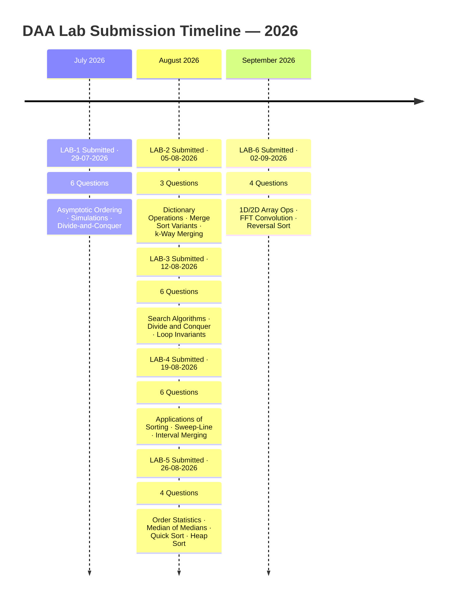

### Lab Index Table

<div align="center">

| 🗂️ Lab | 📖 Title | ❓ Qs | 📆 Submitted | 🏁 Status |
|:---:|:---|:---:|:---:|:---:|
| [**LAB-1**](WEEK-1) | Asymptotic Ordering, Randomized Simulations & Divide-and-Conquer | 6 | 29-07-2026 | ✅ Done |
| [**LAB-2**](WEEK-2) | Dictionary Operations, Merge Sort Variants & k-Way Merging | 3 | 05-08-2026 | ✅ Done |
| [**LAB-3**](WEEK-3) | Search Algorithms, Divide and Conquer & Loop Invariants | 6 | 12-08-2026 | ✅ Done |
| [**LAB-4**](WEEK-4) | Applications of Sorting — Sweep-Line, k-Sum & Interval Merging | 6 | 19-08-2026 | ✅ Done |
| [**LAB-5**](WEEK-5) | Order Statistics & Optimized Sorting Algorithms | 4 | 26-08-2026 | ✅ Done |
| [**LAB-6**](WEEK-6) | Array & Matrix Operations, FFT Convolution & Reversal Sort | 4 | 02-09-2026 | ✅ Done |

</div>

### ✅ Lab Completion Tracker

- [x] **LAB-1** — Asymptotic Ordering, Simulations & Divide-and-Conquer *(6 / 6 questions)*
- [x] **LAB-2** — Dictionary Operations, Merge Sort Variants & k-Way Merging *(3 / 3 questions)*
- [x] **LAB-3** — Search Algorithms, Divide and Conquer & Loop Invariants *(6 / 6 questions)*
- [x] **LAB-4** — Applications of Sorting — Sweep-Line, k-Sum & Interval Merging *(6 / 6 questions)*
- [x] **LAB-5** — Order Statistics & Optimized Sorting Algorithms *(4 / 4 questions)*
- [x] **LAB-6** — Array & Matrix Operations, FFT Convolution & Reversal Sort *(4 / 4 questions)*

---

## 🗂️ Repository Structure

```
📦 DAA-Assignments-2026/
│
├── 📄 README.md
│
├── 📁 WEEK-1/
│   ├── 📑 2026_Week1_DAA_Lab_01.pdf
│   ├── 🔵 q1_put_them_in_order.c
│   ├── 🔵 q2_fair_vs_biased_coin.c
│   ├── 🔵 q3_performance_analysis_of_bubble_sort.c
│   ├── 🔵 q4_towers_of_hanoi.c
│   ├── 🔵 q5_find_the_partition_point.c
│   ├── 🔵 q6_element_uniqueness.c
│   ├── 📊 fair_vs_biased_coin.csv / .png
│   ├── 📊 performance_analysis_of_bubble_sort.csv / .png
│   └── 📊 towers_of_hanoi.csv / .png
│
└── 📁 WEEK-2/
    ├── 📑 2026_Week2_DAA_Lab_02.pdf
    │
    ├── 📁 Q1/   ← Dictionary Operations
    │   ├── 🔵 q1_dictionary_operations.c          (408 lines · 42 operations)
    │   ├── 📊 dictionary_operations.csv            (420 rows)
    │   └── 🖼️  graph_search.png    graph_insert.png    graph_delete.png
    │            graph_max.png      graph_min.png        graph_predecessor.png
    │            graph_successor.png
    │
    ├── 📁 Q2/   ← Merge Sort Variants
    │   ├── 🔵 q2_merge_sort_vs_modified_merge_sort.c  (218 lines)
    │   ├── 📊 merge_sort_vs_modified_merge_sort.csv   (21 rows)
    │   └── 🖼️  merge_sort_vs_modified_merge_sort_graph_analysis.png
    │
    └── 📁 Q3/   ← k-Way Merging
        ├── 🔵 q3_merging_k_sorted_arrays.c            (415 lines)
        ├── 📊 merging_k_sorted_arrays.csv             (21 rows)
        └── 🖼️  merging_k_sorted_arrays_vs_k.png
                 merging_k_sorted_arrays_vs_n.png
                 merging_k_sorted_arrays_loglog.png
│
└── 📁 WEEK-3/
    ├── 📑 2026_Week3_DAA_Lab_03.pdf
    │
    ├── 📁 Q1/   ← Binary vs Ternary Search
    │   ├── 🔵 q1_binary_vs_ternary_search.c
    │   └── 🖼️  full_complexity_analysis.png
    │
    ├── 📁 Q2/   ← Search the Defective Coin
    │   └── 🔵 q2_search_the_defective_coin.c
    │
    ├── 📁 Q3/   ← Max and Min using D&C
    │   ├── 🔵 q3_max_and_min_using_D_and_C_approach.c
    │   └── 🖼️  max_min_comparison_graph.png
    │
    ├── 📁 Q4/   ← Strassen's Matrix Multiplication
    │   ├── 🔵 q4_matrix_multiplication_using_D_and_C_approach.c
    │   └── 🖼️  strassen_matrix_multiplication_graph.png
    │
    ├── 📁 Q5/   ← Pattern Square Matrices
    │   ├── 🔵 q5_multiply_special_pattern_square_matrices_using_D_and_C_approach.c
    │   └── 🖼️  Matrix_Complexity_Analysis.png
    │
    └── 📁 Q6/   ← Loop Invariants in Sorting
        ├── 🔵 q6_use_of_loop_invariants_in_sorting.c
        ├── 📄 pseudocode.txt
        └── 🖼️  Selection_Sort_Complexity_Analysis.png
│
└── 📁 WEEK-4/
    ├── 📑 2026_Week4_DAA_Lab_04.pdf
    │
    ├── 📁 Q1/   ← Application of Sorting-1
    │   ├── 🔵 q1_application_of_sorting_1.c
    │   └── 🖼️  q1_application_of_sorting_1_analysis.png
    │            q1_application_of_sorting_1_graph.png
    │
    ├── 📁 Q2/   ← Application of Sorting-2
    │   ├── 🔵 q2_application_of_sorting_2.c
    │   └── 🖼️  q2_application_of_sorting_2_analysis.png
    │            q2_application_of_sorting_2_graph.png
    │
    ├── 📁 Q3/   ← Application of Sorting-3
    │   ├── 🔵 q3_application_of_sorting_3.c
    │   └── 🖼️  q3_application_of_sorting_3_analysis.png
    │            q3_application_of_sorting_3_graph.png
    │
    ├── 📁 Q4/   ← Application of Sorting-4
    │   ├── 🔵 q4_application_of_sorting_4.c
    │   └── 🖼️  q4_application_of_sorting_4_analysis.png
    │            q4_application_of_sorting_4_graph.png
    │
    ├── 📁 Q5/   ← Application of Sorting-5
    │   ├── 🔵 q5_application_of_sorting_5.c
    │   └── 🖼️  q5_application_of_sorting_5_analysis1.png
    │            q5_application_of_sorting_5_analysis2.png
    │            q5_application_of_sorting_5_graph.png
    │
    └── 📁 Q6/   ← Application of Sorting-6
        ├── 🔵 q6_application_of_sorting_6.c
        └── 🖼️  q6_application_of_sorting_6_analysis.png
                 q6_application_of_sorting_6_graph.png
│
└── 📁 WEEK-5/
    ├── 🖼️  LAB-5 QUESTIONS.jpeg
    │
    ├── 📁 Q1/   ← Finding the Median
    │   ├── 📄 README.md
    │   ├── 🔵 q1_finding_median.c
    │   └── 🖼️  median_complexity_graph.png
    │
    ├── 📁 Q2/   ← Finding the K-th Smallest Element
    │   ├── 📄 README.md
    │   ├── 🔵 q2_finding_kth_smallest_element.c
    │   └── 🖼️  kth_smallest_graph_v2.png
    │
    ├── 📁 Q3/   ← Quick Sort
    │   ├── 📄 README.md
    │   ├── 🔵 q3_quick_sort.c
    │   ├── 📊 random_data.csv / sorted_data.csv
    │   └── 🖼️  complexity_analysis.png
    │
    └── 📁 Q4/   ← Heap Sort
        ├── 📄 README.md
        ├── 🔵 q4_heap_sort.c
        ├── 📊 input.csv / sorted_output.csv
        └── 🖼️  heap_sort_complexity.png
│
└── 📁 WEEK-6/
    ├── 📑 2026_Week6_DAA_Lab_06.pdf
    │
    ├── 📁 Q1/   ← 1D Array Operations
    │   ├── 📄 README.md
    │   ├── 🔵 q1_1D_array_operations_and_their_complexities.c
    │   └── 🖼️  complexity_analysis.png
    │
    ├── 📁 Q2/   ← 2D Square Matrix Operations
    │   ├── 📄 README.md
    │   ├── 🔵 q2_2D_square_matrix_operations_and_their_complexities.c
    │   └── 🖼️  matrix_complexity_analysis.png
    │
    ├── 📁 Q3/   ← Convolution Operation
    │   ├── 📄 README.md
    │   ├── 🔵 q3_convolution_operation_on_vectors_of_size_n.c
    │   └── 🖼️  convolution_complexity_analysis.png
    │
    └── 📁 Q4/   ← Sorting via Reversal Procedure
        ├── 📄 README.md
        ├── 🔵 q4_sorting_via_reversal_procedure.c
        └── 🖼️  reversal_sort_complexity.png
```

---

## 🔬 LAB-1 — Asymptotic Ordering, Simulations & Divide-and-Conquer

**Date:** 29-07-2026 &nbsp;|&nbsp; **Total Questions:** 6

<div align="center">

| # | 📌 Question | ⚙️ Core Technique | ⏱️ Time | 💾 Space |
|:---:|:---|:---|:---:|:---:|
| **Q1** | [Put Them in Order](#q1--put-them-in-order) | Merge Sort · Custom Comparator | `O(n log n)` | `O(n)` |
| **Q2** | [Fair vs Biased Coin](#q2--fair-vs-biased-coin) | Monte Carlo Simulation | `O(k·n)` | `O(k)` |
| **Q3** | [Bubble Sort Performance](#q3--performance-analysis-of-bubble-sort) | Early-Stop vs Full-Pass | `O(n²)` | `O(1)` |
| **Q4** | [Towers of Hanoi](#q4--towers-of-hanoi) | Recursion | `O(2ⁿ)` | `O(n)` |
| **Q5** | [Find the Partition Point](#q5--find-the-partition-point) | Binary Search | `O(log n)` | `O(1)` |
| **Q6** | [Element Uniqueness](#q6--element-uniqueness) | Brute-Force Pairwise | `O(n²)` | `O(1)` |

</div>

---

### Q1 — Put Them in Order

<details>
<summary><strong>📖 Click to expand</strong></summary>

<br/>

**Goal:** Arrange twelve mathematical functions in strictly increasing asymptotic order using a merge sort driven by a custom comparator.

**Ordering produced:**

```
1/n  <  log₂(n)  <  12√n  ≡  50n^0.5  <  n^0.51  <  (2³²)n
     <  n·log₂(n)  <  n²−324  <  100n²+6n  <  2·n³  <  n^(log₂n)  <  3ⁿ
```

**How the comparator works:**

1. Compare **growth group** — each function is assigned one of: reciprocal, logarithmic, sub-linear power, linear, log-linear, polynomial, super-polynomial, exponential
2. If tied → compare **dominant power exponent**
3. If still tied → compare **leading coefficient** as a strict tiebreaker

| Property | Detail |
|---|---|
| Algorithm | Merge Sort — `O(n log n)` comparisons |
| Overflow guard | Values exceeding `double` range shown as `INF` |
| ASCII chart | Log-of-log scale at `n = 10¹⁰⁰` — fits `1/n` through `3ⁿ` on one axis |
| Chart character | Unicode `█` block (UTF-8 terminals) |

> [!NOTE]
> Without a log-of-log scale at `n = 10¹⁰⁰`, the bar for `3ⁿ` would be incomprehensibly larger than every other bar. The log-of-log transform makes all bars visible and comparable on one axis.

</details>

---

### Q2 — Fair vs Biased Coin

<details>
<summary><strong>📖 Click to expand</strong></summary>

<br/>

**Goal:** Demonstrate the **Law of Large Numbers** empirically through Monte Carlo simulation.

**Three phases:**

| Phase | Description |
|:---:|---|
| **1 — Convergence** | Fair coin flipped in 10× batches (10 → 1,000,000); absolute error from 0.5 tabulated per batch |
| **2 — Multi-Bias** | Five coins at 50 / 60 / 70 / 90 / 30 % bias; all results exported to `fair_vs_biased_coin.csv` |
| **3 — Histogram** | Observed probabilities rendered as a scaled ASCII bar chart |

**Complexity:**

$$
\text{Time} = O(k \cdot n) \quad \text{where } k = \text{coins},\ n = \text{flips per coin}
\qquad
\text{Space} = O(k)
$$

> [!TIP]
> Phase 1 is the core insight: as the sample size grows 10×, the absolute error from the true bias shrinks by approximately $\frac{1}{\sqrt{10}}$ — a direct empirical validation of CLT convergence at rate $\frac{1}{\sqrt{n}}$.

</details>

---

### Q3 — Performance Analysis of Bubble Sort

<details>
<summary><strong>📖 Click to expand</strong></summary>

<br/>

**Goal:** Quantify the comparison savings of early-termination Bubble Sort vs naive full-pass Bubble Sort on **identical** random input.

| Metric | ⚡ Early-Stop | 🐌 Full Pass |
|---|:---:|:---:|
| **Best case** | `O(n)` | `O(n²)` |
| **Average case** | `O(n²)` | `O(n²)` |
| **Worst case** | `O(n²)` | `O(n²)` |
| **Space** | `O(1)` | `O(1)` |

Both variants receive **clones of the same base array** so comparison counts are directly comparable. Output includes: operations saved (count + percentage), ASCII bar graph, CSV export, and complexity table.

> [!NOTE]
> On random input the early-stop gain is modest; the best-case `O(n)` advantage is dramatic only on **already-sorted or nearly-sorted data** — which is exactly what the best-case row captures.

</details>

---

### Q4 — Towers of Hanoi

<details>
<summary><strong>📖 Click to expand</strong></summary>

<br/>

**Goal:** Solve the puzzle recursively, validate the closed-form formula, and characterise exponential growth empirically.

**Recurrence and closed form:**

$$
T(n) = 2\,T(n-1) + 1 \implies T(n) = 2^n - 1
$$

- Step-by-step trace printed for `n = 3`
- Solver runs silently for `n = 1…25`; simulated count verified against $2^n - 1$ for every `n`
- Bar chart bar length `= n` → straight line on a log axis (signature of exponential data)
- Results exported to `towers_of_hanoi.csv`

| Property | Detail |
|---|---|
| Time complexity | `O(2ⁿ)` — each additional disc **doubles** the work |
| Space complexity | `O(n)` — call-stack depth never exceeds `n` |
| Feasibility limit | Practically infeasible beyond `n ≈ 64` |

> [!WARNING]
> The recursion counter is passed as a **pointer argument** — never a global. This ensures every run starts at zero with no cross-call side effects.

</details>

---

### Q5 — Find the Partition Point

<details>
<summary><strong>📖 Click to expand</strong></summary>

<br/>

**Goal:** Locate the first `1` in a binary array `[0,0,…,0,1,1,…,1]` using binary search.

**Midpoint calculation:** `mid = left + (right − left) / 2` — avoids integer overflow.

| `arr[mid]` | Action |
|:---:|---|
| `1` | Record as candidate → search **left** (hunt for an earlier `1`) |
| `0` | Transition must lie **right** |

**Edge cases explicitly handled:**

| Input | Output |
|---|---|
| All zeros | `"No transition found"` |
| All ones | Transition at index `0` |
| Mixed | Index of the **first** `1` |

$$
\text{Time} = O(\log n) \qquad \text{Space} = O(1)
$$

</details>

---

### Q6 — Element Uniqueness

<details>
<summary><strong>📖 Click to expand</strong></summary>

<br/>

**Goal:** Detect duplicates by brute-force pairwise comparison while counting every comparison made.

The inner loop **returns immediately** on the first match — the comparison counter doubles as a measure of how early a duplicate appeared.

| Case | Time |
|---|:---:|
| Best — duplicate found immediately | `O(1)` |
| Worst — all elements unique | `O(n²)` |
| Space | `O(1)` |

> [!TIP]
> Pre-sorting (`O(n log n)`) or hashing (`O(n)` average) would reduce time — at the expense of the `O(1)` space this brute-force version preserves.

</details>

---

## 🚀 LAB-2 — Dictionary Operations, Merge Sort Variants & k-Way Merging

**Date:** 05-08-2026 &nbsp;|&nbsp; **Total Questions:** 3

### LAB-2 — Overview Map

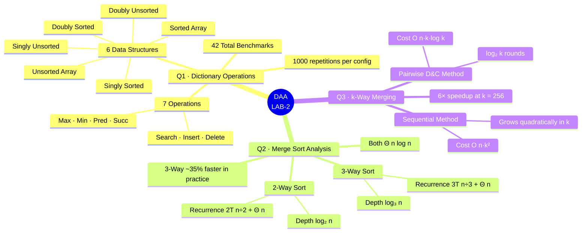

<div align="center">

| # | 📌 Question | ⚙️ Core Technique | ⏱️ Time | 💾 Space |
|:---:|:---|:---|:---:|:---:|
| **Q1** | [Dictionary Operations](#q1--dictionary-operations-asymptotic-analysis-across-data-structures) | 42 ops × 6 data structures | `O(1)` – `O(n)` per op | `O(n)` |
| **Q2** | [Merge Sort vs 3-Way Merge Sort](#q2--standard-2-way-merge-sort-vs-modified-3-way-merge-sort) | Divide & Conquer · Master Theorem | `Θ(n log n)` | `O(n)` |
| **Q3** | [Merging k Sorted Arrays](#q3--merging-k-sorted-arrays-sequential-vs-divide-and-conquer) | Sequential vs Pairwise D&C | `O(nk²)` vs `O(nk log k)` | `O(nk)` |

</div>

---

### Q1 — Dictionary Operations: Asymptotic Analysis Across Data Structures

<details>
<summary><strong>📖 Click to expand</strong></summary>

<br/>

**Goal:** Implement and empirically benchmark **7 dictionary operations** across **6 data structures**, validating theoretical Big-O worst-case bounds against wall-clock timing data.

#### Data Structures Under Test

| # | Data Structure | Ordering | Link Type |
|:---:|---|:---:|:---:|
| 1 | Unsorted Array | Unsorted | Array |
| 2 | Sorted Array | Sorted | Array |
| 3 | Singly Linked List | Unsorted | Singly |
| 4 | Singly Linked List | Sorted | Singly |
| 5 | Doubly Linked List | Unsorted | Doubly |
| 6 | Doubly Linked List | Sorted | Doubly |

#### Full Worst-Case Complexity Matrix — 42 Operations

| Data Structure | Search | Insert | Delete | Max | Min | Predecessor | Successor | Space |
|---|:---:|:---:|:---:|:---:|:---:|:---:|:---:|:---:|
| Unsorted Array | `O(n)` | `O(1)` | `O(1)` | `O(n)` | `O(n)` | `O(n)` | `O(n)` | `O(n)` |
| **Sorted Array** | **`O(log n)`** | `O(n)` | `O(n)` | **`O(1)`** | **`O(1)`** | **`O(1)`** | **`O(1)`** | `O(n)` |
| Singly Unsorted | `O(n)` | `O(1)` | `O(n)` | `O(n)` | `O(n)` | `O(n)` | `O(n)` | `O(n)` |
| Singly Sorted | `O(n)` | `O(n)` | `O(n)` | `O(1)` | **`O(1)`** | `O(n)` | **`O(1)`** | `O(n)` |
| Doubly Unsorted | `O(n)` | `O(1)` | **`O(1)`** | `O(n)` | `O(n)` | `O(n)` | `O(n)` | `O(n)` |
| **Doubly Sorted** | `O(n)` | `O(n)` | **`O(1)`** | **`O(1)`** | **`O(1)`** | **`O(1)`** | **`O(1)`** | `O(n)` |

#### Key Algorithmic Insights

<details>
<summary>🔍 <strong>Search</strong></summary>

- **Unsorted structures:** require a full linear scan — `O(n)`
- **Sorted Linked Lists:** still `O(n)` — sorted order cannot unlock binary search because linked structures lack `O(1)` random access
- **Sorted Array:** achieves `O(log n)` via binary search — contiguous memory enables `O(1)` midpoint calculation

</details>

<details>
<summary>➕ <strong>Insert</strong></summary>

- **Unsorted Array & Unsorted Linked Lists:** `O(1)` — append to end or prepend to head
- **Sorted Array:** `O(n)` — inserting a new minimum forces every element to shift right
- **Sorted Linked Lists:** `O(n)` — must traverse to find the correct insertion position

</details>

<details>
<summary>➖ <strong>Delete</strong> (given pointer / index)</summary>

- **Unsorted Array:** `O(1)` — swap-with-last trick: `arr[idx] = arr[--size]`
- **Doubly Linked (both):** `O(1)` — `node→prev` and `node→next` allow immediate pointer bypass with no scan
- **Sorted Array:** `O(n)` — all subsequent elements must shift left
- **Singly Linked (both):** `O(n)` — no backward pointer forces linear scan from head to find predecessor

</details>

<details>
<summary>🔺 <strong>Max / Min</strong></summary>

- **Unsorted structures:** `O(n)` full scan required
- **Sorted structures:** `O(1)` — Min at head / index 0, Max at tail / index `n−1`

</details>

<details>
<summary>⬅️ ➡️ <strong>Predecessor / Successor</strong></summary>

- **Unsorted structures:** `O(n)` scan
- **Sorted Array:** `O(1)` via `arr[idx−1]` and `arr[idx+1]`
- **Doubly Sorted:** `O(1)` via `node→prev` and `node→next`
- **Singly Sorted:** Successor `O(1)` (`node→next`); Predecessor `O(n)` (no backward link)

</details>

#### Benchmark Configuration

```
Input sizes   :  N = 2,000 → 20,000  (step 2,000)
Repetitions   :  1,000 per (N, structure, operation) — averaged
Search key    :  −1  (guaranteed absent → forces worst-case full scan)
Delete setup  :  Target re-inserted at tail each iteration
                 → keeps it at far end → exposes true O(n) delete cost for singly linked
Insert setup  :  New minimum each time
                 → forces maximum element shifts in Sorted Array
```

> [!IMPORTANT]
> Every benchmark deliberately forces **worst-case** scenarios. Using a random key or random position would produce average-case measurements that understate the true asymptotic cost.

#### Generated Output

- **`dictionary_operations.csv`** — 420 rows: `10 N-values × 6 structures × 7 operations`

| 🖼️ Graph | Operation | Expected Visual Shape |
|---|:---:|---|
| `graph_search.png` | Search | Sorted Array near-zero `O(log n)` line; all others linear `O(n)` |
| `graph_insert.png` | Insert | Sorted structures grow linearly; unsorted structures flat near zero |
| `graph_delete.png` | Delete | Unsorted Array + Doubly Linked flat `O(1)`; others grow linearly |
| `graph_max.png` | Max | Sorted structures flat; unsorted grow linearly |
| `graph_min.png` | Min | Sorted structures flat; unsorted grow linearly |
| `graph_predecessor.png` | Predecessor | Sorted Array + Doubly Sorted flat; others linear |
| `graph_successor.png` | Successor | Sorted Array + Singly Sorted (tail-ptr) + Doubly Sorted flat; others linear |

</details>

---

### Q2 — Standard 2-Way Merge Sort vs. Modified 3-Way Merge Sort

<details>
<summary><strong>📖 Click to expand</strong></summary>

<br/>

**Goal:** Determine — theoretically via the Master Theorem and empirically via wall-clock timing — whether splitting into three parts reduces the asymptotic complexity of merge sort.

#### Recursion Tree Comparison

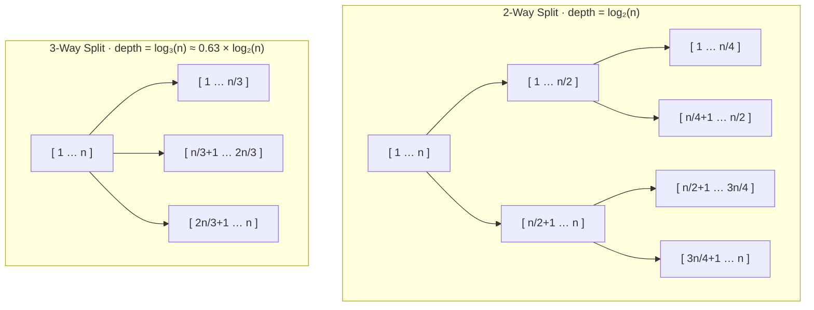

#### Master Theorem Derivation

**2-Way Merge Sort:**

$$
T(n) = 2\,T\!\left(\frac{n}{2}\right) + \Theta(n)
\quad \xrightarrow{\text{Master Thm Case 2}} \quad
T(n) = \Theta(n \log_2 n)
$$

**3-Way Merge Sort:**

$$
T(n) = 3\,T\!\left(\frac{n}{3}\right) + \Theta(n)
\quad \xrightarrow{\text{Master Thm Case 2}} \quad
T(n) = \Theta(n \log_3 n) = \Theta(n \log n)
$$

**Why Case 2 applies to both:**

$$
n^{\log_b a} = n^{\log_2 2} = n^1 = \Theta(n) = f(n)
\qquad \Rightarrow \qquad \text{Case 2: } T(n) = \Theta\!\left(n^{\log_b a} \log n\right)
$$

#### Head-to-Head Summary

| Criterion | 2-Way Merge Sort | 3-Way Merge Sort |
|---|---|---|
| Recurrence | $T(n) = 2T(n/2) + O(n)$ | $T(n) = 3T(n/3) + O(n)$ |
| Asymptotic bound | **`Θ(n log n)`** | **`Θ(n log n)`** |
| Recursion depth | `log₂(n)` | `log₃(n)` ← ~37% shallower |
| Comparisons / merge step | **1** per element | **Up to 2** per element |
| Practical speed | Baseline | ~25–35% faster *(constant factor only)* |
| Asymptotic winner? | **Tie** | **Tie** |

> [!IMPORTANT]
> Both algorithms are $\Theta(n \log n)$. The 3-way variant **does not improve the asymptotic class**. The shallower recursion tree is largely cancelled by the heavier per-merge comparison overhead — the empirical speedup is a constant-factor effect only.

#### Benchmark Configuration & Sample Results

```
Input type  :  Reverse-sorted array  (worst case for all comparison-based sorts)
Range       :  N = 10,000 → 100,000   (step 10,000)
Repetitions :  50 per N
Correctness :  is_sorted() check after every single sort call

── Sample CSV Output ──────────────────────────────────────
N,Algorithm,Time
10000,2-Way Merge Sort,0.00080000
10000,3-Way Merge Sort,0.00052000
100000,2-Way Merge Sort,0.00682000
100000,3-Way Merge Sort,0.00524000
───────────────────────────────────────────────────────────
```

> [!NOTE]
> The right panel of the output graph plots `Time / (N log₂ N)` vs `N`. Both curves flatten to horizontal constants — a visual proof that the growth rate is **exactly** $\Theta(n \log n)$ for both algorithms.

</details>

---

### Q3 — Merging k Sorted Arrays: Sequential vs. Divide-and-Conquer

<details>
<summary><strong>📖 Click to expand</strong></summary>

<br/>

**Goal:** Merge **k sorted arrays** of **n elements** each into one sorted array of **k·n elements**. Compare two strategies and confirm the theoretical `O(k²)` vs `O(k log k)` gap empirically.

#### Algorithm Flow — Both Methods

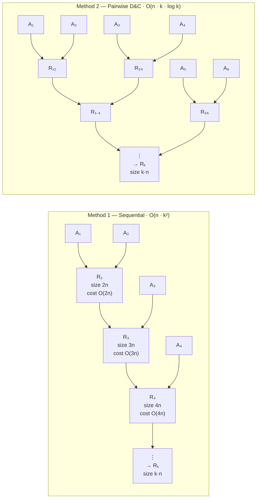

#### Theoretical Cost Derivation

**Method 1 — Sequential:**

$$
\text{Total} = \sum_{i=2}^{k} O(i \cdot n)
= O\!\left(n \cdot \frac{k(k+1)}{2}\right)
= O(n \cdot k^2)
$$

**Method 2 — Pairwise Divide-and-Conquer:**

$$
\text{Each of } \log_2 k \text{ rounds costs } O(k \cdot n)
\implies \text{Total} = O(k \cdot n) \times \log_2 k = O(n \cdot k \log k)
$$

#### Complexity Comparison

| Method | Strategy | Worst-Case Complexity |
|---|---|:---:|
| Method 1 (Sequential) | Left-to-right repeated merge | $O(n \cdot k^2)$ |
| Method 2 (Pairwise D&C) | Pair-merge in $\log_2 k$ rounds | $O(n \cdot k \log k)$ |

#### Implementation Highlights

| Feature | Detail |
|---|---|
| **High-res timer** | `QueryPerformanceCounter` (Windows) · `clock_gettime(CLOCK_MONOTONIC)` (POSIX) — avoids `clock()`'s ~10–16 ms coarse granularity |
| **Adaptive timing** | Reruns until ≥ 50 ms cumulative, then divides — stable non-zero readings even at tiny `(k, n)` |
| **Correctness** | 200 random trials (`k ∈ [2,16]`, `n ∈ [1,50]`); each output verified against reference `qsort()` of concatenated input |
| **Odd-k handling** | Leftover array (when `k` is odd in a round) carried forward unchanged to the next round |

#### Benchmark Sweeps

| Sweep | Fixed | Variable | Values |
|---|:---:|:---:|---|
| **Vary-k** | `n = 400` | `k` | `{2, 4, 8, 16, 32, 64, 96, 128, 160, 192, 224, 256}` |
| **Vary-n** | `k = 64` | `n` | `{50, 100, 200, 400, 800, 1600, 3200, 6400}` |

#### Sample Benchmark Results

```
series,k,n,method1_time_ms,method2_time_ms
vary_k,2,400,  0.003515,  0.003889   ← k=2: one merge each — methods identical
vary_k,64,400, 4.307808,  1.626513   ← k=64: Method 2 is 2.6× faster
vary_k,256,400,59.745100, 9.745317   ← k=256: Method 2 is ~6× faster ⚡
vary_n,64,50,  0.447409,  0.184777
vary_n,64,6400,67.336100,22.175167   ← both scale linearly in n
```

> [!CAUTION]
> Method 1's cost grows **quadratically** in `k`. At `k = 256` the gap is already ~6×; at `k = 1024` it exceeds 30×. For any large-`k` workload, **only Method 2 is viable**.

#### Generated Graphs

| 🖼️ Graph | Series | X-Axis | Key Visual Feature |
|---|:---:|:---:|---|
| `merging_k_sorted_arrays_vs_k.png` | vary_k | `k` | Method 1 curves steeply (quadratic); Method 2 curves gently (sub-linear) |
| `merging_k_sorted_arrays_vs_n.png` | vary_n | `n` | Both grow linearly; Method 1 steeper by `~log(k)` factor |
| `merging_k_sorted_arrays_loglog.png` | vary_k | `log(k)` | Method 1 slope **≈ 2** confirms $O(k^2)$; Method 2 slope **< 2** confirms $O(k \log k)$ |

#### Final Conclusion

| Criterion | Method 1 (Sequential) | Method 2 (Pairwise D&C) |
|---|---|---|
| Strategy | Left-to-right repeated merge | Pair-merge in $\log_2 k$ rounds |
| Worst-Case | $O(n \cdot k^2)$ | $O(n \cdot k \log k)$ |
| Growth in `k` (n fixed) | Quadratic — slope 2 in log-log | Sub-quadratic — slope < 2 |
| Growth in `n` (k fixed) | Linear | Linear |
| Speedup @ `k = 256` | 59.7 ms | 9.7 ms — **~6× faster** ⚡ |
| **Asymptotic winner?** | ❌ No | ✅ **Yes** |

</details>

---

## 🚀 LAB-3 — Divide-and-Conquer & Search Algorithms

**Date:** 12-08-2026 &nbsp;|&nbsp; **Total Questions:** 6

### LAB-3 — Overview Map

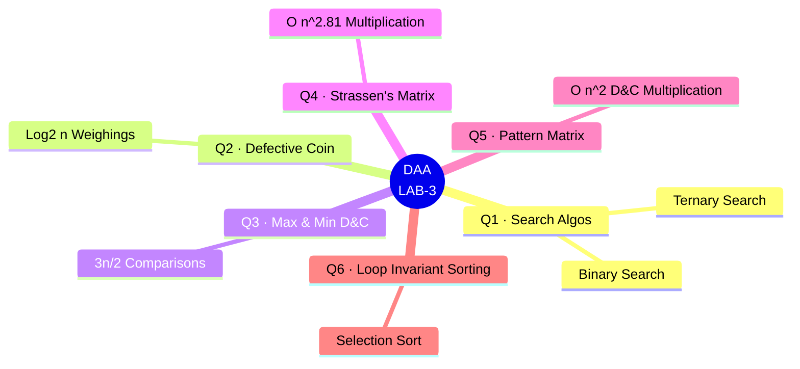

<div align="center">

| # | 📌 Question | ⚙️ Core Technique | ⏱️ Time | 💾 Space |
|:---:|:---|:---|:---:|:---:|
| **Q1** | [Binary vs Ternary Search](#q1--binary-vs-ternary-search) | Divide & Conquer | `O(log n)` | `O(1)` |
| **Q2** | [Search the Defective Coin](#q2--search-the-defective-coin) | Divide & Conquer | `O(log n)` | `O(log n)` |
| **Q3** | [Max and Min using D&C](#q3--max-and-min-using-dc-approach) | Divide & Conquer | `O(n)` | `O(log n)` |
| **Q4** | [Strassen's Matrix Multiplication](#q4--matrix-multiplication-using-dc-approach) | Strassen's Method | `O(n^2.81)` | `O(n^2)` |
| **Q5** | [Pattern Square Matrices](#q5--multiply-special-pattern-square-matrices-using-dc-approach) | Divide & Conquer | `O(n^2)` | `O(n^2)` |
| **Q6** | [Loop Invariants in Sorting](#q6--use-of-loop-invariants-in-sorting) | Selection Sort | `Θ(n^2)` | `O(1)` |

</div>

---

### Q1 — Binary vs Ternary Search

<details>
<summary><strong>📖 Click to expand</strong></summary>

<br/>

**Goal:** Search for an element `x` in a sorted list of size `n` using binary and ternary search, and validate that binary search is computationally superior despite having a larger logarithmic base.

#### Algorithmic Comparison

| Feature | Binary Search | Ternary Search |
|---|---|---|
| **Division** | 2 equal halves | 3 equal intervals |
| **Comparisons / step** | 1 (worst case: `<` or `>`) | Up to 2 (worst case: 2 boundaries) |
| **Max Depth** | $\log_2 n$ | $\log_3 n$ |
| **Max Comparisons** | $\log_2 n$ | $2 \log_3 n$ |

#### Complexity Proof

$$
\text{Ternary vs Binary Ratio} = \frac{2 \log_3 n}{\log_2 n} = \frac{2}{\log_2 3} \approx 1.26
$$

> [!TIP]
> While $\log_3 n < \log_2 n$, the number of comparisons per split makes ternary search do **~26% more comparisons** in the worst case. The empirical Python plot (`full_complexity_analysis.png`) confirms this constant-factor overhead.

</details>

---

### Q2 — Search the Defective Coin

<details>
<summary><strong>📖 Click to expand</strong></summary>

<br/>

**Goal:** Find a single defective (lighter) coin among `n` identical-looking coins using a balance weighing scale in $O(\log n)$ time.

#### The Divide and Conquer Strategy

1. **Divide:** Split the `n` coins into two equal halves. If `n` is odd, leave one coin aside.
2. **Weigh:** Place the two halves on the balance scale.
3. **Conquer:**
   - If **balanced**: The defective coin is the one left aside (terminates).
   - If **unbalanced**: The lighter side contains the defective coin. Recursively apply the strategy to this lighter half.

#### Recurrence Relation

$$
T(n) = T(n/2) + O(1) \implies T(n) = O(\log_2 n)
$$

> [!NOTE]
> Since we eliminate half of the coins with a single `O(1)` weighing operation, the maximum number of weighings strictly bounded by $\lfloor \log_2 n \rfloor + 1$.

</details>

---

### Q3 — Max and Min using D&C Approach

<details>
<summary><strong>📖 Click to expand</strong></summary>

<br/>

**Goal:** Find both the maximum and minimum elements in an array using divide and conquer, rigorously bounding the number of comparisons to $\frac{3n}{2} - 2$.

#### Method Comparison

| Algorithm | Strategy | Comparisons |
|---|---|:---:|
| **Naive Scan** | Track min/max via separate linear scans | $2n - 2$ |
| **Tournament D&C** | Divide into halves, find min/max of each, then compare | $\frac{3n}{2} - 2$ |

#### Recursion Tree & Cost Derivation

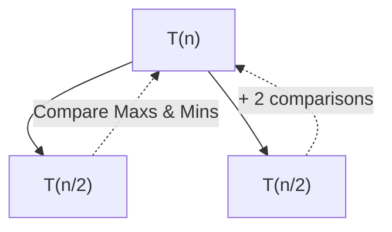

$$
T(n) = \begin{cases} 
0 & \text{if } n = 1 \\
1 & \text{if } n = 2 \\
2\,T(n/2) + 2 & \text{if } n > 2 
\end{cases}
$$
Expanding the recurrence reveals the total cost:
$$
T(n) = \frac{3n}{2} - 2
$$

> [!TIP]
> This algorithm proves that you can achieve a **25% reduction** in comparisons over the naive approach by pairing elements up. The `max_min_comparison_graph.png` empirically verifies the exact $\frac{3n}{2} - 2$ slope.

</details>

---

### Q4 — Matrix Multiplication using D&C Approach

<details>
<summary><strong>📖 Click to expand</strong></summary>

<br/>

**Goal:** Multiply two `n × n` square matrices using Strassen's Method, bypassing the cubic $O(n^3)$ lower bound of standard multiplication.

#### Standard vs Strassen

- **Standard D&C:** Computes 8 recursive multiplications of size $(n/2) \times (n/2)$.
$$
T(n) = 8T(n/2) + O(n^2) \implies O(n^3)
$$
- **Strassen's D&C:** Uses algebraic combinations to compute only **7 recursive multiplications**.
$$
T(n) = 7T(n/2) + O(n^2) \implies O(n^{\log_2 7})
$$

#### Complexity Matrix

| Method | Recursive Multiplications | Matrix Additions | Asymptotic Bound |
|---|:---:|:---:|:---:|
| **Standard** | 8 | 4 | $O(n^3)$ |
| **Strassen** | 7 | 18 | $O(n^{2.807})$ |

> [!WARNING]
> While Strassen's algorithm is asymptotically superior, the massive constant factor generated by the 18 matrix additions/subtractions makes it slower for small $n$. The generated plot `strassen_matrix_multiplication_graph.png` perfectly captures the crossover point where Strassen's begins to outperform the standard approach.

</details>

---

### Q5 — Multiply special-pattern square matrices using D&C approach

<details>
<summary><strong>📖 Click to expand</strong></summary>

<br/>

**Goal:** Exploit a recursive symmetric block structure to achieve an optimal $O(n^2)$ matrix multiplication algorithm.

#### The Special Structure

A matrix $M$ (where $n = 2^k$) is recursively composed of identical diagonal and off-diagonal blocks:
$$
M = 
\begin{pmatrix} 
  M_1 & M_2 \\ 
  M_2 & M_1 
\end{pmatrix} 
\quad , \quad 
N = 
\begin{pmatrix} 
  N_1 & N_2 \\ 
  N_2 & N_1 
\end{pmatrix}
$$

#### Multiplication Algebra

When multiplying $M \times N$, the result inherits the exact same structure:
$$
M \times N = 
\begin{pmatrix} 
  M_1 N_1 + M_2 N_2 & M_1 N_2 + M_2 N_1 \\ 
  M_2 N_1 + M_1 N_2 & M_2 N_2 + M_1 N_1 
\end{pmatrix} 
= 
\begin{pmatrix} 
  R_1 & R_2 \\ 
  R_2 & R_1 
\end{pmatrix}
$$

#### The Sub-Quadratic Hack

Instead of computing all 4 quadrants (which would require 8 multiplications), we only need to compute two unique blocks ($R_1$ and $R_2$):
1. $R_1 = M_1 N_1 + M_2 N_2$ (2 multiplications, 1 addition)
2. $R_2 = M_1 N_2 + M_2 N_1$ (2 multiplications, 1 addition)

Total cost per level: **4 multiplications** instead of 8.

$$
T(n) = 4\,T(n/2) + O(n^2) \implies \Theta(n^2)
$$

> [!TIP]
> Standard matrix multiplication requires $O(n^3)$ because reading the output takes $O(n^2)$ and computing each cell takes $O(n)$. Because of the fractal symmetry here, we can compute the entire matrix in exactly $O(n^2)$ — proportional solely to the number of cells!

</details>

---

### Q6 — Use of loop invariants in sorting

<details>
<summary><strong>📖 Click to expand</strong></summary>

<br/>

**Goal:** Formulate mathematical loop invariants for Selection Sort to formally prove its correctness, and empirically analyze its quadratic complexity bounds.

#### Algorithm: Selection Sort

Iteratively find the smallest element in the unsorted portion $A[i \dots n]$ and swap it with $A[i]$.

#### Formal Loop Invariant Proof

At the start of each iteration $i$ (from $1$ to $n-1$), the subarray $A[1 \dots i-1]$ contains the $(i-1)$ smallest elements of $A$ in sorted order.

| Phase | Proof Requirement | State in Selection Sort |
|---|---|---|
| **Initialization** | True before first iteration ($i=1$) | $A[1 \dots 0]$ is empty. An empty array is trivially sorted and contains the $0$ smallest elements. |
| **Maintenance** | If true before iteration $i$, remains true before $i+1$ | We find the absolute minimum in $A[i \dots n]$ and place it at $A[i]$. Now $A[1 \dots i]$ contains the $i$ smallest elements in sorted order. |
| **Termination** | Loop ends ($i=n$); invariant gives useful property | Loop terminates at $i=n$. The invariant states $A[1 \dots n-1]$ contains the $(n-1)$ smallest elements sorted. Thus, $A[n]$ must be the maximum, and the entire array $A[1 \dots n]$ is sorted. |

#### Complexity Bound

$$
\text{Comparisons} = \sum_{i=1}^{n-1} (n - i) = \frac{n(n-1)}{2} = \Theta(n^2)
$$

> [!NOTE]
> The proof explains why the outer loop only needs to run $(n-1)$ times. The $n$-th iteration is mathematically redundant!

</details>

---

## 🚀 LAB-4 — Applications of Sorting

**Date:** 19-08-2026 &nbsp;|&nbsp; **Total Questions:** 6

### LAB-4 — Overview Map

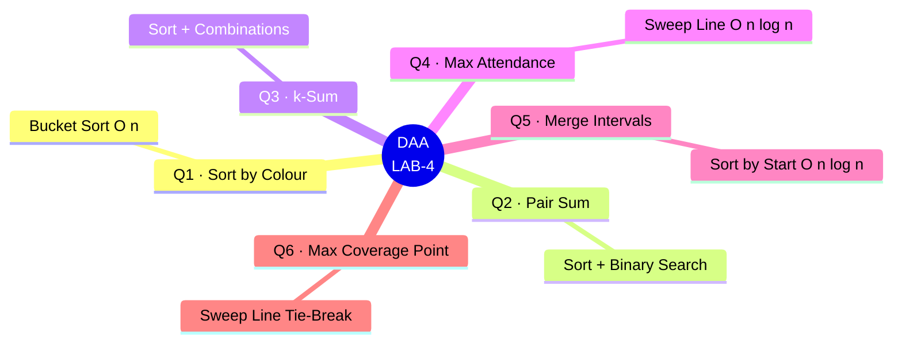

<div align="center">

| # | 📌 Question | ⚙️ Core Technique | ⏱️ Time | 💾 Space |
|:---:|:---|:---|:---:|:---:|
| **Q1** | [Application of Sorting-1](#application-of-sorting-1) | Bucket / Counting Sort (Linked List) | `O(n)` | `O(1)` |
| **Q2** | [Application of Sorting-2](#application-of-sorting-2) | Sort + Binary Search | `O(n log n)` | `O(1)` |
| **Q3** | [Application of Sorting-3](#application-of-sorting-3) | Sort + Combinations + Binary Search | `O(n^(k-1) log n)` | `O(k)` |
| **Q4** | [Application of Sorting-4](#application-of-sorting-4) | Sweep Line (Event Sort) | `O(n log n)` | `O(n)` |
| **Q5** | [Application of Sorting-5](#application-of-sorting-5) | Sort by Start + Linear Merge | `O(n log n)` | `O(n)` |
| **Q6** | [Application of Sorting-6](#application-of-sorting-6) | Sweep Line + Merge Sort (tie-break) | `O(n log n)` | `O(n)` |

</div>

---

### Application of Sorting-1

<details>
<summary><strong>📖 Click to expand</strong></summary>

<br/>

**Goal:** Given `n` `(number, colour)` pairs already sorted by number, re-sort them by colour — all Reds before all Blues before all Yellows — while keeping numbers sorted *within* each colour, in `O(n)` time and `O(1)` extra space.

**Input representation:** a **singly linked list** of nodes rather than an array. This is the choice that makes `O(1)` extra space achievable: nodes are re-spliced by rewiring pointers, so no second array or copy is ever needed.

**Algorithm — three-bucket splice:**

1. Maintain a `Bucket { head, tail }` for each of the 3 colours (6 pointers total, independent of `n`).
2. Walk the list once; detach each node and append it — via its bucket's `tail` pointer — to the end of its colour's bucket in `O(1)`.
3. Concatenate the three non-empty buckets in order Red → Blue → Yellow.

Because nodes are only ever appended to the tail of their bucket, the relative order of numbers within a colour is preserved automatically — the sort is **stable** by construction, with no comparisons needed at all.

| Property | Detail |
|---|---|
| Technique | Bucket sort / 3-way stable partition on a linked list |
| Time | `O(n)` — one pass to bucket, one pass to concatenate |
| Space | `O(1)` — 3 buckets × (head, tail) regardless of `n` |
| Validator | `is_valid_result()` checks colours are grouped `R ≤ B ≤ Y` **and** numbers are non-decreasing within each colour |

> [!NOTE]
> This complexity is optimal: any algorithm must examine every node at least once (`Ω(n)` lower bound), and the linked-list representation lets that single pass double as the entire sort.

<p align="center">
  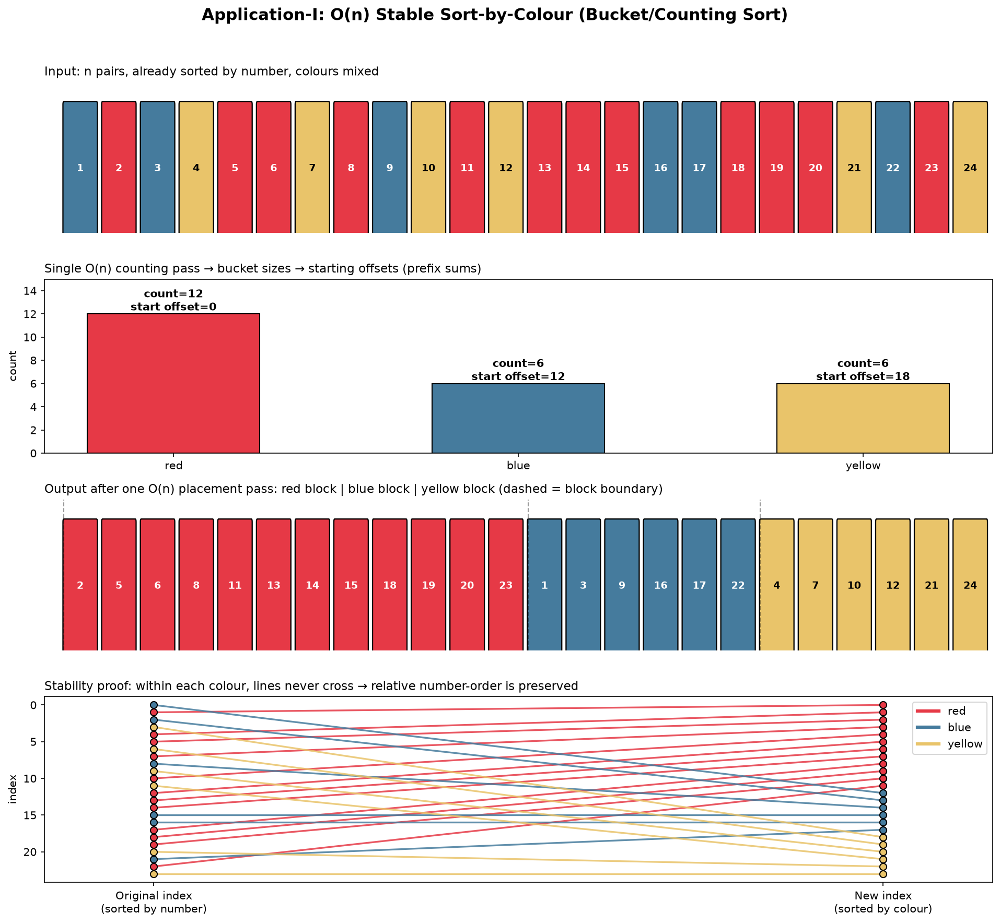
  <br/><sub><b>Bucket-and-splice walkthrough:</b> input pairs → per-colour counting pass → concatenated output → stability proof (index lines never cross within a colour)</sub>
</p>

</details>

---

### Application of Sorting-2

<details>
<summary><strong>📖 Click to expand</strong></summary>

<br/>

**Goal:** Given two sets `S₁` and `S₂` (each of size `n`) and a target `x`, determine whether some `a ∈ S₁` and `b ∈ S₂` satisfy `a + b = x`, in `O(n log n)`.

**Algorithm:**

1. Sort `S₁` in place with `qsort` — `O(n log n)`.
2. For each `b` in `S₂` (unsorted, scanned once), binary-search `S₁` for the complement `x − b` — `O(log n)` per lookup, `O(n log n)` total.

$$
\text{Total} = O(n \log n) + O(n \log n) = O(n \log n)
$$

| Property | Detail |
|---|---|
| Overflow guard | `x − s2[j]` is computed in `long long` before comparison, since it can overflow `int` (e.g. `x = INT_MAX`, `s2[j] = INT_MIN`) |
| Side effect | `S₁` is left sorted after the call — documented and printed explicitly in the output as "S1 (after in-place sort, as a side effect)" |
| Space | `O(1)` extra — sorting is in place, no auxiliary array |

> [!TIP]
> `S₂` is deliberately **not** sorted — only one of the two sets needs to be, since the algorithm only ever binary-searches into `S₁`. Sorting both would waste an `O(n log n)` pass for no asymptotic benefit.

<p align="center">
  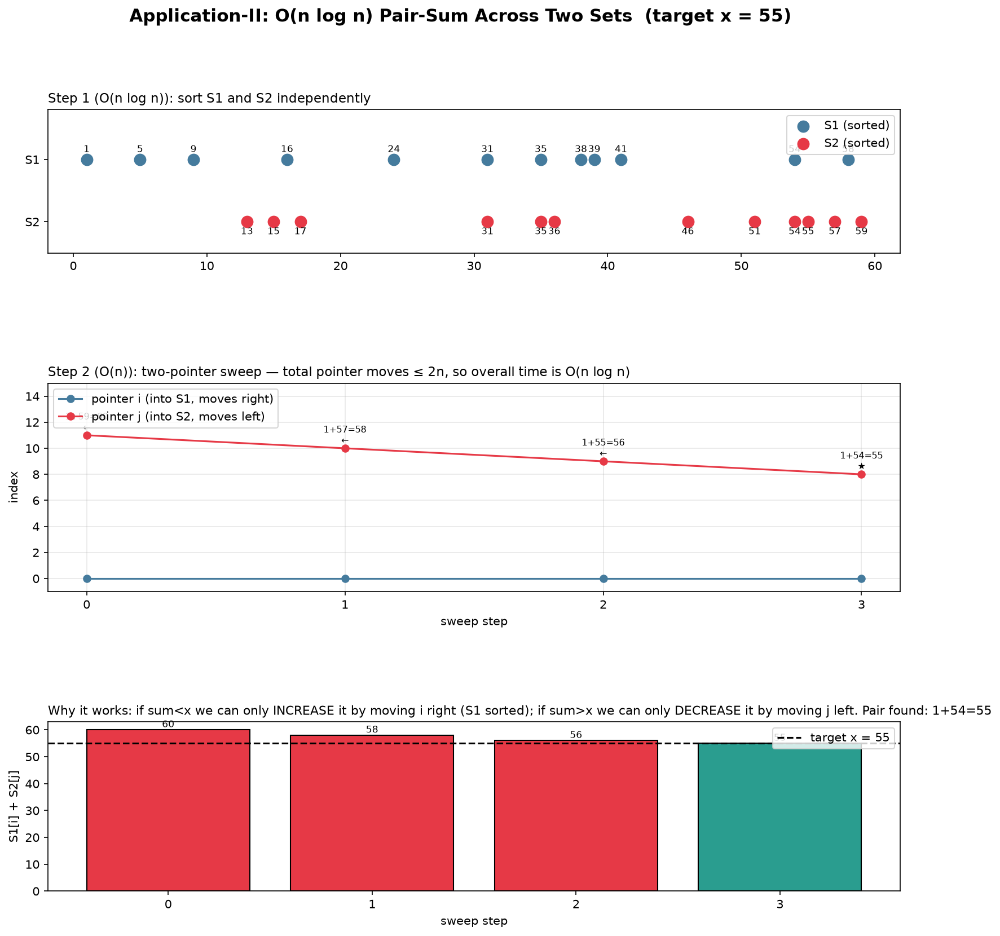
  <br/><sub><b>Sort + binary-search walkthrough:</b> S₁ sorted once, each element of S₂ probes for its complement</sub>
</p>

</details>

---

### Application of Sorting-3

<details>
<summary><strong>📖 Click to expand</strong></summary>

<br/>

**Goal:** Given a set `S` of `n` integers and a target `T`, determine whether some `k` of them sum to `T`, in `O(n^(k-1) log n)` (`k` treated as a fixed constant).

**Algorithm — fix `k−1`, binary-search the last:**

1. Sort `S` — `O(n log n)`.
2. Recursively generate every combination of `(k−1)` **strictly increasing** indices — `O(n^(k-1))`.
3. For each combination, binary-search (restricted to indices *after* the largest chosen index) for the value completing the sum to `T` — `O(log n)` each. Restricting the search window to later indices guarantees distinctness for free, with no separate collision check.

$$
\text{Total} = O(n^{k-1}) \times O(\log n) = O(n^{k-1} \log n)
$$

| `k` | Reduces to | Cost |
|:---:|---|:---:|
| `k = 1` | Direct binary search for `T` itself | `O(log n)` |
| `k = 2` | Classic two-sum via single-index scan + binary search | `O(n log n)` |
| `k ≥ 3` | General recursive combination + binary search | `O(n^(k-1) log n)` |

| Property | Detail |
|---|---|
| Time | `O(n^(k-1) log n)` | 
| Space | `O(k)` extra (recursion stack / chosen-index array) — `O(1)` with respect to `n` |
| Correctness fix | `target` is range-checked against `INT_MIN`/`INT_MAX` **before** any cast to `int`, both in the `k=1` fast path and the general combination path — an unchecked cast on an out-of-range `long long` is implementation-defined truncation and can produce false positives |

> [!WARNING]
> The `O(n^(k-1) log n)` bound only holds when `k` is fixed; for `k` growing with `n` this degenerates toward brute-force enumeration of all `k`-subsets.

<p align="center">
  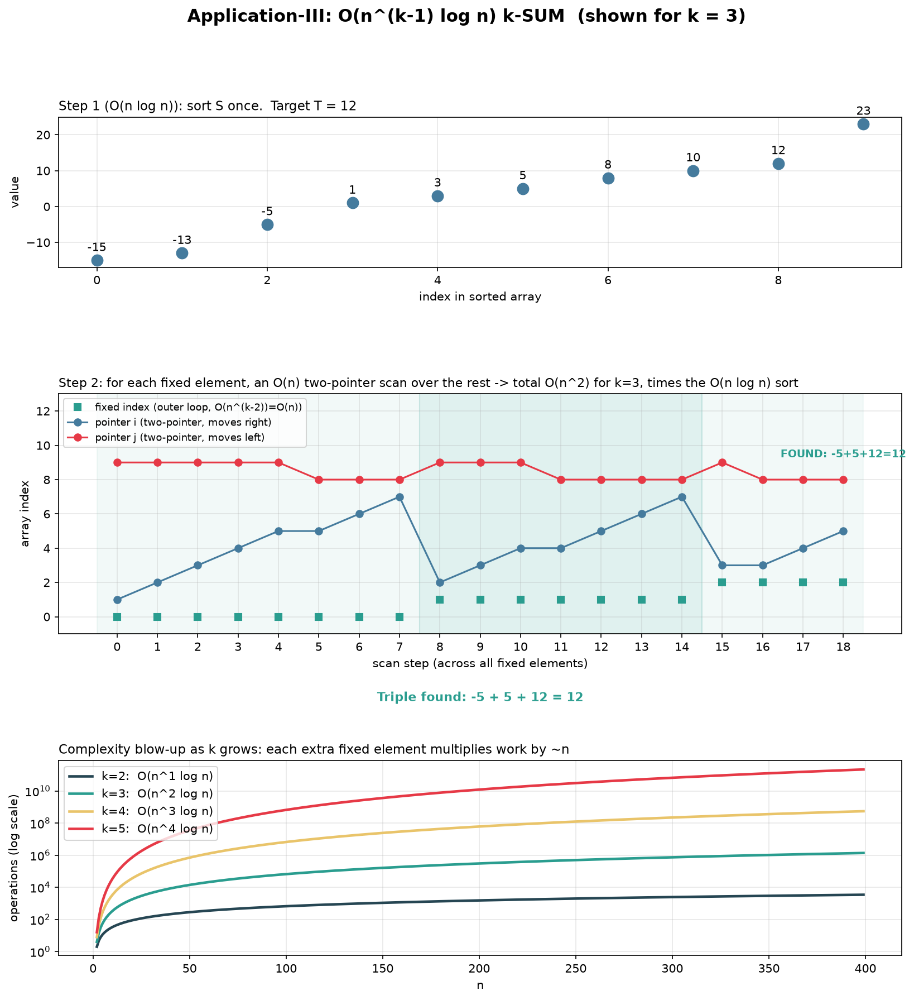
  <br/><sub><b>k-Sum walkthrough:</b> sorted array, fixed (k−1)-index combinations, binary search completing each candidate sum</sub>
</p>

</details>

---

### Application of Sorting-4

<details>
<summary><strong>📖 Click to expand</strong></summary>

<br/>

**Goal:** Given entry time `aᵢ` and exit time `bᵢ` (`bᵢ > aᵢ`) for `n` people, with all `2n` entry/exit times distinct, find the time at which the most people were simultaneously present — in `O(n log n)`.

**Key idea — sweep line:** attendance only *changes* at an arrival or a departure, never in between. So instead of scanning a continuum of time, only the `2n` discrete event moments need examining.

**Algorithm:**

1. Build `2n` events: `(aᵢ, +1)` for each arrival, `(bᵢ, −1)` for each departure.
2. Sort all events by time ascending — `O(n log n)` (times guaranteed distinct, so no tie-break is needed).
3. Sweep once, maintaining a running `count`: on arrival, `count++` and check against the best seen so far; on departure, `count--` (a departure can never itself create a new maximum, so no check is needed there) — `O(n)`.

$$
\text{Total} = O(n \log n) + O(n) = O(n \log n)
$$

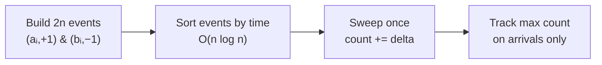

| Property | Detail |
|---|---|
| Time | `O(n log n)` — sort dominates; sweep is `O(n)` |
| Space | `O(n)` — the `2n` events (a necessary restructuring of the input); `qsort` sorts in place beyond that |
| Input representation | Each person becomes **two independent** `(time, delta)` events rather than one interval — this is what turns "max overlap" into "max running sum of a ±1 sequence" |

> [!NOTE]
> Because entry/exit times are guaranteed distinct, a plain numeric comparator suffices — there's no coordinate at which an arrival and a departure could tie (contrast with Q6 below, where this guarantee does *not* hold).

<p align="center">
  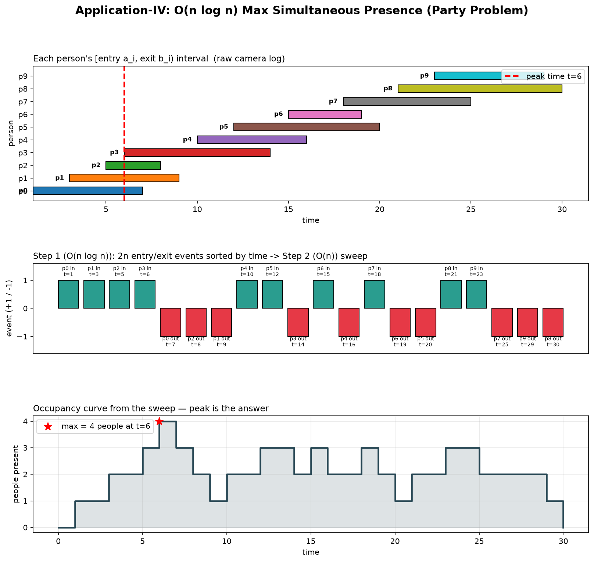
  <br/><sub><b>Party problem walkthrough:</b> raw entry/exit intervals → sorted ±1 events → resulting occupancy curve with its peak marked</sub>
</p>

</details>

---

### Application of Sorting-5

<details>
<summary><strong>📖 Click to expand</strong></summary>

<br/>

**Goal:** Given `n` intervals `(xᵢ, yᵢ)`, merge all overlapping ones into a minimal set of disjoint intervals, in `O(n log n)` worst case.

**Example:** `I = {(1,3), (2,6), (8,10), (7,18)} → {(1,6), (7,18)}`

**Algorithm:**

1. Sort intervals by start value `xᵢ` ascending — `O(n log n)`.
2. Initialize the "current" merged interval as the first one.
3. Scan the rest in order: if `xᵢ ≤ curY` it overlaps (or touches) the current interval, so extend `curY = max(curY, yᵢ)`; otherwise the current interval is finalized and a new one begins — `O(n)`.
4. Push the final current interval.

$$
\text{Total} = O(n \log n) + O(n) = O(n \log n)
$$

| Property | Detail |
|---|---|
| Boundary convention | **Closed** intervals `[xᵢ, yᵢ]` — touching intervals like `(1,3)` and `(3,5)` merge into `(1,5)` since they share the point 3 |
| Degenerate case | Point intervals (`xᵢ == yᵢ`) need no special-casing — the same merge condition handles them correctly |
| Space | `O(n)` for input/output (the output can itself contain up to `n` intervals); the merge is done **in place** on the sorted array via a write-pointer that never outruns the read-pointer, so only `O(1)` extra space is used beyond the input |
| Optimality | `Ω(n log n)` is a proven lower bound — any comparison-based interval-merge algorithm could be used to sort `n` numbers via the merge output, so no asymptotic improvement over this algorithm is possible |

> [!TIP]
> Unlike Q4 and Q6, each interval here is kept as a single `(start, end)` pair rather than split into two events — the problem only needs the union of overlapping ranges, not a running count of *how many* intervals overlap, so sorting by start and scanning is sufficient on its own.

<p align="center">
  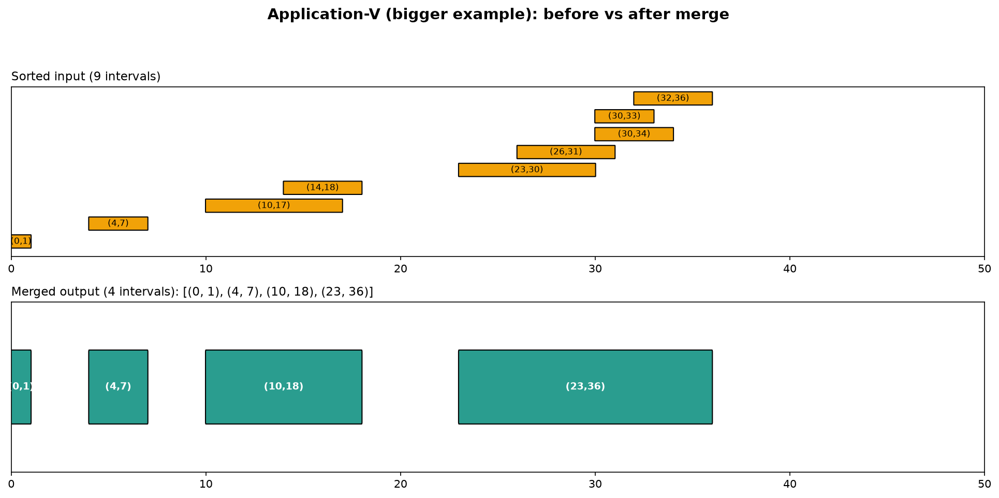
  <br/>
  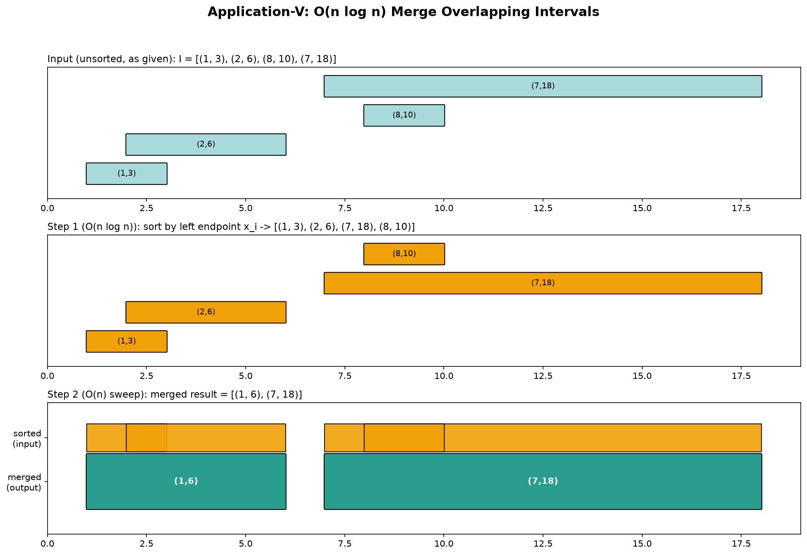
  <br/><sub><b>Interval-merge walkthrough:</b> unsorted intervals → sorted by start → single linear pass merging overlaps into the final disjoint set</sub>
</p>

</details>

---

### Application of Sorting-6

<details>
<summary><strong>📖 Click to expand</strong></summary>

<br/>

**Goal:** Given `n` closed intervals `[lᵢ, rᵢ]`, find a point `p` covered by the largest number of intervals, in `O(n log n)`.

**Example:** `S = {(10,40), (20,60), (50,90), (15,70)}` → `p = 50` (or `p = 20`) lies in 3 intervals; no point lies in all 4. The point of maximum coverage need not be unique.

**Relation to Q4:** same sweep-line idea — convert each interval into a `START` (+1) and `END` (−1) event, sort, and sweep with a running count. **The crucial difference:** here endpoints are **not** guaranteed distinct — intervals are closed, so `(1,5)` and `(5,10)` both legitimately contain the point `5`.

**Why the tie-break matters:** if a `START` and an `END` land on the same coordinate and the `END` were processed first, the count would momentarily drop *before* the `START`'s contribution is added — silently hiding the true maximum at that exact point. So the sort here uses a **secondary key**: at equal coordinates, all `START` events must be processed before any `END` events.

**Algorithm:**

1. Build `2n` events: `(lᵢ, START)` and `(rᵢ, END)`.
2. Sort by `(coordinate, type)` — coordinate primary, `START` before `END` on ties — `O(n log n)`, implemented here with an explicit **merge sort** to guarantee worst-case (not just average-case) `O(n log n)`.
3. Sweep, tracking `count`: `START → count++`, check against best; `END → count--` (never itself creates a new maximum, so no check is needed) — `O(n)`.

$$
\text{Total} = O(n \log n) + O(n) = O(n \log n)
$$

| Property | Detail |
|---|---|
| Sort algorithm | Explicit **merge sort** (not `qsort`) — guarantees `Θ(n log n)` worst case for every input, matching the problem's required bound |
| Tie-break rule | `START (0)` sorts before `END (1)` at equal coordinates — required for correctness, not just robustness |
| Space | `O(n)` — the `2n` events plus a same-sized `O(n)` temporary buffer used only during the merge sort (freed immediately after) |
| Output | The maximum coverage count and the **first** coordinate that achieves it — any point achieving the max is an equally valid answer |

> [!IMPORTANT]
> Q4 and Q6 look almost identical but differ in one detail that changes the required tie-breaking: Q4's `2n` times are guaranteed distinct (numeric sort suffices), while Q6's closed-interval endpoints can coincide (a secondary sort key on event type becomes mandatory for correctness).

<p align="center">
  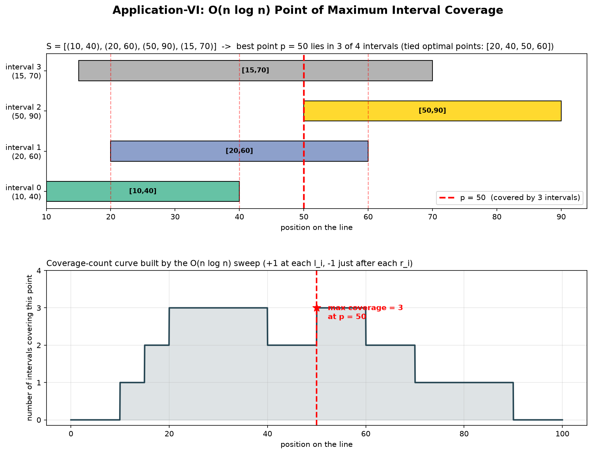
  <br/><sub><b>Max-coverage walkthrough:</b> overlapping intervals on the line → coverage-count curve from the tie-broken sweep, peak marked as p</sub>
</p>

</details>

---

## 🚀 LAB-5 — Order Statistics & Optimized Sorting Algorithms

**Date:** 26-08-2026 &nbsp;|&nbsp; **Total Questions:** 4

### LAB-5 — Overview Map

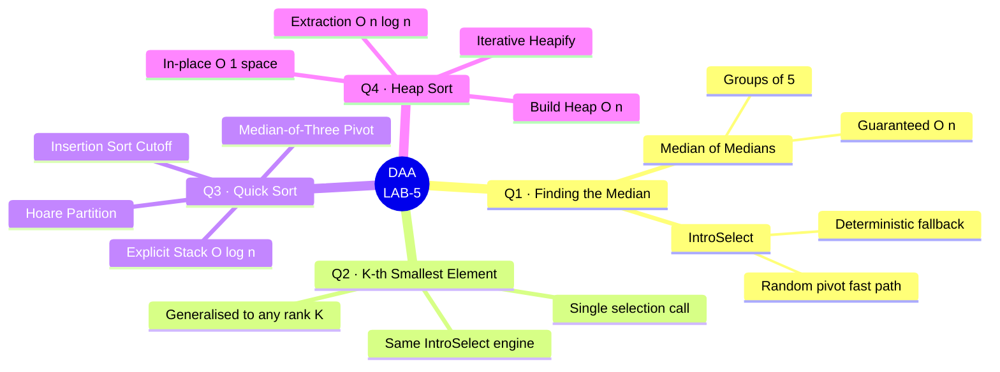

<div align="center">

| # | 📌 Question | ⚙️ Core Technique | ⏱️ Time | 💾 Space |
|:---:|:---|:---|:---:|:---:|
| **Q1** | [Finding the Median](#q1--finding-the-median) | Median of Medians · IntroSelect | `O(n)` worst case | `O(log n)` |
| **Q2** | [Finding the K-th Smallest Element](#q2--finding-the-k-th-smallest-element) | Median of Medians · IntroSelect | `O(n)` worst case | `O(log n)` |
| **Q3** | [Quick Sort](#q3--quick-sort) | Median-of-Three · Hoare Partition | `O(n log n)` | `O(log n)` |
| **Q4** | [Heap Sort](#q4--heap-sort) | Iterative Binary Max-Heap | `O(n log n)` | `O(1)` |

</div>

---

### Q1 — Finding the Median

<details>
<summary><strong>📖 Click to expand</strong></summary>

<br/>

**Goal:** Find the median of an unsorted array with a **guaranteed worst-case** `O(n)` time bound — not just `O(n)` on average.

**Why average-case Quickselect isn't enough:** a randomly-pivoted Quickselect runs in `O(n)` on average, but a stream of unlucky pivot choices can still degrade it to `O(n²)`. This implementation removes that risk entirely.

**Algorithm — deterministic Median of Medians as a fallback pivot source:**

1. `insertionSortSmall` — sorts a fixed group of ≤ 5 elements in `O(1)`.
2. `medianOfMedians` — splits the range into groups of 5, takes each group's median in `O(1)` via insertion sort, then **recurses** on the `n/5` medians to find the median of medians.
3. `introSelect` — an **IntroSelect** hybrid: spends a bounded "budget" of steps trying fast randomized pivots first, then permanently switches to `medianOfMedians` pivots once the budget runs out, so a bad sequence of random pivots can never blow up the runtime.
4. `partition3way` — a single left-to-right pass grouping elements into `[< pivot | == pivot | > pivot]`, which also correctly handles arrays containing duplicate values.
5. `findMedianOptimized` — for odd `n`, one `introSelect` call returns the median directly. For even `n`, it makes **one** `introSelect` call for the lower-middle rank, then finds the very next element with a single extra linear scan — avoiding a second full `O(n)` selection call.

**Recurrence for `medianOfMedians`:**

$$
T(n) = T(n/5) + O(n) \implies T(n) = O(n)
$$

**Why the pivot guarantee holds:** the median-of-medians pivot is provably greater than roughly 30% of the array and less than roughly 30% of it, so every fallback partition discards a constant fraction of elements — this is what bounds `introSelect` to `T(n) = T(0.7n) + O(n) = O(n)` even in the worst case.

| Property | Detail |
|---|---|
| Time (average) | `O(n)` — random pivots usually partition close to evenly |
| Time (worst case) | `O(n)` — **guaranteed**, unlike plain randomized Quickselect's `O(n²)` |
| Space | `O(log n)` — recursion depth of `medianOfMedians` (log base 5 of `n`) |
| Optimality | `Ω(n)` lower bound — any correct algorithm must inspect every element at least once |
| Overflow guard | For even `n`, the two middle values are each divided by `2.0` **before** being summed, avoiding `int` overflow near `INT_MAX`/`INT_MIN` |

> [!NOTE]
> The same `introSelect` engine is reused unchanged in Q2 below — the median is simply the special case of "the k-th smallest element" where `k = n/2`.

</details>

---

### Q2 — Finding the K-th Smallest Element

<details>
<summary><strong>📖 Click to expand</strong></summary>

<br/>

**Goal:** Generalise Q1 to find the **K-th smallest** element (`1 ≤ K ≤ n`, user-specified) in `O(n)` guaranteed worst-case time.

**Algorithm:** identical `insertionSortSmall` → `medianOfMedians` → `partition3way` → `introSelect` pipeline as Q1, except `findKthSmallest` converts the user's 1-indexed `K` into a 0-indexed target rank (`K − 1`) and makes a **single** `introSelect` call for that rank — there's no even/odd special case here, since a general k-th-smallest query only ever needs one selection call regardless of where `K` falls.

$$
\text{Time (worst case)} = O(n) \qquad \text{Space} = O(\log n)
$$

| Property | Detail |
|---|---|
| Input | `N`, the `N` array elements, then `K` (validated as `1 ≤ K ≤ N`) |
| Pivot guarantee | Same as Q1 — the median-of-medians fallback discards ≥ ~30% of the array every time it's used, **for any target rank `K`**, not just the median |
| Time (average / worst) | `O(n)` / `O(n)` — guaranteed, since plain randomized Quickselect alone is `O(n²)` worst case |
| Space | `O(log n)` — dominated by the `medianOfMedians` recursion depth |
| Optimality | `Ω(n)` lower bound holds for every value of `K`, not just the median, so the algorithm is asymptotically optimal across the board |

> [!TIP]
> Sorting the whole array first and indexing `arr[K-1]` would also work, but costs `O(n log n)`. Selection-based approaches like this one avoid paying for a full sort just to extract one order statistic.

</details>

---

### Q3 — Quick Sort

<details>
<summary><strong>📖 Click to expand</strong></summary>

<br/>

**Goal:** Sort `n` randomly generated elements (read from / written to CSV files) with a highly optimized Quick Sort that avoids the classic pitfalls of a naive implementation, achieving a robust **`O(n log n)`** in practice.

**Optimizations stacked together:**

| # | Optimization | What it fixes |
|:---:|---|---|
| 1 | **Median-of-Three pivot** (`median_of_three`) | Sampling first/mid/last and using their median as pivot avoids the classic `O(n²)` trigger on already-sorted, reverse-sorted, or "organ-pipe" input |
| 2 | **Insertion Sort cutoff** (`INSERTION_THRESHOLD = 10`) | Quick Sort's per-call overhead dominates on tiny sub-arrays; switching to insertion sort below the threshold is faster there |
| 3 | **Tail-call elimination + smaller-half recursion** | An explicit stack replaces recursive calls, and the algorithm always pushes the *larger* half while looping on the *smaller* half — this strictly bounds stack depth to `O(log n)` instead of a possible `O(n)` |
| 4 | **Hoare partition scheme** (`hoare_partition`) | Does roughly 3× fewer swaps on average than the standard Lomuto scheme |
| 5 | **`xorshift32` PRNG** | Replaces libc `rand()` with a faster, better-distributed generator for producing large volumes of test data |
| 6 | **Buffered CSV I/O** (`write_csv`, 1 MB buffer) | Avoids one `fprintf`/`fscanf` call per element by batching writes through a large manual buffer, keeping I/O at `O(n)` with a low constant |

**Recurrence (balanced case, thanks to median-of-three + smaller-half recursion):**

$$
T(n) = 2\,T\!\left(\frac{n}{2}\right) + O(n) \implies T(n) = O(n \log n)
$$

| Property | Detail |
|---|---|
| Time (average / worst) | `O(n log n)` / `O(n log n)` — median-of-three pivoting plus always recursing on the smaller half prevents the classic `O(n²)` worst case |
| Space | `O(log n)` — explicit stack (`stack_low[64]`, `stack_high[64]`), never `O(n)` recursion |
| Stress-test input modes | `random` (default), `sorted`, `reverse`, `duplicates` — command-line selectable, to empirically confirm the median-of-three fix holds even on adversarial inputs |
| CLI usage | `./q3_quick_sort <N> [random\|sorted\|reverse\|duplicates]` — prompts interactively if `N` is omitted |
| Timing | High-resolution per-platform timer: `QueryPerformanceCounter` on Windows, `clock_gettime(CLOCK_PROCESS_CPUTIME_ID)` on POSIX |
| Verification | After sorting, a linear pass confirms `arr[i-1] ≤ arr[i]` for all `i` and prints `PASSED`/`FAILED` |

> [!WARNING]
> Even with median-of-three pivoting, Quick Sort's `O(n log n)` here is an empirically robust *practical* guarantee, not a formally airtight worst-case bound the way Heap Sort's is — adversarial inputs specifically crafted against median-of-three (rather than just sorted/reverse/duplicate data) could, in principle, still degrade performance.

</details>

---

### Q4 — Heap Sort

<details>
<summary><strong>📖 Click to expand</strong></summary>

<br/>

**Goal:** Sort `n` randomly generated elements (read from / written to CSV files) using Heap Sort, with a **guaranteed** `O(n log n)` worst case and `O(1)` extra space.

**Algorithm — two phases over a binary max-heap stored implicitly in the array:**

1. **Build Heap** (`heapSort`, phase 1): starting from the last internal node (`n/2 − 1`) down to the root, call `heapify` on each — this is a tight `O(n)` overall (proven via the sum-of-heights argument), *not* `O(n log n)`.
2. **Extraction** (`heapSort`, phase 2): repeatedly swap the root (current maximum) with the last element of the shrinking heap, then re-`heapify` the root — done `n − 1` times, each costing `O(log n)`, so this phase is `O(n log n)` and **dominates** the total runtime.

**Key optimization — iterative `heapify`:** the traditional recursive sift-down incurs function-call overhead and `O(log n)` stack usage. Replacing it with an iterative `while` loop removes both, which matters most at large `n`.

$$
\text{Build Heap: } O(n) \qquad + \qquad \text{Extraction: } O(n \log n) \qquad = \qquad O(n \log n) \text{ overall}
$$

| Property | Detail |
|---|---|
| Time (best / average / worst) | `Θ(n log n)` in all three cases — Heap Sort has no adversarial-input weak spot the way Quick Sort does |
| Space | `O(1)` extra — entirely in-place, heap is stored implicitly in the array itself |
| Program workflow | Prompts for `N` → generates `N` random ints (`0`–`99999`) into `input.csv` → reads them back into memory → sorts → writes `sorted_output.csv` → prints a before/after sample |
| Empirical validation | `analyzeComplexity()` runs instrumented `heapSortCounted`/`heapifyCounted` variants over `N ∈ {1000 … 64000}`, tracking the ratio `comparisons / (N·log₂N)` — a ratio that stays roughly constant as `N` grows is the empirical signature of true `O(n log n)` growth |
| Input validation | The main input loop rejects non-numeric or non-positive `N`, re-prompting and flushing bad `stdin` input rather than looping forever on garbage |

> [!TIP]
> Unlike Quick Sort (Q3), Heap Sort's `O(n log n)` bound is airtight for every input distribution — there is no sorted/reverse/duplicate case that can push it toward `O(n²)`. The trade-off is that Heap Sort's constant factor is typically higher in practice, and unlike Quick Sort or Merge Sort it isn't stable.

</details>

---

## 🚀 LAB-6 — Array & Matrix Operations, FFT Convolution & Reversal Sort

**Date:** 02-09-2026 &nbsp;|&nbsp; **Total Questions:** 4

### LAB-6 — Overview Map

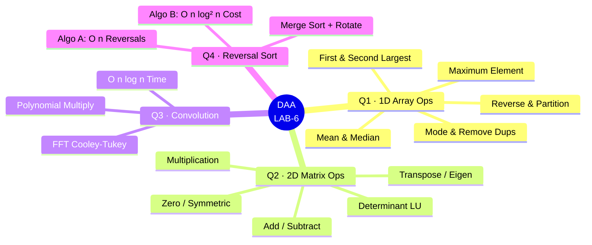

<div align="center">

| # | 📌 Question | ⚙️ Core Technique | ⏱️ Time | 💾 Space |
|:---:|:---|:---|:---:|:---:|
| **Q1** | [1D Array Operations](#q1--1d-array-operations-and-their-complexities) | Multiple (Scan, Sort, Select) | `O(n)` / `O(n log n)` | `O(1)` / `O(log n)` |
| **Q2** | [2D Square Matrix Operations](#q2--2d-square-matrix-operations-and-their-complexities) | Multiple (LU, Jacobi, Power) | `O(n²)` / `O(n³)` | `O(1)` / `O(n²)` |
| **Q3** | [Convolution Operation](#q3--convolution-operation-on-vectors-of-size-n) | FFT (Divide & Conquer) | `O(n log n)` | `O(n)` |
| **Q4** | [Sorting via Reversal Procedure](#q4--sorting-via-the-reversal-procedure) | Selection / Merge Sort | `O(n)` / `O(n log² n)` | `O(1)` / `O(log n)` |

</div>

---

### Q1 — 1D Array Operations and Their Complexities

<details>
<summary><strong>📖 Click to expand</strong></summary>

<br/>

**Goal:** Implement nine fundamental operations on a 1D integer array and analyze their worst-case optimal complexities.

**Operations Covered:**

| Operation | Worst-Case Time | Algorithm Used |
|---|:---:|---|
| **Maximum Element** | `Θ(n)` | Linear scan, running max |
| **First & Second Largest** | `Θ(n)` | Single pass, two trackers |
| **Mean** | `Θ(n)` | Single accumulation pass |
| **Median** | `Θ(n)` | Deterministic Median-of-Medians (BFPRT) |
| **Standard Deviation** | `Θ(n)` | Two sequential linear passes |
| **Mode** | `Θ(n log n)` | Sort + linear run-length scan |
| **Remove Duplicates** | `Θ(n log n)` | Sort + in-place compaction |
| **Reverse Array** | `Θ(n)` | Two-pointer in-place swap |
| **Partition Around Pivot** | `Θ(n)` | Single sweep with slot pointer |

> [!TIP]
> The Median operation uses the deterministic Median-of-Medians algorithm, which guarantees a worst-case `O(n)` time bound, unlike randomized Quickselect which can degrade to `O(n²)`.

</details>

---

### Q2 — 2D Square Matrix Operations and Their Complexities

<details>
<summary><strong>📖 Click to expand</strong></summary>

<br/>

**Goal:** Implement seven fundamental operations on `n × n` square matrices of `double` values and analyze their worst-case optimal complexities. The matrix is stored as a flattened 1D array for optimal cache locality.

**Operations Covered:**

| Operation | Time (Worst Case) | Core Technique |
|---|:---:|---|
| **Addition / Subtraction** | `Θ(n²)` | Single linear pass |
| **Multiplication** | `O(n³)` | Optimized `i-k-j` loop order for cache locality |
| **Is Zero Matrix?** | `O(n²)` | Linear scan with early exit |
| **Is Symmetric Matrix?** | `O(n²)` | Double loop with early exit |
| **Determinant** | `O(n³)` | Gaussian Elimination with Partial Pivoting (LU) |
| **Transpose In-Place** | `Θ(n²)` | Element swapping over upper triangle |
| **Eigenvalues / Eigenvectors** | `O(k·n³)` / `O(k·n²)` | Jacobi Algorithm / Power Iteration |

> [!NOTE]
> The matrix multiplication uses the `i-k-j` loop order instead of `i-j-k`. This ensures the inner loop accesses elements sequentially (stride-1), dramatically improving cache performance.

</details>

---

### Q3 — Convolution Operation on Vectors of Size n

<details>
<summary><strong>📖 Click to expand</strong></summary>

<br/>

**Goal:** Compute the convolution of two integer vectors (equivalent to polynomial multiplication) using an `O(n log n)` Divide and Conquer algorithm based on the Fast Fourier Transform (FFT).

**Algorithm — Cooley-Tukey FFT:**

1. Zero-pad the input vectors to the next power of 2 length `N`.
2. Compute the FFT of both vectors to evaluate them at the roots of unity — `O(N log N)`.
3. Pointwise multiply the results — `O(N)`.
4. Compute the Inverse FFT of the result to interpolate back to coefficients — `O(N log N)`.

$$
\text{Total Time} = O(n \log n) \qquad \text{Space} = O(n)
$$

> [!WARNING]
> The naive double-loop approach costs `O(n²)`. For input vectors of length 10,000, the FFT approach performs roughly 130,000 operations compared to 100 million for the naive approach — over a 750× speedup.

</details>

---

### Q4 — Sorting via the Reversal Procedure

<details>
<summary><strong>📖 Click to expand</strong></summary>

<br/>

**Goal:** Sort a permutation of `{1, ..., n}` using only the `reverse(p, i, j)` operation, minimizing either the number of reversals or the total cost (sum of reversal lengths).

**Two Approaches:**

| Algorithm | Optimizes | Bound | Strategy |
|---|---|---|---|
| **Algorithm A** | Number of reversals | `O(n)` | Selection Sort by Reversal. Places elements one at a time using at most one reversal per element. Total cost can be `O(n²)`. |
| **Algorithm B** | Total cost (sum of lengths) | `O(n \log^2 n)` | Merge Sort + Rotation-Reversal. Uses the 3-reversal rotation trick to perform in-place merging. |

**The 3-Reversal Rotation Trick:**
To rotate blocks `A` and `B` into `B A`:
1. Reverse `A`
2. Reverse `B`
3. Reverse the whole combined block.
`reverse( rev(A) ∥ rev(B) ) = B A`

> [!IMPORTANT]
> Algorithm A minimizes the number of `reverse()` calls to strictly $\le n-1$, but an adversary can force the total length of those reversals to be quadratic. Algorithm B guarantees a sub-quadratic total work cost of $O(n \log^2 n)$.

</details>

---

## 📈 Complexity Growth Scale

The diagram below maps every complexity class used in this repository from fastest to slowest — from constant-time operations to the exponential growth of Towers of Hanoi.


<div align="center">

| 🎨 Colour | Class | Example in this repo |
|:---:|:---:|---|
| 🟢 Green | `O(1)` | Sorted Array — Max, Min, Pred, Succ; Unsorted Array — Delete |
| 🟩 Light green | `O(log n)` | Sorted Array — Search (binary search); Q5 — Partition Point |
| 🟡 Yellow | `O(n)` | Linked List Search; Coin Simulation per coin; LAB-4 Application of Sorting-1; LAB-5 Q1/Q2 — Median & K-th Smallest (guaranteed worst case) |
| 🟠 Orange | `O(n log n)` | All Merge Sort variants; Q1 — Asymptotic Ordering; LAB-4 Q2, Q4, Q5, Q6; LAB-5 Q3 — Quick Sort; LAB-5 Q4 — Heap Sort |
| 🔴 Red | `O(n²)` | Bubble Sort (worst/avg); Element Uniqueness (worst); Sequential k-Merge |
| 🟣 Purple | `O(2ⁿ)` | Towers of Hanoi |
| ⚫ Grey | `O(n^(k-1) log n)` | LAB-4 Q3 — k-Sum (super-polynomial for fixed `k ≥ 3`, but still polynomial in `n`) |

</div>

---

## 🔧 Building & Running

### Prerequisites

```bash
gcc --version        # GCC 7.0+ recommended · any C99-compliant compiler works
```

### WEEK-1

```bash
cd WEEK-1

# Q1 & Q2 require the math library
gcc -Wall -std=c99 -o q1 q1_put_them_in_order.c -lm          &&  ./q1
gcc -Wall -std=c99 -o q2 q2_fair_vs_biased_coin.c -lm        &&  ./q2

# Q3 – Q6 — no extra flags needed
gcc -Wall -std=c99 -o q3 q3_performance_analysis_of_bubble_sort.c  &&  ./q3
gcc -Wall -std=c99 -o q4 q4_towers_of_hanoi.c                     &&  ./q4
gcc -Wall -std=c99 -o q5 q5_find_the_partition_point.c            &&  ./q5
gcc -Wall -std=c99 -o q6 q6_element_uniqueness.c                  &&  ./q6
```

### WEEK-2

```bash
# Q1 — Dictionary Operations
cd WEEK-2/Q1
gcc -O2 -std=c99 -o q1_dictionary_operations q1_dictionary_operations.c
./q1_dictionary_operations
# ↳ Writes: dictionary_operations.csv + prints complexity table to terminal

# Q2 — Merge Sort vs 3-Way Merge Sort
cd ../Q2
gcc -O2 -std=c99 -o q2_merge_sort_vs_modified_merge_sort \
       q2_merge_sort_vs_modified_merge_sort.c -lm
./q2_merge_sort_vs_modified_merge_sort
# ↳ Writes: merge_sort_vs_modified_merge_sort.csv + prints analysis to terminal

# Q3 — Merging k Sorted Arrays
cd ../Q3
gcc -O2 -std=c99 -o q3_merging_k_sorted_arrays q3_merging_k_sorted_arrays.c
./q3_merging_k_sorted_arrays
# ↳ Writes: merging_k_sorted_arrays.csv + 200-trial correctness report
```

### WEEK-3

```bash
# Q1 — Binary vs Ternary Search
cd WEEK-3/Q1
gcc -O2 -std=c99 -o q1_binary_vs_ternary_search q1_binary_vs_ternary_search.c -lm
./q1_binary_vs_ternary_search

# Q2 — Search the Defective Coin
cd ../Q2
gcc -O2 -std=c99 -o q2_search_the_defective_coin q2_search_the_defective_coin.c -lm
./q2_search_the_defective_coin

# Q3 — Max and Min using D&C Approach
cd ../Q3
gcc -O2 -std=c99 -o q3_max_and_min_using_D_and_C_approach q3_max_and_min_using_D_and_C_approach.c
./q3_max_and_min_using_D_and_C_approach

# Q4 — Matrix Multiplication using D&C Approach
cd ../Q4
gcc -O2 -std=c99 -o q4_matrix_multiplication_using_D_and_C_approach q4_matrix_multiplication_using_D_and_C_approach.c
./q4_matrix_multiplication_using_D_and_C_approach

# Q5 — Multiply special-pattern square matrices using D&C approach
cd ../Q5
gcc -O2 -std=c99 -o q5_multiply_special_pattern_square_matrices_using_D_and_C_approach q5_multiply_special_pattern_square_matrices_using_D_and_C_approach.c
./q5_multiply_special_pattern_square_matrices_using_D_and_C_approach

# Q6 — Use of loop invariants in sorting
cd ../Q6
gcc -O2 -std=c99 -o q6_use_of_loop_invariants_in_sorting q6_use_of_loop_invariants_in_sorting.c
./q6_use_of_loop_invariants_in_sorting
```

### WEEK-4

```bash
# Application of Sorting-1
cd WEEK-4/Q1
gcc -O2 -std=c99 -o q1_application_of_sorting_1 q1_application_of_sorting_1.c
./q1_application_of_sorting_1

# Application of Sorting-2
cd ../Q2
gcc -O2 -std=c99 -o q2_application_of_sorting_2 q2_application_of_sorting_2.c
./q2_application_of_sorting_2

# Application of Sorting-3
cd ../Q3
gcc -O2 -std=c99 -o q3_application_of_sorting_3 q3_application_of_sorting_3.c
./q3_application_of_sorting_3

# Application of Sorting-4
cd ../Q4
gcc -O2 -std=c99 -o q4_application_of_sorting_4 q4_application_of_sorting_4.c
./q4_application_of_sorting_4

# Application of Sorting-5
cd ../Q5
gcc -O2 -std=c99 -o q5_application_of_sorting_5 q5_application_of_sorting_5.c
./q5_application_of_sorting_5

# Application of Sorting-6
cd ../Q6
gcc -O2 -std=c99 -o q6_application_of_sorting_6 q6_application_of_sorting_6.c
./q6_application_of_sorting_6
```

### WEEK-5

```bash
# Q1 — Finding the Median
cd WEEK-5/Q1
gcc -O2 -std=c99 -o q1_finding_median q1_finding_median.c
./q1_finding_median

# Q2 — Finding the K-th Smallest Element
cd ../Q2
gcc -O2 -std=c99 -o q2_finding_kth_smallest_element q2_finding_kth_smallest_element.c
./q2_finding_kth_smallest_element

# Q3 — Quick Sort
cd ../Q3
gcc -O3 -march=native -std=c99 -o q3_quick_sort q3_quick_sort.c
./q3_quick_sort <N> [random|sorted|reverse|duplicates]

# Q4 — Heap Sort
cd ../Q4
gcc -O2 -std=c99 -o q4_heap_sort q4_heap_sort.c -lm
./q4_heap_sort
```

### WEEK-6

```bash
# Q1 — 1D Array Operations
cd WEEK-6/Q1
gcc -O2 -Wall -std=c11 q1_1D_array_operations_and_their_complexities.c -o q1 -lm
./q1

# Q2 — 2D Square Matrix Operations
cd ../Q2
gcc -O2 -Wall -std=c11 q2_2D_square_matrix_operations_and_their_complexities.c -lm -o q2
./q2
# Or run with: ./q2 demo  or  ./q2 test [N]

# Q3 — Convolution Operation
cd ../Q3
gcc -O2 -Wall -std=c11 q3_convolution_operation_on_vectors_of_size_n.c -lm -o q3
./q3
# Or run with: ./q3 demo  or  ./q3 test [N]

# Q4 — Sorting via Reversal Procedure
cd ../Q4
gcc -O2 -Wall -o reversal_sort q4_sorting_via_reversal_procedure.c -lm
./reversal_sort
# Or run with: ./reversal_sort -test
```

> [!NOTE]
> Run each WEEK-2/WEEK-4/WEEK-5/WEEK-6 program **from inside its own `Q*/` subdirectory** so that CSV and graph outputs land next to the source files, matching the committed dataset paths.

### Compiler Flags Reference

| Flag | Purpose |
|---|---|
| <kbd>-Wall</kbd> | Enable all standard warnings |
| <kbd>-std=c99</kbd> | Enforce C99 standard strictly |
| <kbd>-O2</kbd> | Level-2 optimisation — used for all timing benchmarks |
| <kbd>-lm</kbd> | Link the math library (`math.h` — needed by Q1/Q2 LAB-1, Q2 LAB-2, Q1/Q2 LAB-3, and Q4 LAB-5) |
| <kbd>-march=native</kbd> | Enables CPU-specific instruction sets — used for the highly optimized Q3 LAB-5 Quick Sort benchmark |

### Input Reference

| Lab | Program | 📥 Input Required |
|:---:|:---:|---|
| LAB-1 | Q1 | None |
| LAB-1 | Q2 | Number of flips for the comparison matrix *(defaults to 10,000 on bad input)* |
| LAB-1 | Q3 | Number of elements, 2–10,000 *(defaults to 100 on bad input)* |
| LAB-1 | Q4 | None |
| LAB-1 | Q5 | Element count, then that many 0s and 1s — **0s must precede all 1s** |
| LAB-1 | Q6 | Element count, then that many integers |
| LAB-2 | Q1–Q3 | **None** — all parameters hardcoded in each benchmark driver |
| LAB-3 | Q1–Q6 | Expected formats vary (refer to source code for details) |
| LAB-4 | Q1 | `n`, then `n` pairs as `<number> <R\|B\|Y>`, already sorted by number |
| LAB-4 | Q2 | `n`, then `n` elements of `S1`, then `n` elements of `S2`, then target `x` |
| LAB-4 | Q3 | `n`, then `n` distinct integers of `S`, then `k`, then target `T` |
| LAB-4 | Q4 | `n`, then `n` entry times `aᵢ`, then `n` exit times `bᵢ` |
| LAB-4 | Q5 | `n`, then `n` intervals as `"x y"` pairs (`x ≤ y`) |
| LAB-4 | Q6 | `n`, then `n` intervals as `"l r"` pairs (`l ≤ r`); `n = 0` is accepted |
| LAB-5 | Q1 | `n`, then `n` integers (array elements) |
| LAB-5 | Q2 | `n`, then `n` integers, then `k` (`1 ≤ k ≤ n`) |
| LAB-5 | Q3 | Optional CLI args: `<N> [random\|sorted\|reverse\|duplicates]`; prompts for `N` interactively if omitted |
| LAB-5 | Q4 | `n` — the program generates the `n` random elements itself |
| LAB-6 | Q1 | `n`, then `n` space-separated integers |
| LAB-6 | Q2 | Interactive mode prompts for `n` and `n × n` elements; Demo/Test modes require no input / optional `N` |
| LAB-6 | Q3 | Interactive mode prompts for vectors A and B; Demo/Test modes require no input / optional `N` |
| LAB-6 | Q4 | Interactive mode prompts for permutation; `-test` mode requires no input |

---

## 📊 Complexity Quick Reference

<div align="center">

### LAB-1

| Question | Best Case | Average Case | Worst Case | Space |
|:---:|:---:|:---:|:---:|:---:|
| Q1 — Asymptotic Ordering | `Θ(n log n)` | `Θ(n log n)` | `Θ(n log n)` | `O(n)` |
| Q2 — Coin Simulation | `O(kn)` | `O(kn)` | `O(kn)` | `O(k)` |
| Q3 — Bubble Sort (opt.) | **`O(n)`** | `O(n²)` | `O(n²)` | `O(1)` |
| Q4 — Towers of Hanoi | `O(2ⁿ)` | `O(2ⁿ)` | `O(2ⁿ)` | `O(n)` |
| Q5 — Binary Search | **`O(1)`** | `O(log n)` | `O(log n)` | `O(1)` |
| Q6 — Element Uniqueness | **`O(1)`** | `O(n²)` | `O(n²)` | `O(1)` |

### LAB-2

| Question | Best Case | Worst Case | Space |
|:---:|:---:|:---:|:---:|
| Q1 — Best single op (Sorted Array / Doubly Sorted) | `O(1)` | `O(n)` | `O(n)` |
| Q2 — 2-Way Merge Sort | `Θ(n log n)` | `Θ(n log n)` | `O(n)` |
| Q2 — 3-Way Merge Sort | `Θ(n log n)` | `Θ(n log n)` | `O(n)` |
| Q3 — Sequential k-Merge | `O(nk²)` | `O(nk²)` | `O(nk)` |
| Q3 — Pairwise D&C k-Merge | **`O(nk log k)`** | **`O(nk log k)`** | `O(nk)` |

### LAB-3

| Question | Best Case | Worst Case | Space |
|:---:|:---:|:---:|:---:|
| Q1 — Binary Search | `O(1)` | `O(log n)` | `O(1)` |
| Q1 — Ternary Search | `O(1)` | `O(log n)` | `O(1)` |
| Q2 — Defective Coin | `O(1)` | `O(log n)` | `O(log n)` |
| Q3 — Max and Min (D&C) | `O(n)` | `O(n)` | `O(log n)` |
| Q4 — Strassen's Matrix | `O(n^2.81)` | `O(n^2.81)` | `O(n^2)` |
| Q5 — Pattern Matrix | `O(n^2)` | `O(n^2)` | `O(n^2)` |
| Q6 — Selection Sort | `Θ(n^2)` | `Θ(n^2)` | `O(1)` |

### LAB-4

| Question | Time | Space |
|:---:|:---:|:---:|
| Application of Sorting-1 | `O(n)` | `O(1)` |
| Application of Sorting-2 | `O(n log n)` | `O(1)` |
| Application of Sorting-3 | `O(n^(k-1) log n)` | `O(k)` |
| Application of Sorting-4 | `O(n log n)` | `O(n)` |
| Application of Sorting-5 | `O(n log n)` | `O(n)`* |
| Application of Sorting-6 | `O(n log n)` | `O(n)` |

### LAB-5

| Question | Best Case | Average Case | Worst Case | Space |
|:---:|:---:|:---:|:---:|:---:|
| Q1 — Finding the Median | `O(n)` | `O(n)` | **`O(n)`** | `O(log n)` |
| Q2 — K-th Smallest Element | `O(n)` | `O(n)` | **`O(n)`** | `O(log n)` |
| Q3 — Quick Sort | `O(n log n)` | `O(n log n)` | `O(n log n)`* | `O(log n)` |
| Q4 — Heap Sort | `Θ(n log n)` | `Θ(n log n)` | `Θ(n log n)` | `O(1)` |

<sub>*Achieved in practice via median-of-three pivoting + smaller-half recursion; not a formally airtight worst-case guarantee the way Heap Sort's is.</sub>

### LAB-6

| Question | Worst Case Time | Space |
|:---:|:---:|:---:|
| Q1 — 1D Array Operations | `O(n)` to `O(n log n)` | `O(1)` / `O(log n)` |
| Q2 — 2D Matrix Operations | `O(n²)` to `O(n³)` | `O(1)` / `O(n²)` |
| Q3 — Convolution Operation (FFT) | **`O(n log n)`** | `O(n)` |
| Q4 — Reversal Sort | `O(n)` revs / `O(n log² n)` cost | `O(1)` / `O(log n)` |

</div>

---

## 📝 Notes

<details>
<summary><strong>⚙️ LAB-1 Notes</strong></summary>

<br/>

- **Q2 & Q3** seed `rand()` from `time(NULL)` — output differs between runs. Committed CSV and PNG files capture one representative run.
- **Q3, Q5, Q6** allocate arrays with `malloc` and free them before exit — no memory leaks on normal termination.
- **Q1**'s ASCII chart uses the Unicode block character `█`; all other programs use plain `#` for compatibility on terminals without UTF-8 support.

</details>

<details>
<summary><strong>⚙️ LAB-2 Notes</strong></summary>

<br/>

- All three WEEK-2 programs use <kbd>-O2</kbd> and measure **wall-clock time**, not CPU time.
- **Q3** uses a platform-adaptive high-resolution timer:
  - **Windows:** `QueryPerformanceCounter` / `QueryPerformanceFrequency` — sub-microsecond precision
  - **POSIX / Linux:** `clock_gettime(CLOCK_MONOTONIC)` — nanosecond precision
  - This avoids the ~10–16 ms coarse granularity of the standard `clock()` function.
- **Q3**'s adaptive timing loop self-calibrates the repeat count — it reruns each configuration until cumulative elapsed time exceeds 50 ms, then divides — ensuring stable non-zero measurements even for very small `(k, n)` combinations.

</details>

<details>
<summary><strong>⚙️ LAB-3 Notes</strong></summary>

<br/>

- **WEEK-3 programs** also use <kbd>-O2</kbd> for timing benchmarks and performance measurements.
- **Q1, Q3, Q4, Q5, Q6** all generate data and use python plotting scripts (e.g., `q1_binary_vs_ternary_search_graph.py`) to generate the corresponding `.png` graphs representing their empirical analysis. You will need `python` with `matplotlib` to reproduce the graphs from the csv outputs.
- **Q4 & Q5** allocate contiguous memory blocks or 2D array blocks via `malloc` and must carefully `free` memory after completion, especially when matrices reach larger bounds where stack memory would overflow.
- **Q6** features an additional `pseudocode.txt` file demonstrating the structural loop invariants validation logic prior to implementation.

</details>

<details>
<summary><strong>⚙️ LAB-4 Notes</strong></summary>

<br/>

- Every WEEK-4 program pairs an `_analysis.png` (a schematic walkthrough of the algorithm on a small example) with a `_graph.png` (empirical time growth vs input size); **Q5** additionally has two `_analysis` images covering both the sort and merge phases separately.
- **Q1** uses a singly linked list, not an array, as its input representation — this is the deliberate design choice that makes `O(1)` extra space achievable for an `O(n)` stable 3-way sort.
- **Q3**'s complexity is stated for **fixed `k`**; the driver validates `1 ≤ k ≤ n` before running and range-checks the target sum against `INT_MIN`/`INT_MAX` before any narrowing cast, to avoid implementation-defined truncation bugs.
- **Q4** and **Q6** both use the sweep-line (event) technique, but only **Q6** needs a secondary tie-breaking sort key (`START` before `END` on equal coordinates) — Q4's entry/exit times are guaranteed distinct by the problem statement, while Q6's closed-interval endpoints can legitimately coincide.
- **Q6** implements its own explicit merge sort for the event list (rather than `qsort`) specifically to guarantee the required `O(n log n)` bound holds in the **worst case**, not just on average.
- **Q2, Q3, Q4, Q5, Q6** allocate their working arrays with `malloc` and free them before exit; **Q1**'s nodes are freed via `free_list()` after validation.

</details>

<details>
<summary><strong>⚙️ LAB-5 Notes</strong></summary>

<br/>

- **Q1 and Q2** share the exact same `insertionSortSmall` → `medianOfMedians` → `partition3way` → `introSelect` core — Q2 is the direct generalisation of Q1 from "find rank `n/2`" to "find any user-supplied rank `k`".
- **Q1 and Q2**'s `introSelect` is an IntroSelect hybrid: it spends a bounded budget on fast randomized pivots first, then permanently falls back to the deterministic `medianOfMedians` pivot once that budget is exhausted — this is what upgrades plain Quickselect's average-case `O(n)` into a worst-case `O(n)` guarantee.
- **Q3** stress-tests its own median-of-three optimization against `random`, `sorted`, `reverse`, and `duplicates` input distributions via a command-line argument, specifically to verify the classic `O(n²)` naive-Quicksort trigger (already-sorted / reverse-sorted input) no longer applies.
- **Q3** uses a platform-adaptive high-resolution timer, matching the approach used in WEEK-2 Q3: `QueryPerformanceCounter` on Windows, `clock_gettime(CLOCK_PROCESS_CPUTIME_ID)` on POSIX.
- **Q4**'s `analyzeComplexity()` uses instrumented, comparison-counting copies of `heapify`/`heapSort` (`heapifyCounted`/`heapSortCounted`) so the real sort used on the user's input stays at zero instrumentation overhead.
- **Q3 and Q4** both generate their own random test data and round-trip it through CSV files (`random_data.csv`/`sorted_data.csv` for Q3, `input.csv`/`sorted_output.csv` for Q4) rather than taking pre-supplied arrays, since the goal is large-scale empirical timing rather than correctness on a specific fixed input.
- All four WEEK-5 programs allocate their working arrays with `malloc` and free them before exit.

</details>

<details>
<summary><strong>⚙️ LAB-6 Notes</strong></summary>

<br/>

- **WEEK-6 programs** all compile with `-O2 -Wall` optimizations and mostly use C11 standard (`-std=c11`).
- **Q2, Q3, and Q4** provide interactive, demo, and automated validation (test) modes to thoroughly verify outputs without manual data entry.
- **Q3**'s iterative FFT provides mathematically identical results to recursive FFT but avoids function-call overhead for a better constant factor.
- All programs dynamically allocate their structures and carefully `free` them to prevent memory leaks when processing large inputs, especially crucial for `O(n³)` matrix and `O(n log n)` FFT algorithms.

</details>

---

<div align="center">

## 👤 Author

**Asit Kumar Mohapatra**

*Registration ID: B525017 &nbsp;·&nbsp; CE — Computer Engineering &nbsp;·&nbsp; IIIT Bhubaneswar*

<br/>

[](https://github.com/Asit-Kumar-Mohapatra)
[](https://github.com/Asit-Kumar-Mohapatra/Design-and-Analysis-of-Algorithm-DAA-Assignments-2026)

<br/>

---

<sub>
Made with ❤️ for the DAA course at IIIT Bhubaneswar &nbsp;·&nbsp; 2026
<br/>
All programs written in standard C (C99) and compiled with GCC
</sub>

<br/>

</div>
