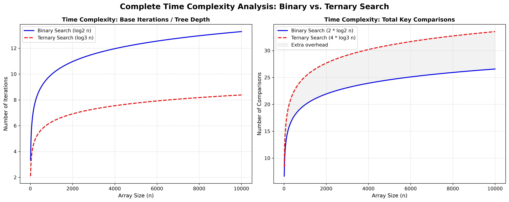

<!-- ═══ HEADER ═══ -->

  
// Week-3 · Question 01 · DAA Lab

  <h1 class="title">BINARY vs TERNARY SEARCH</h1>
  
Divide & Conquer · Comparison Analysis

  TIME: O(log N)
  SPACE: O(1)
  LANG: C
  PARADIGM: D&C
  WEEK: 03

<!-- ═══ GRAPH ═══ -->

  

    
  

// Problem Statement

<!-- ═══ QUESTION ═══ -->

  

    <h2>▶ THE QUESTION</h2>
    
Compare <b>Binary Search</b> and <b>Ternary Search</b> on a sorted array to determine which algorithm requires fewer key comparisons in the worst case. Implement both in C, count the exact number of comparisons made, and prove your finding through both empirical testing and theoretical (recurrence relation) analysis.

    

      
⚠️

      
<b>Core Intuition to Prove:</b> Though Ternary Search divides into 3 parts (reducing depth), it needs more comparisons <em>per level</em> to decide which third to enter. Does saving depth offset the extra per-level cost?

    

  

// Algorithm Deep Dive

<!-- ═══ ALGORITHM ANALYSIS ═══ -->

  

    <h2>▶ BINARY SEARCH</h2>
    <h3>Working Principle</h3>
    
Computes a single midpoint <code>mid</code> splitting the search space into 2 halves. At each step, performs 2 comparisons:

    <ol class="steps">
      <li><b>Equality check:</b> <code>arr[mid] == target</code> → Found! Return.</li>
      <li><b>Direction check:</b> <code>arr[mid] > target</code> → go left; else go right.</li>
    </ol>
    <h3>Recurrence Relation</h3>
    
T(n) = T(n/2) + 2

    
Each level: 2 comparisons, problem size halved. Tree height = <code>log₂(n)</code>.

    
Cbinary(n) = 2 · log₂(n)

  

  

    <h2>▶ TERNARY SEARCH</h2>
    <h3>Working Principle</h3>
    
Computes two midpoints <code>mid1</code> and <code>mid2</code>, splitting the space into 3 thirds. At each step, performs up to 4 comparisons:

    <ol class="steps">
      <li><b>Check mid1:</b> <code>arr[mid1] == target</code> → Found!</li>
      <li><b>Check mid2:</b> <code>arr[mid2] == target</code> → Found!</li>
      <li><b>Compare target vs mid1:</b> <code>target < arr[mid1]</code> → left third.</li>
      <li><b>Compare target vs mid2:</b> <code>target > arr[mid2]</code> → right third; else middle.</li>
    </ol>
    <h3>Recurrence Relation</h3>
    
T(n) = T(n/3) + 4

    
Tree height = <code>log₃(n) = log₂(n)/log₂(3) ≈ log₂(n)/1.585</code>

    
Cternary(n) = 4 · log₃(n) ≈ 2.524 · log₂(n)

  

<!-- comparison table -->

  <h2>▶ SIDE-BY-SIDE COMPARISON</h2>
  <table class="compare-table">
    <tr>
      <th>Metric</th>
      <th>Binary Search</th>
      <th>Ternary Search</th>
    </tr>
    <tr>
      <td>Partitions per step</td>
      <td class="winner">2</td>
      <td>3</td>
    </tr>
    <tr>
      <td>Comparisons per level (worst)</td>
      <td class="winner">2</td>
      <td class="loser">4</td>
    </tr>
    <tr>
      <td>Tree height</td>
      <td>log₂(n)</td>
      <td class="winner">log₃(n) [smaller]</td>
    </tr>
    <tr>
      <td>Total worst-case comparisons</td>
      <td class="winner">2·log₂(n)</td>
      <td class="loser">2.524·log₂(n)</td>
    </tr>
    <tr>
      <td>Overhead vs Binary</td>
      <td class="winner">Baseline</td>
      <td class="loser">+26% comparisons</td>
    </tr>
    <tr>
      <td>Time Complexity</td>
      <td>O(log n)</td>
      <td>O(log n)</td>
    </tr>
    <tr>
      <td>Space Complexity</td>
      <td>O(1)</td>
      <td>O(1)</td>
    </tr>
    <tr>
      <td><b>Winner</b></td>
      <td class="winner">✔ BINARY SEARCH</td>
      <td></td>
    </tr>
  </table>

// C Code Walkthrough

<!-- ═══ C CODE EXPLANATION ═══ -->

  

    <h2>▶ binarySearch() FUNCTION</h2>
    

      

      
int binarySearch(arr, size, target, *comparisons) {
  int low = 1, high = size;
  while (low <= high) {
    int mid = low + (high - low) / 2;
    (*comparisons)++;           // equality check
    if (arr[mid] == target) return mid;
    (*comparisons)++;           // direction check
    if (arr[mid] > target) high = mid - 1;
    else low = mid + 1;
  }
  return -1;
}

    

    <ul>
      <li><b>1-based indexing:</b> <code>low = 1, high = size</code> — matches mathematical convention.</li>
      <li><b>Overflow-safe mid:</b> Uses <code>low + (high-low)/2</code> instead of <code>(low+high)/2</code> to prevent integer overflow for large arrays.</li>
      <li><b>Per-iteration cost:</b> Worst case 2 comparisons — one equality, one direction.</li>
    </ul>
  

  

    <h2>▶ ternarySearch() FUNCTION</h2>
    

      

      
int ternarySearch(arr, size, target, *comparisons) {
  int low=1, high=size;
  while (low <= high) {
    int mid1 = low + (high-low)/3;
    int mid2 = high - (high-low)/3;
    (*comparisons)++;  if(arr[mid1]==target) return mid1;
    (*comparisons)++;  if(arr[mid2]==target) return mid2;
    (*comparisons)++;
    if (target < arr[mid1])  high = mid1-1;
    else {
      (*comparisons)++;
      if (target > arr[mid2]) low = mid2+1;
      else { low=mid1+1; high=mid2-1; }
    }
  }
  return -1;
}

    

    <ul>
      <li><b>Two midpoints:</b> <code>mid1 = low + range/3</code> and <code>mid2 = high - range/3</code>.</li>
      <li><b>4 comparison path:</b> Equality at mid1 → equality at mid2 → direction vs mid1 → direction vs mid2.</li>
      <li><b>3 zones:</b> Left (< mid1), Middle (between mid1 and mid2), Right (> mid2).</li>
    </ul>
  

  

    <h2>▶ MAIN FUNCTION: MEMORY & I/O ARCHITECTURE</h2>
    

      

      
// 1-based indexing trick: allocate n+1 slots, ignore index 0
int *arr = (int *)malloc((n + 1) * sizeof(int));

// Sorted input validation — detect unsorted input early
if (i > 1 && arr[i] < arr[i-1])
    printf("[!] WARNING: Input not sorted. Results may be inaccurate.\n");

// Run both searches on same data
int bin_comp = 0, tern_comp = 0;
binarySearch (arr, n, target, &bin_comp);
ternarySearch(arr, n, target, &tern_comp);

// Compare results: empirical validation of theoretical proof
printf("Binary  comparisons: %d\n", bin_comp);
printf("Ternary comparisons: %d\n", tern_comp);

    

    <h3>Key Design Decisions</h3>
    <ul>
      <li><b>Dynamic allocation of (n+1):</b> The extra slot at index 0 is intentionally unused, enabling clean 1-based array indexing for cleaner math without pointer arithmetic adjustments.</li>
      <li><b>Comparison counters by pointer:</b> <code>int *comparisons</code> is passed to each function, letting the main function receive the count as an output parameter without global variables.</li>
      <li><b>Sorted-order warning:</b> Both algorithms silently produce wrong answers on unsorted input. The runtime check at each element alerts the user before damage is done.</li>
      <li><b>Memory cleanup:</b> <code>free(arr)</code> is called before exit to prevent memory leaks.</li>
    </ul>
  

// Graph Analysis

  

    <h2>▶ WHAT THE GRAPH SHOWS</h2>
    
The <code>full_complexity_analysis.png</code> graph plots <b>number of comparisons vs array size N</b> for both algorithms across a range of values (typically N = 100 to 10,000+).

    <ul>
      <li><b>Both curves flatten logarithmically</b> — confirming the <code>O(log N)</code> bound visually.</li>
      <li><b>Ternary curve consistently sits ABOVE Binary</b> — by approximately 26% at every data point tested.</li>
      <li><b>The gap widens slightly with N</b> — because the constant factor multiplies a slightly larger log value each time.</li>
    </ul>
  

  

    <h2>▶ MATHEMATICAL CONFIRMATION</h2>
    <h3>Formal Derivation</h3>
    
C_ternary / C_binary = (4/log₂3) / 2 = 2/log₂3 ≈ 1.26

    
This <b>1.26× overhead</b> = <b>26% MORE comparisons</b> for Ternary in all worst-case scenarios.

    

      
✅

      
<b>Conclusion:</b> Despite having a shallower tree (log₃n < log₂n), the Ternary Search's 4-comparison-per-level cost outweighs the depth savings. Binary Search is strictly more efficient for sorted array search.

    

  

