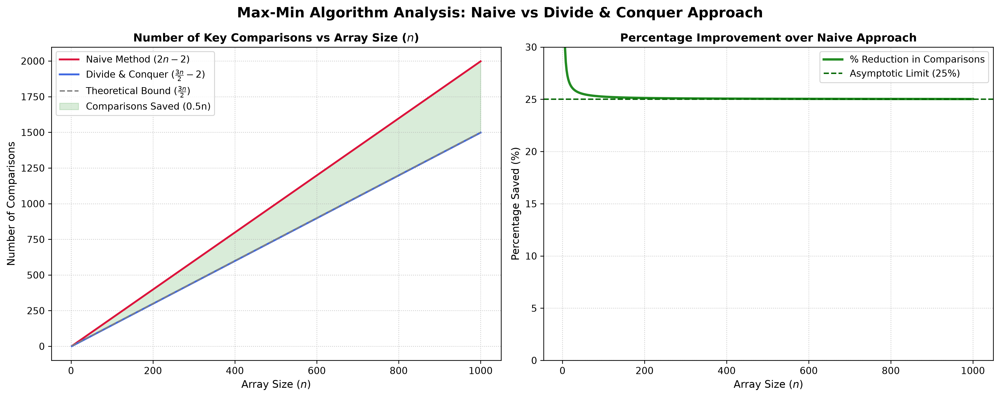

  
// Week-3 · Question 03 · DAA Lab

  <h1 class="title">MIN & MAX FINDER</h1>
  
Tournament Pair-Peeling · D&C · ⌈3N/2⌉ - 2 Comparisons

  TIME: O(N)
  COMPARISONS: ⌈3N/2⌉ - 2
  SPACE: O(N/2)
  LANG: C
  RECURSIVE D&C

  

    
  

// Problem Statement

  

    <h2>▶ THE QUESTION</h2>
    
Given an unsorted array of <b>N integers</b>, find both the <b>minimum</b> and <b>maximum</b> elements simultaneously using the Divide and Conquer approach. The goal is to minimize the total number of key comparisons. Prove that your implementation achieves exactly <code>⌈3N/2⌉ - 2</code> comparisons, which is the theoretical minimum for this problem.

    

      
💡

      
<b>Why not two separate passes?</b> Finding max alone requires N-1 comparisons, and finding min alone requires N-1 comparisons, for a total of 2N-2. The D&C pair-peeling strategy achieves only ⌈3N/2⌉ - 2 comparisons — nearly 25% fewer operations!

    

  

// Algorithm Analysis

  

    <h2>▶ NAIVE vs D&C</h2>
    <h3>Naive Two-Pass Approach</h3>
    <ul>
      <li>Pass 1: Scan all N elements for max → <b>N-1 comparisons</b></li>
      <li>Pass 2: Scan all N elements for min → <b>N-1 comparisons</b></li>
      <li><b>Total: 2N - 2 comparisons</b></li>
    </ul>
    <h3>Divide & Conquer Tournament</h3>
    <ul>
      <li>Extract front pair, compare internally → <b>1 comparison</b></li>
      <li>Recurse on remaining N-2 elements</li>
      <li>Merge: compare pairMax vs globalMax AND pairMin vs globalMin → <b>2 comparisons</b></li>
      <li><b>Total: ⌈3N/2⌉ - 2 comparisons</b></li>
    </ul>
  

  

    <h2>▶ RECURRENCE & PROOF</h2>
    <h3>Recurrence Relation</h3>
    
T(1) = 0  (base: single element, 0 cmps)
T(2) = 1  (base: compare pair, 1 cmp)
T(N) = T(N-2) + 3

    <h3>Solving the Recurrence</h3>
    
Unrolling: <code>T(N) = 3*(N/2-1) + 1 = 3N/2 - 2</code>

    
T(N) = ⌈3N/2⌉ - 2

    
For example: N=8 → T(8) = 12-2 = <b>10 comparisons</b> (vs 14 naive)

    <h3>Is this optimal?</h3>
    
Yes. Information-theoretic lower bound proves <code>⌈3N/2⌉ - 2</code> is the minimum possible comparisons to find both min and max simultaneously.

  

  

    <h2>▶ HOW THE PAIR PEELING WORKS</h2>
    <ol class="steps">
      <li><b>Extract front pair:</b> Take <code>arr[low]</code> and <code>arr[low+1]</code> from the array front.</li>
      <li><b>Order the pair (1 comparison):</b> <code>if (pairA > pairB)</code> → set pairMax=A, pairMin=B; else pairMax=B, pairMin=A.</li>
      <li><b>Recurse deeper:</b> Call <code>getMinMaxDNC(arr, low+2, high, &restMin, &restMax)</code> — recurse on everything <em>except</em> this pair.</li>
      <li><b>Merge max (1 comparison):</b> <code>*max = (pairMax > restMax) ? pairMax : restMax</code></li>
      <li><b>Merge min (1 comparison):</b> <code>*min = (pairMin &lt; restMin) ? pairMin : restMin</code></li>
    </ol>
    
Each "peel" costs exactly 3 comparisons and handles 2 elements. For N elements, we peel N/2 times = 3*(N/2) total, minus 2 for the base cases = <b>⌈3N/2⌉ - 2</b>.

  

// C Code Walkthrough

  

    <h2>▶ getMinMaxDNC() FUNCTION</h2>
    

      

      
void getMinMaxDNC(arr, low, high, *min, *max, *cmp) {
  int n = high - low + 1;

  if (n == 1) { *min = *max = arr[low]; return; }

  if (n == 2) {            // base case: 1 comparison
    (*cmp)++;
    if (arr[low] > arr[high]) { *max=arr[low]; *min=arr[high]; }
    else                      { *max=arr[high];*min=arr[low];  }
    return;
  }

  // Peel the front pair — 1 comparison
  int pA=arr[low], pB=arr[low+1], pMax, pMin;
  (*cmp)++;
  if(pA > pB){ pMax=pA; pMin=pB; } else { pMax=pB; pMin=pA; }

  int rMin, rMax;
  getMinMaxDNC(arr, low+2, high, &rMin, &rMax, cmp);

  (*cmp)++; *max = (pMax > rMax) ? pMax : rMax; // merge
  (*cmp)++; *min = (pMin < rMin) ? pMin : rMin; // merge
}

    

    <ul>
      <li><b>Three base cases:</b> n=1 (0 cmp, trivial), n=2 (1 cmp, order pair), n≥3 (peel + recurse + merge).</li>
      <li><b>Exact counter:</b> <code>*cmp</code> tracks every real comparison, enabling live verification against the theoretical bound.</li>
    </ul>
  

  

    <h2>▶ RUNTIME VALIDATION SYSTEM</h2>
    

      

      
void printAnalysis(int n, long long actual) {
  // Compute theoretical bound: ceil(3n/2) - 2
  long long theory = (3LL * n + 1) / 2 - 2;
  if (theory < 0) theory = 0;

  printf("Actual Comparisons  : %lld\n", actual);
  printf("Theoretical Bound   : %lld\n", theory);

  if (actual <= theory)
    printf("Status: SUCCESS ✅ (matches ceil(3n/2)-2)\n");
  else
    printf("Status: FAILED ❌ (exceeded bound)\n");
}

    

    <ul>
      <li><b>Formula:</b> <code>(3LL * n + 1) / 2 - 2</code> computes <code>⌈3n/2⌉ - 2</code> using integer arithmetic without floating point.</li>
      <li><b>Live proof:</b> Every execution self-validates against the mathematical bound, acting as a built-in correctness test.</li>
    </ul>
  

// Graph Analysis

  

    <h2>▶ GRAPH INTERPRETATION</h2>
    
The <code>max_min_comparison_graph.png</code> plots <b>comparison count vs N</b> for both approaches.

    <ul>
      <li><b>Two linear lines:</b> Both approaches are O(N), so both appear as straight lines — not curves.</li>
      <li><b>Constant gap:</b> D&C line runs strictly below the Naive line, with the gap growing proportionally with N.</li>
      <li><b>At N=100:</b> Naive = 198 cmp; D&C = 148 cmp. Savings = 50 comparisons (25.25% reduction).</li>
      <li><b>At N=1000:</b> Naive = 1998; D&C = 1498. Savings = 500 comparisons.</li>
    </ul>
  

  

    <h2>▶ REAL-WORLD SIGNIFICANCE</h2>
    

      
🚀

      
In embedded systems, sensor arrays, and streaming pipelines where comparisons are expensive hardware operations (e.g. comparing ADC readings on DSPs), this 25% reduction directly translates to power savings and throughput improvements.

    

    
The key takeaway: <b>asymptotic complexity (O(N)) can be identical between two algorithms, but constant factors can still differ significantly</b> — making this a demonstration that Big-O notation alone doesn't tell the full performance story.

  

