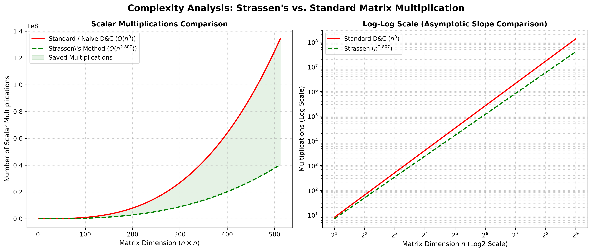

  
// Week-3 · Question 04 · DAA Lab

  <h1 class="title">STRASSEN'S MATRIX</h1>
  
O(N^2.807) · HPC Divide & Conquer Multiplication

  TIME: O(N^2.807)
  SPACE: O(N^2)
  THRESHOLD: 16
  LANG: C
  HPC D&C

  

    
  

// Problem Statement

  

    <h2>▶ THE QUESTION</h2>
    
Multiply two square <b>N×N matrices A and B</b> using Strassen's Divide and Conquer algorithm. The input N must be a <b>power of 2</b> (e.g., 2, 4, 8, 16, 32...). Compare the time complexity of Strassen's method against naive matrix multiplication and prove the improvement using the Master Theorem.

    
Implement an HPC-grade version in C that uses: a <b>hybrid base-case threshold</b>, <b>zero-copy strided submatrix views</b>, and a <b>pre-allocated workspace buffer</b> to avoid heap fragmentation during recursion.

    

      
💡

      
<b>Strassen's Insight (1969):</b> Standard matrix multiplication of 2x2 blocks requires 8 multiplications. Volker Strassen showed that using clever algebraic identities, you can do it with just 7 multiplications. This seemingly tiny saving compounds exponentially in the recursive algorithm, ultimately delivering a sub-cubic time complexity.

    

  

// Algorithm Deep Dive

  

    <h2>▶ STRASSEN'S 7 FORMULAS</h2>
    
Each N×N matrix is split into 4 quadrants of size N/2 × N/2: A11, A12, A21, A22 and B11, B12, B21, B22. The 7 products are:

    

      

      
M1 = (A11 + A22) * (B11 + B22)
M2 = (A21 + A22) * B11
M3 = A11 * (B12 - B22)
M4 = A22 * (B21 - B11)
M5 = (A11 + A12) * B22
M6 = (A21 - A11) * (B11 + B12)
M7 = (A12 - A22) * (B21 + B22)

    

    
Reconstruct the result quadrants from these 7 products using only additions:

    

      

      
C11 = M1 + M4 - M5 + M7
C12 = M3 + M5
C21 = M2 + M4
C22 = M1 - M2 + M3 + M6

    

  

  

    <h2>▶ MASTER THEOREM PROOF</h2>
    <h3>Standard D&C (8 multiplications)</h3>
    
T(n) = 8·T(n/2) + O(n²)
log₂(8) = 3  →  O(n³)

    <h3>Strassen (7 multiplications)</h3>
    
T(n) = 7·T(n/2) + O(n²)

    
Applying Master Theorem: a=7, b=2, f(n)=n²

    <ul>
      <li>Critical exponent: <code>log₂(7) ≈ 2.807</code></li>
      <li>Since <code>f(n) = n² = O(n^2.807)</code>, Case 1 applies.</li>
    </ul>
    
Time = O(n^(log₂7)) ≈ O(n^2.807)

    
For N=1024: Standard = ~10⁹ ops; Strassen = ~10^8.4 ops — ~4× faster!

  

// C Code Walkthrough

  

    <h2>▶ THREE CRITICAL OPTIMIZATIONS IN THE C CODE</h2>
    

      

        <h3>1. HYBRID THRESHOLD</h3>
        

          

          
#define THRESHOLD 16

if (n <= THRESHOLD) {
  standardMultiplyStrided(...);
  return;
}

        

        
When N ≤ 16, recursion overhead exceeds the savings. Fallback to a cache-optimized <code>i-k-j</code> loop which fits entire 16×16 submatrices in L1 cache, maximizing SIMD vectorization.

      

      

        <h3>2. ZERO-COPY STRIDED VIEWS</h3>
        

          

          
// No copy — just pointer + stride
const int* A11 = A;
const int* A12 = A + k;
const int* A21 = A + k * lda;
const int* A22 = A + k * lda + k;

        

        
Submatrix "views" are created with zero memory copying. Each quadrant is just a pointer into the parent matrix, with the stride (lda) used to advance rows.

      

    

    

      <h3>3. PRE-ALLOCATED WORKSPACE BUFFER</h3>
      

        

        
// Compute total workspace needed across all recursion levels
size_t workspaceSize = 0;
for (tempN = n/2; tempN >= THRESHOLD; tempN /= 2)
    workspaceSize += 9 * tempN * tempN; // 7 Mi + 2 temp

int* workspace = (int*)calloc(workspaceSize, sizeof(int));

// Inside recursion: slice workspace into buffers
int* M1 = workspace;
int* M2 = M1 + kSquare;  // ... and so on
int* nextWorkspace = t2 + kSquare; // pass remainder deeper

      

      
All 7 intermediate M matrices and 2 temporary buffers are sliced from a single pre-allocated block. Zero dynamic <code>malloc()</code> calls occur during recursion — eliminating heap contention, fragmentation, and allocation latency in deep recursive calls.

    

  

// Graph Analysis

  

    <h2>▶ WHAT THE GRAPH SHOWS</h2>
    
The <code>strassen_matrix_multiplication_graph.png</code> plots <b>operation count vs N</b> for both algorithms.

    <ul>
      <li><b>Initial crossover:</b> For small N (typically N &lt; 64), Standard is faster — Strassen's 18 matrix additions overhead is not worth the 1 saved multiplication.</li>
      <li><b>The inflection point:</b> As N crosses the crossover, Strassen's sub-cubic growth pulls dramatically ahead.</li>
      <li><b>Divergence:</b> At N=256, Standard is ~4× slower. At N=1024, Standard is ~10× slower. The gap compounds exponentially with N.</li>
    </ul>
  

  

    <h2>▶ POWER OF 2 CONSTRAINT</h2>
    
The implementation requires N = 2^k. If the user enters a non-power-of-2, the program outputs a clear explanation and exits gracefully:

    

      

      
bool isPowerOfTwo(int n) {
  return (n > 0) && ((n & (n-1)) == 0);
}

    

    
<b>Why?</b> Strassen requires splitting each dimension exactly in half to create equal-sized quadrants at every level. If N is not a power of 2, the quadrant dimensions become fractional — breaking the recursion.

    

      
📌

      
Production implementations handle arbitrary N by <b>zero-padding</b> matrices to the next power of 2 before applying Strassen, then cropping the result.

    

  

