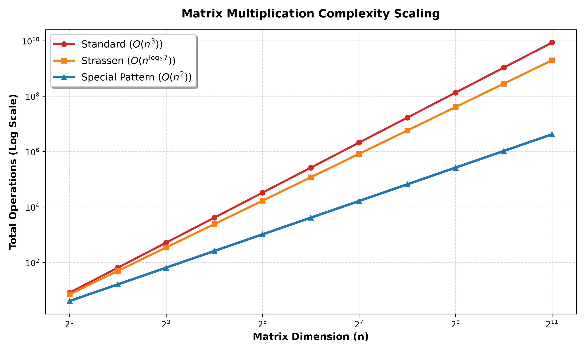

  
// Week-3 · Question 05 · DAA Lab

  <h1 class="title">SPECIAL MATRICES</h1>
  
Symmetric Pattern Multiplication · O(N²) via D&C

  TIME: O(N²)
  SPACE: O(N²)
  ONLY 2 RECURSIVE CALLS
  LANG: C
  D&C

  

    
  

// Problem Statement

  

    <h2>▶ THE QUESTION</h2>
    
Some special square matrices possess a symmetric block structure. Specifically, a <b>"Special Pattern Matrix"</b> M of size N×N has the following 2×2 block form (where each block itself is an (N/2)×(N/2) matrix):

    
M = [ M₁  M₂ ]
    [ M₂  M₁ ]

    
The off-diagonal blocks are identical, and so are the diagonal blocks. Exploit this symmetry to multiply two such matrices A and B using a <b>Divide and Conquer approach with only 2 recursive multiplications</b> instead of the standard 4, achieving O(N²) time complexity.

    

      
💡

      
<b>Why 2 instead of 4?</b> Standard block matrix multiplication of this pattern would naively compute C₁ = A₁B₁ + A₂B₂ and C₂ = A₁B₂ + A₂B₁, requiring 4 recursive multiplications. By exploiting algebraic identities (similar to Strassen, but for this special pattern), we can reduce to just 2 multiplications using sum and difference matrices.

    

  

// Mathematical Foundation

  

    <h2>▶ THE ALGEBRAIC TRICK</h2>
    <h3>Standard Block Product</h3>
    
For C = A × B where A, B follow the special pattern:

    
C₁ = A₁B₁ + A₂B₂
C₂ = A₁B₂ + A₂B₁

    
This needs 4 multiplications. Instead, define:

    <h3>The Reduction</h3>
    
P₁ = (A₁ + A₂) × (B₁ + B₂)
P₂ = (A₁ - A₂) × (B₁ - B₂)

    <h3>Reconstruction (additions only)</h3>
    
C₁ = (P₁ + P₂) / 2
C₂ = (P₁ - P₂) / 2

    
Only 2 recursive multiplications! The additions/subtractions cost O(N²) but that's the cheaper operation.

  

  

    <h2>▶ MASTER THEOREM PROOF</h2>
    <h3>Why does division by 2 work exactly?</h3>
    
Expanding P₁ + P₂ algebraically:

    
P₁ + P₂ = (A₁+A₂)(B₁+B₂) + (A₁-A₂)(B₁-B₂)
       = 2A₁B₁ + 2A₂B₂  (always even!)

    
So <code>(P₁+P₂)/2 = A₁B₁ + A₂B₂ = C₁</code>. Integer division is exact — no floating-point precision errors.

    <h3>Master Theorem</h3>
    
T(n) = 2·T(n/2) + O(n²)

    
a=2, b=2, f(n)=n². Critical exponent: log₂(2)=1. Since f(n)=n² = Ω(n^(1+1)) with ε=1, <b>Case 3 applies</b>. Regularity: 2·(n/2)² = n²/2 ≤ c·n² for c=1/2 &lt; 1.

    
Time = Θ(n²)

  

// C Code Walkthrough

  

    <h2>▶ multiplySpecialRec() FUNCTION</h2>
    

      

      
void multiplySpecialRec(A, lda, B, ldb, C, ldc, n, workspace) {
  if (n == 1) { C[0] = A[0] * B[0]; return; }

  int k = n / 2;
  // Slice workspace into 6 named buffers
  int* S_A1 = workspace;           // (A1 + A2)
  int* S_B1 = S_A1 + k*k;         // (B1 + B2)
  int* P1   = S_B1 + k*k;         // result of recursive call 1
  int* S_A2 = P1   + k*k;         // (A1 - A2)
  int* S_B2 = S_A2 + k*k;         // (B1 - B2)
  int* P2   = S_B2 + k*k;         // result of recursive call 2
  int* next = P2 + k*k;

  // Zero-copy submatrix views
  const int* A1 = A; const int* A2 = A + k;
  const int* B1 = B; const int* B2 = B + k;

  // Compute S_A1 = A1+A2, S_B1 = B1+B2 → O(n²)
  for (i=0;i&lt;k;i++) for (j=0;j&lt;k;j++) {
    S_A1[i*k+j] = A1[i*lda+j] + A2[i*lda+j];
    S_B1[i*k+j] = B1[i*ldb+j] + B2[i*ldb+j];
  }
  multiplySpecialRec(S_A1,k,S_B1,k,P1,k,k,next); // call 1

  // Compute S_A2 = A1-A2, S_B2 = B1-B2
  for (i=0;i&lt;k;i++) for (j=0;j&lt;k;j++) {
    S_A2[i*k+j] = A1[i*lda+j] - A2[i*lda+j];
    S_B2[i*k+j] = B1[i*ldb+j] - B2[i*ldb+j];
  }
  multiplySpecialRec(S_A2,k,S_B2,k,P2,k,k,next); // call 2

  // Reconstruct C — exact integer division by 2
  for(i=0;i&lt;k;i++) for(j=0;j&lt;k;j++) {
    int c1=(P1[idx]+P2[idx])/2;  // A1B1 + A2B2
    int c2=(P1[idx]-P2[idx])/2;  // A1B2 + A2B1
    C11[i*ldc+j]=c1; C12[i*ldc+j]=c2;
    C21[i*ldc+j]=c2; C22[i*ldc+j]=c1;
  }
}

    

    <ul>
      <li><b>6 workspace buffers:</b> Two sum matrices (S_A1, S_B1), two difference matrices (S_A2, S_B2), two product matrices (P1, P2) — all sliced from a pre-allocated master workspace, no dynamic allocations inside recursion.</li>
      <li><b>Zero-copy views:</b> A1, A2, B1, B2 are just pointer offsets — no memory copying of sub-matrices.</li>
      <li><b>Exact reconstruction:</b> The mathematical guarantee that P1±P2 is always even means the division-by-2 is always precise for integer arithmetic.</li>
    </ul>
  

  

    <h2>▶ WORKSPACE SIZE DERIVATION</h2>
    

      

      
// At level 1: 6 buffers of (n/2)² = 6n²/4
// At level 2: 6 buffers of (n/4)² = 6n²/16
// Sum (geometric series):
// = 6n²/4 × 1/(1-1/4) = 6n²/4 × 4/3 = 2n²
// Using 3n² gives 50% safety headroom
size_t workspaceSize = 3 * (size_t)n * n;
int* workspace = calloc(workspaceSize, sizeof(int));

    

    
The geometric series sum of all workspace needed at every recursion level converges to exactly 2n². We use 3n² to provide 50% safety headroom against off-by-one pointer arithmetic bugs.

  

  

    <h2>▶ GRAPH ANALYSIS</h2>
    
The <code>Matrix_Complexity_Analysis.png</code> shows three curves:

    <ul>
      <li><b>Standard O(N³):</b> Shoots up steeply — cubic growth quickly dominates.</li>
      <li><b>Strassen O(N^2.807):</b> Less steep, but still super-quadratic.</li>
      <li><b>Special Pattern O(N²):</b> Nearly flat compared to the others — the quadratic curve hugs the bottom of the graph.</li>
    </ul>
    

      
⚠️

      
<b>Important:</b> The O(N²) complexity is only achievable because of the special pattern constraint. General matrices cannot be multiplied in O(N²) — the theoretical lower bound for general matrix multiplication is still an open problem in CS (≈ O(N^2.37)).

    

  

