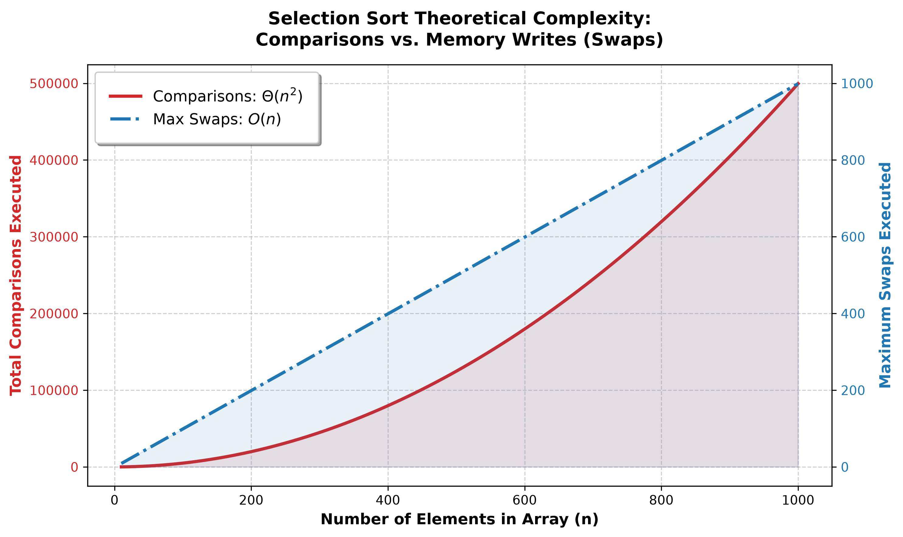

  
// Week-3 · Question 06 · DAA Lab

  <h1 class="title">SELECTION SORT</h1>
  
Loop Invariant Proof · Mathematical Correctness Validation

  TIME: Θ(N²)
  SPACE: O(1) IN-PLACE
  COMPARISONS: N(N-1)/2
  LANG: C
  LOOP INVARIANTS

  

    
  

// Problem Statement

  

    <h2>▶ THE QUESTION</h2>
    
Implement the <b>Selection Sort</b> algorithm in C and formally prove its correctness using <b>Loop Invariants</b> — a mathematical technique used to verify algorithm correctness. A loop invariant is a logical condition that:

    <ul>
      <li>Is true <b>before</b> the loop starts (Initialization)</li>
      <li>Remains true <b>after every iteration</b> (Maintenance)</li>
      <li>Implies the algorithm's <b>correctness at termination</b> (Termination)</li>
    </ul>
    
Also derive the exact comparison count, time complexity, and space complexity. Explain why the outer loop only runs <code>n-1</code> times (not n times).

    

      
💡

      
<b>Selection Sort Key Idea:</b> In each iteration <code>i</code>, scan the entire remaining unsorted sub-array to find the minimum element, then place it at position <code>i</code>. After <code>n-1</code> iterations, the array is fully sorted.

    

  

// The Formal Loop Invariant Proof

  

    <h2>▶ COMPLETE LOOP INVARIANT PROOF</h2>

    A loop invariant is a property about the state of the algorithm that must be true before the loop starts, must remain true after every iteration, and must lead us to conclude that the algorithm is correct when the loop ends. For Selection Sort, the invariant is: at the beginning of each pass through the outer loop, the left portion of the array already contains exactly the correct smallest elements arranged in sorted order. Whatever has been placed on the left side is final and will not change again.

    Initialization — Before the very first pass begins, no elements have been processed yet, so the sorted portion is completely empty. An empty collection trivially satisfies any ordering condition, because there are no elements to be out of order. The invariant is vacuously true at the start. This is the base case of the proof and it holds without question.

    Maintenance — Assume the invariant is true at the start of some arbitrary pass. At that point, the left side holds correctly sorted smallest elements and the right side contains everything else. During this pass, the algorithm scans the entire unsorted right portion and identifies the smallest element within it. That element is smaller than everything still unsorted, and since the sorted portion already holds all elements smaller than it, this newly found minimum is the next element in overall sorted order. It is then moved to the boundary position, extending the sorted region by exactly one. After the pass completes, the sorted portion is one element larger and still correctly ordered. The invariant is preserved.

    Termination — The outer loop runs until all but the last element have been placed. When the loop ends, the sorted region covers every element except the very last one. Since all smaller elements have already been placed correctly, the final remaining element must be the largest in the array. It therefore sits in its correct position automatically, without needing any additional work. At this point the entire array is sorted from smallest to largest. The invariant combined with the loop ending directly proves correctness.

    Why n minus one passes are sufficient — After n minus one passes, every element except the last has been explicitly placed in its correct sorted position. The last element has no other place to go, because all smaller values are already to its left, so it must already be in the right position. Performing one more pass would accomplish nothing. The algorithm would scan a single-element region, compare it against itself, find no improvement, and make no change. This extra work would be entirely redundant. Stopping at n minus one passes is both correct and optimal.
  

// Complexity Analysis

  

    <h2>▶ EXACT COMPARISON COUNT</h2>
    In each pass i, the inner scan checks every element from position i+1 to the end of the array, making exactly n minus 1 minus i comparisons. Summing this over all passes from i equals 0 to i equals n minus 2 gives the total as the sum of the series (n-1) + (n-2) + ... + 2 + 1, which equals n(n-1)/2.

    As a concrete example: for an array of 10 elements this is 45 comparisons; for 100 elements it is 4,950 comparisons; for 1,000 elements it is 499,500 comparisons. The count grows as the square of n.

    The most important characteristic of Selection Sort is that it has no early termination. Unlike Insertion Sort or Bubble Sort, it always performs exactly n(n-1)/2 comparisons regardless of whether the input is already sorted, randomly ordered, or in reverse. This is why the best case, average case, and worst case are all identical and equal to Theta of n squared.
  

  

    <h2>▶ SPACE COMPLEXITY: O(1)</h2>
    Selection Sort sorts entirely in-place, meaning it rearranges elements within the original array without ever allocating any additional storage that grows with the input size. The only extra memory used consists of four simple integer variables: one to track the current outer boundary, one to drive the inner scan, one to remember the position of the current minimum, and one temporary variable used during the swap step. None of these grow larger or multiply in count as the array size increases.

    Because the amount of extra memory is fixed and independent of n, the auxiliary space complexity is O(1). This constant-space property makes Selection Sort particularly well suited for memory-constrained environments such as microcontrollers and embedded systems where no dynamic memory allocation is available and every byte of RAM matters.
  

// Code Explanation & Analysis

  

    <h2>▶ HOW THE ALGORITHM WORKS — STEP BY STEP</h2>
    Selection Sort works by repeatedly picking the smallest remaining element and placing it at the correct position, one at a time, until the entire array is sorted. The process is simple, predictable, and always takes the same number of steps regardless of how the data is arranged.

    Before sorting begins, the function first checks whether the input is actually sortable. If the array is empty or contains only a single element, there is nothing to do and it stops immediately. This is a defensive measure — it ensures the program behaves correctly even when given unusual or invalid input. An array of zero or one element is already considered sorted by definition, so no work is needed.

    The sorting itself is driven by an outer loop that runs exactly n minus one times, where n is the number of elements. Each pass through this outer loop is responsible for finding the next smallest element and locking it permanently into its final position. After n minus one passes, all but the last element have been placed correctly, and since all smaller elements are already settled, the last element must be the largest, so it automatically sits in the right place without any extra work.

    Inside each pass, a second inner loop scans through every element that has not yet been sorted, from the current position all the way to the end of the array. As it moves forward, it keeps a record of where the smallest value seen so far is located. Each element is compared against this current known minimum, and whenever something smaller is found, the record is updated to point to that new location. This scan is always complete — every remaining element is checked without exception — which is why Selection Sort always makes the same number of comparisons no matter the input.

    Once the inner scan completes, the algorithm knows exactly where the true smallest remaining element is. Before moving it, there is a check: if that smallest element already happens to be sitting exactly where it needs to be, no exchange is performed. This saves three memory write operations in cases where the element is already in place. When a swap is needed, a temporary holding variable preserves one of the values while the two positions exchange their contents — a classic three-step exchange that guarantees no data is ever overwritten and lost.

    The swap itself is handled by a small dedicated helper kept separate from the main logic for clarity. This helper is designed to be merged directly into the surrounding code by the compiler, so there is no extra cost from calling it as a separate function. After each outer pass completes, the sorted region of the array grows by one element, and the process repeats until the entire array is ordered.
  

  

    <h2>▶ VARIABLE ROLES EXPLAINED</h2>
    Outer counter — Represents the current boundary between the sorted and unsorted halves. After each outer pass it advances by one, permanently locking one more element in its final sorted position. It never moves backward.

    Inner counter — Scans the unsorted half from just after the outer boundary all the way to the last element. It always moves forward and never revisits any position already scanned in that pass.

    Minimum tracker — Remembers the location of the smallest element encountered during the inner scan. It starts at the outer boundary position and updates whenever a smaller element is found further along. At the end of the inner scan it points to the true minimum.

    Temporary holder — A single extra variable used only during the exchange step. It briefly holds one value so the other can overwrite it without being lost. It is the only additional memory the algorithm needs beyond the input array itself.

    Only four extra integer variables are ever used at any point, and none of them grow in size or count as the input grows larger. This is precisely why the auxiliary space requirement is constant at O(1) regardless of how large the array is.
  

  

    <h2>▶ TRACE EXAMPLE: A = [64, 25, 12, 22]</h2>
    Pass 1 — The unsorted region is the entire array. Scanning from position 1 to 3 finds the value 12 at index 2 as the minimum. It is swapped with the value at index 0. The array becomes 12, 25, 64, 22. The sorted region now holds one element.

    Pass 2 — The unsorted region starts at index 1. Scanning from index 2 to 3 finds 22 at index 3 as the minimum. It is swapped with the value at index 1. The array becomes 12, 22, 64, 25. The sorted region now holds two elements.

    Pass 3 — The unsorted region starts at index 2. Scanning finds 25 at index 3 as the minimum. It is swapped with the value at index 2. The array becomes 12, 22, 25, 64. The sorted region now holds three elements.

    End — Only one element remains at index 3. Since all smaller elements are already to its left, the value 64 is automatically in its correct position. The algorithm ends. Total comparisons made: 3 plus 2 plus 1 equals 6, which equals n times n minus 1 divided by 2 for n equal to 4. The formula is confirmed exactly.
  

// Graph Analysis

  

    <h2>▶ GRAPH INTERPRETATION</h2>
    The complexity graph plots the number of comparisons against the input size n. Because Selection Sort always makes exactly n(n-1)/2 comparisons regardless of the order of the input, the best case, average case, and worst case all trace the exact same curve. There is no variation between them.

    This single overlapping parabola distinguishes Selection Sort from algorithms like Insertion Sort and Bubble Sort, which can terminate early on already-sorted input and therefore show a lower best-case curve. Selection Sort never benefits from favorable input ordering — it always does the full work.

    The shape of the curve confirms the Theta of n squared growth rate. As n doubles, the number of operations quadruples, which is the defining characteristic of quadratic growth.
  

  

    <h2>▶ WHEN TO USE SELECTION SORT</h2>
    Selection Sort is the right choice when memory writes are expensive or limited. Because it makes at most n minus one swaps — one per pass — it minimises the number of write operations to the array. This matters in hardware like Flash memory or EEPROM, where each write wears down the storage medium and has a finite lifetime. Bubble Sort by contrast can make up to n squared swaps, making it far more damaging to write-sensitive storage.

    Selection Sort should be avoided when the input is large or when it is likely to be already partially sorted. For those cases Insertion Sort is a strictly better choice: it adapts to the order of the input and can sort a nearly-sorted array in close to linear time, whereas Selection Sort will always take the same quadratic time regardless.

    The upper bound on swaps — at most n minus one — is actually the theoretical minimum for any comparison-based in-place sorting algorithm, making Selection Sort uniquely efficient in terms of write operations even though it is not efficient in terms of comparisons.
  

